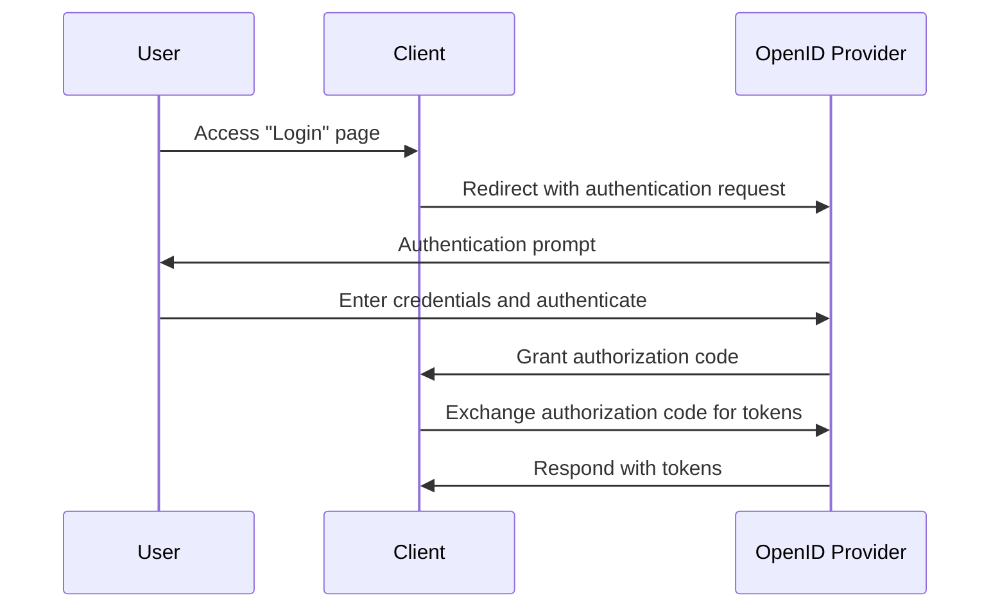

## What is an authentication request?

While the meaning of an authentication request can vary depending on the context, we will focus on the definition in the OpenID Connect (OIDC) specification. In OIDC, an authentication request is an <Ref slug="authorization-request" /> to the authorization server for authenticating a user.

The standard definition seems very confusing because similar terms, such as "authorization request", are used. This is because OIDC is built on top of OAuth 2.0 that is primarily designed for authorization, and OIDC inherits the OAuth 2.0 terminology and extends it to support authentication.

To clarify, let's add some context to the definition:

> An (OpenID Connect) authentication request is an (OAuth 2.0 authorization) request to the (OpenID Connect authorization) server for authenticating a user.

It becomes even longer! Now let's remove all the parentheses:

> An authentication request is a request to the server for authenticating a user.

After removing all the attributes, the definition becomes straightforward. Here are the breakdowns of the terms:

- **Authentication request**: The term from the OIDC specification.
- <Ref slug="authorization-request" />: The term from the OAuth 2.0 specification. OIDC reuses the specification and extends it.
- <Ref slug="authorization-server" />: The term from the OAuth 2.0 specification. OIDC also uses the term <Ref slug="openid-connect" headingId="openid-provider-op" /> to refer to the same entity that is capable of authenticating users.

In the following sections, we will use "OpenID Provider (OP)" to refer to the authorization server that supports OIDC.

## How does an authentication request work?

When a client application wants to authenticate a user, it initiates an authentication request to the OpenID Provider (OP). As we mentioned earlier, the authentication request is also an authorization request in OAuth 2.0; thus, certain OAuth 2.0 grant types (flows) can be used to complete the authentication process.

OIDC defines three grant types (flows) to support authentication:

1. <Ref slug="authorization-code-flow" />: The most recommended authentication flow. It is usually used with <Ref slug="pkce" /> for better security and is suitable for most applications.
2. <Ref slug="implicit-flow" />: A simplified flow that is deprecated in <Ref slug="oauth-2.1" /> due to security concerns.
3. <Ref slug="hybrid-flow" />: A combination of the authorization code flow and the implicit flow.

The authentication request is the first step in the OIDC authentication flow. The actual parameters to include and the steps to follow depend on the flow you choose. Click on the flow names above to learn more about each flow.

Here's a simplified example of an authentication request using the authorization code flow:

Once the client receives the tokens, it can use them (e.g., <Ref slug="access-token" />) to access protected resources (e.g., an API) on behalf of the user.

### Key parameters in an authentication request

Here are some key parameters in an authentication request:

- **`response_type`**: The type of response the client expects from the authorization server. It can be `code` for the authorization code flow, `id_token` for the implicit flow, or `code id_token` for the hybrid flow.
- **`client_id`**: The client identifier issued by the OpenID Provider (OP).
- **`redirect_uri`**: The URI to which the authorization server will redirect the user-agent after the authentication request.
- **`scope`**: The requested <Ref slug="scope">scopes</Ref> (permissions) for the <Ref slug="id-token" /> and <Ref slug="access-token" />.
- **`resource`**: The optional parameter that specifies the <Ref slug="resource-indicator" /> for the requested resources. The authorization server needs to support [RFC 8707](https://datatracker.ietf.org/doc/html/rfc8707) to use this parameter.

Note that the above parameters are non-exhaustive. Before making an authentication request, you should refer to the full list of parameters for the specific flow you are using.

<SeeAlso slugs={["openid-connect", "oauth-2.0", "authorization-code-flow", "implicit-flow", "hybrid-flow"]} />

<Resources
  urls={[
    "https://openid.net/specs/openid-connect-core-1_0.html",
  ]}
/>
