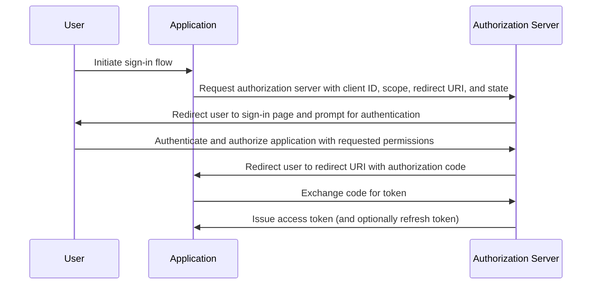

## What is authorization code flow?

The authorization code flow (a.k.a authorization code grant), defined in [OAuth 2.0 RFC 6749, section 4.1](https://datatracker.ietf.org/doc/html/rfc6749#section-4.1), is a widely used OAuth 2.0 authorization mechanism that allows applications to obtain an access token on behalf of a user. This flow is particularly suitable for confidential applications (e.g. Traditional server-side running web applications) where the client secret can be securely stored. 

Authorization code flow is a robust and secure method for obtaining access tokens in OAuth 2.0, making it a preferred choice for many web applications. Understanding this flow is essential for developers working with OAuth 2.0 and API integrations.

## How does authorization code flow work?

The authorization code flow involves the following steps:

1. **Flow initiation**: The user initiates the flow by typically clicking a link or button in the application to sign in. The application redirects the user to the authorization server's authorization endpoint, passing along the client ID, the requested scope, a redirect URI, and a state parameter. Authorization server validates the parameters and prompts the user to authenticate on the authorization server's sign-in page.
2. **User authentication and authorization**: The user authenticates with the authorization server and grants the application permission to access the requested resources.
3. **Code generation and redirection**: The authorization server generates an authorization code and redirects the user back to the application using the redirect URI provided earlier. The authorization code is included in the query string of the redirect URI.
4. **Code exchange**: The application extracts the authorization code from the query string and makes a POST request to the authorization server's token endpoint to exchange the authorization code for an access token. The application must also include the client ID, client secret, redirect URI, and the authorization code in the request.
5. **Access token retrieval**: The authorization server validates the authorization code and issues an access token (and optionally a refresh token) to the application upon successful validation. The application can then use the access token to make authorized API requests on behalf of the user.

The steps can be illustrated by the following sequence diagram:



## Authentication request

Request parameters are as follows:

- **client_id**: REQUIRED. Valid OAuth 2.0 client identifier.
- **scope**: REQUIRED. This value specifies a set of resources the user is requesting from the authorization server. E.g., `openid profile email`.
- **response_type**: REQUIRED. The value must be `code` to indicate that the application expects an authorization code.
- **redirect_uri**: REQUIRED. The URI to which the authentication response will be sent, and should exactly match the redirect URI the client pre-registered at the authorization server.
- **state**: RECOMMENDED. An opaque value used to maintain state between the request and callback. It is also used to prevent <Ref slug="csrf" /> attacks.
- **nonce**: OPTIONAL. A random string used to associate a client session with an ID token and to mitigate replay attacks.
- **prompt**: OPTIONAL. Space-delimited, case-sensitive list of string values that specifies whether the authorization server prompts the end-user for re-authentication and consent. The defined values are:
  - **none**: The authorization server MUST NOT display any authentication or consent user interface pages. An error is returned if an end-user is not already authenticated or the client does not have pre-configured consent for the requested Claims or does not fulfill other conditions for processing the request. The error code will typically be `login_required`, `interaction_required`. This can be used as a method to check for existing authentication and/or consent.
  - **login**: The authorization server SHOULD prompt the end-user for reauthentication. If it cannot reauthenticate the end-user, it MUST return an error, typically `login_required`.
  - **consent**: The authorization server SHOULD prompt the end-user for consent before returning information to the client. If it cannot obtain consent, it MUST return an error, typically `consent_required`.
  - **select_account**: The authorization server SHOULD prompt the end-user to select a user account. This enables an end-user who has multiple accounts at the authorization server to select amongst the multiple accounts that they might have current sessions for. If it cannot obtain an account selection choice made by the end-user, it MUST return an error, typically `account_selection_required`.

[Full request parameter definition](https://openid.net/specs/openid-connect-core-1_0.html#AuthRequest)

### Authentication request example

```bash
curl -X GET "https://authorization-server.com/auth" \
  -d "response_type=code" \
  -d "client_id=YOUR_APPLICATION_ID" \
  -d "redirect_uri=https://yourapp.com/callback" \
  -d "scope=openid profile email" \
  -d "state=RANDOM_STRING_FOR_STATE"
```

A typical successful response:

```http
HTTP/1.1 302 Found
Location: https://yourapp.com/callback?
  code=YOUR_AUTHORIZATION_CODE
  &state=RANDOM_STRING_FOR_STATE
```

## Token exchange request

Once the above authentication request is successfully responded, the client will be automatically redirected to the callback URI `https://yourapp.com/callback`, with the code as a URI parameter.

The client is expected to obtain and process the `code` with a subsequent token exchange request, in order to exchange for the access tooken.

### Token exchange request example

```bash
curl -X POST "https://authorization-server.com/token" \
  -H "Content-Type: application/x-www-form-urlencoded" \
  -d "client_id=YOUR_CLIENT_ID" \
  -d "code=YOUR_AUTHORIZATION_CODE" \
  -d "redirect_uri=https://yourapp.com/callback" \
  -d "grant_type=authorization_code" \
```

## Benefits

- **Enhanced security**: The client secret is never exposed to the user's browser, reducing the risk of client impersonation.
- **One-time authorization code**: The authorization code has a short lifespan and can only be used once, reducing the risk of interception and replay attacks.
- **Short-lived tokens**: Access tokens issued in this flow are short-lived (typically 1 hour), reducing the risk of unauthorized access if the token is compromised.
- **Refresh token**: The authorization server can optionally issue a refresh token, allowing the application to obtain a new access token without requiring user interaction.

## What is the difference between authorization code flow and implicit flow?

The main difference between the authorization code flow and the implicit flow is how the access token is obtained:

- **Authorization code flow**: The client application receives an authorization code first from the authorization endpoint, then exchanges it for an access token in a subsequent POST request to the token endpoint.
- **Implicit flow**: The client application receives the access token directly from the authorization endpoint.

## What is the difference between authorization code flow and client credentials flow?

The main difference between the authorization code flow and the client credentials flow is the context in which the flow is used:

- **Authorization code flow**: Used when the client application needs to access resources on behalf of a user. The flow involves user authentication and authorization.
- **Client credentials flow**: Used when the client application needs to access resources on its own behalf. The flow involves client authentication but not user authentication, best suited for machine-to-machine communication.

## What are the typical use cases for the authorization code flow?

- Traditional web applications that require user authentication and access to APIs.
- Applications that need to access user data from third-party services securely.

<SeeAlso slugs={['device-flow', 'implicit-flow', 'client-credentials-flow']} />

<Resources urls={['https://datatracker.ietf.org/doc/html/rfc6749']} />
