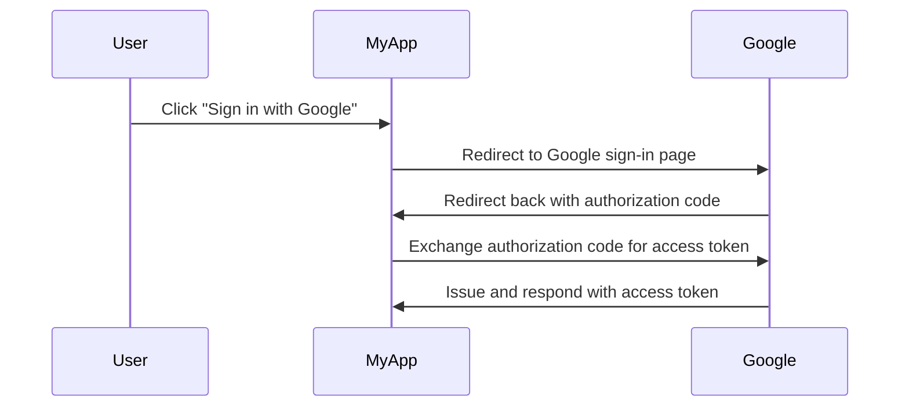

## What is an authorization server?

The term "authorization server" can be a general term that refers to any server that performs authorization. We'll focus on the definition in the context of the <Ref slug="oauth-2.0" /> and <Ref slug="openid-connect" /> frameworks.

In OAuth 2.0, an authorization server is a component that issues <Ref slug="access-token">access tokens</Ref> to <Ref slug="client">clients</Ref> after successfully authenticating and authorizing them. The access tokens are used by clients to access protected resources on behalf of the user (resource owner).

Too many terms? Let's see a real-world example: a user clicks "Sign in with Google" on an application "MyApp" that uses <Ref slug="authorization-code-flow" /> for Google sign-in.

In this example, Google acts as the **authorization server** that issues an access token to the **client** (MyApp) after the user successfully signs in. The client can then use the **access token** to fetch the user's profile (protected resource) on Google.

### Authorization server in OpenID Connect (OIDC)

Since OpenID Connect is built on top of OAuth 2.0, it reuses some terms and concepts from OAuth 2.0. OIDC adds the authentication ability to the OAuth 2.0 authorization server, which makes the authorization server also an <Ref slug="openid-connect" headingId="openid-provider-op" />. To avoid ambiguity, we recommend always using the term "OpenID Provider" when referring to the authorization server in OIDC.

In addition to issuing access tokens, the OpenID Provider (authorization server) in OIDC also issues <Ref slug="id-token">ID tokens</Ref> to clients. The ID tokens contain user information and are used to authenticate users.

## How does an authorization server work?

An authorization server should support the <Ref slug="oauth-2.0-grant">OAuth 2.0 grants (flows)</Ref> to issue access tokens to clients. A grant type usually consists of a series of steps that the client and the authorization server follow to obtain an access token.

- For user authorization, most of grant types require the client initiates an <Ref slug="authorization-request" /> to the authorization server. In the above Google sign-in example, the step "Redirect to Google sign-in page" is an authorization request initiated by the client.
- For <Ref slug="machine-to-machine" /> authorization, the client may use the <Ref slug="client-credentials-flow" /> to directly send a <Ref slug="token-request" /> to the authorization server.

The authorization server should also validate the client's request, authenticate the client, and verify the user's identity before issuing an access token. It may also enforce additional security measures, such as <Ref slug="pkce" /> for the <Ref slug="authorization-code-flow" />.

## Authorization server use cases

As the name suggests, authorization servers are used to handle <Ref slug="authorization" />. The authorization server may involve first and third parties:

- The above Google sign-in example.
- An e-commerce website (client) requesting access to a user's payment information (protected resource) from another website.
- A mobile app (client) requesting access to a user's location data (protected resource) from a location service provider.

Or, it can be only used for internal authorization, such as:

- A user needs to access their orders (protected resource) in an e-commerce website (client).
- A service (client) needs to access a database (protected resource) in a microservices architecture.

In modern applications, an authorization server can be also an <Ref slug="identity-provider" /> that also supports <Ref slug="openid-connect" /> for user authentication.

<SeeAlso slugs={["oauth-2.0", "authorization-request", "access-token"]} />
 
<Resources
  urls={[
    "https://blog.logto.io/ciam-102-authz-and-rbac",
    "https://tools.ietf.org/html/rfc6749",
  ]}
/>
