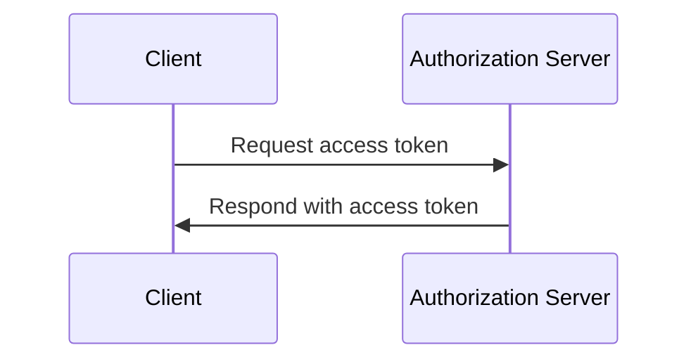
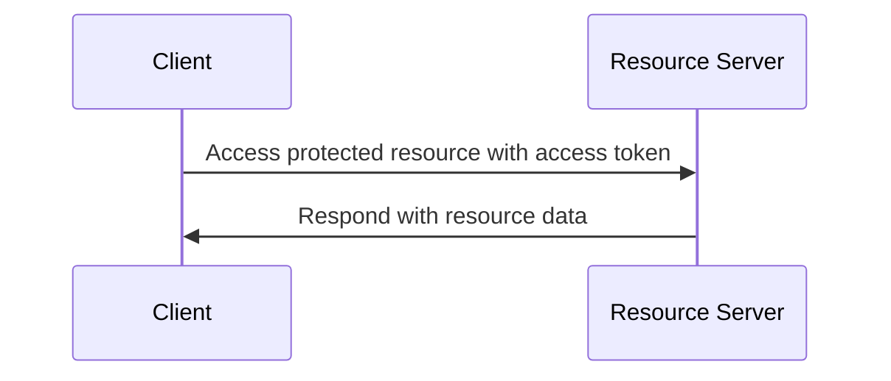

## What is client credentials flow?

The client credentials flow (grant) is an <Ref slug="oauth-2.0-grant" /> type that allows confidential clients to obtain <Ref slug="access-token">access tokens</Ref> to access protected resources. Usually, this flow is used for <Ref slug="machine-to-machine" /> communication where the client is a server or a service.

> [!Note]
> The client credentials flow is not suitable for end-user authorization. For end-user authorization, you should use <Ref slug="authentication-request" /> or <Ref slug="authorization-request" />.

## How does client credentials flow work?

The client credentials flow is a simple two-step process:

1. **Token request**: The client sends a <Ref slug="token-request" /> with its client credentials (client ID and client secret) and the requested <Ref slug="scope">scopes</Ref>.
2. **Token response**: The <Ref slug="authorization-server" /> validates the client credentials and issues an access token if the client is authorized.

Here's a simplified sequence diagram of the client credentials flow:



Here's a non-normative example of a client credentials flow token request:

```http
POST /token HTTP/1.1
Host: your-authorization-server.com
Content-Type: application/x-www-form-urlencoded

grant_type=client_credentials
  &client_id=YOUR_CLIENT_ID
  &client_secret=YOUR_CLIENT_SECRET
  &scope=read write
```

The authorization server will validate the client credentials and issue an access token if the client is authorized. Once the client receives the access token, it can use it to access protected resources (e.g., an API) on behalf of itself. Here's an example of how a client uses the access token to access an API:



Note that the <Ref slug="resource-server" /> should validate the access token and enforce the <Ref slug="access-control" /> policies to ensure that the client has the necessary permissions to access the resource.

### Key parameters in a client credentials flow token request

Unlike other OAuth 2.0 flows, the client credentials flow has a simple <Ref slug="token-request" /> with the following key parameters:

- **`grant_type`**: The grant type should be set to `client_credentials` to indicate the client credentials flow.
- **`client_id`**: The client identifier issued by the authorization server.
- **`client_secret`**: The client secret issued by the authorization server.
- **`scope`**: The requested <Ref slug="scope">scopes</Ref> (permissions) for the access token.
- **`resource`**: The optional parameter that specifies the <Ref slug="resource-indicator" /> for the requested resources. The authorization server needs to support [RFC 8707](https://datatracker.ietf.org/doc/html/rfc8707) to use this parameter.

## Security considerations

### Private clients

The client credentials flow is suitable for <Ref slug="client" headingId="private-clients" /> (confidential clients) that can securely store the client secret. If the client is a public client (e.g., a single-page application), it should not use the client credentials flow because the client secret can be exposed.

### Token expiration

Although the access token obtained in the client credentials flow can have a long expiration time, it is recommended to use short-lived access tokens (e.g., 1 hour) to reduce the risk of unauthorized access if the token is compromised.

### Client secret rotation

To enhance security, it is recommended to rotate the client secret periodically. The authorization server should support client secret rotation without affecting the client's ability to obtain access tokens. For example, the authorization server should support multiple client secrets for backward compatibility during the rotation process.

<SeeAlso slugs={["machine-to-machine", "token-request", "access-token", "scope", "resource-indicator"]} />

<Resources
  urls={[
    "https://blog.logto.io/programmatic-authentication-methods",
    { 
      url: "https://datatracker.ietf.org/doc/html/rfc6749#section-4.4",
      result: {
        ogTitle: "Client Credentials Grant",
        ogDescription: "The client can request an access token using only its client credentials (or other supported means of authentication) when the client is requesting access to the protected resources under its control, or those of another resource owner that have been previously arranged with the authorization server."
      }
    }
  ]}
/>
