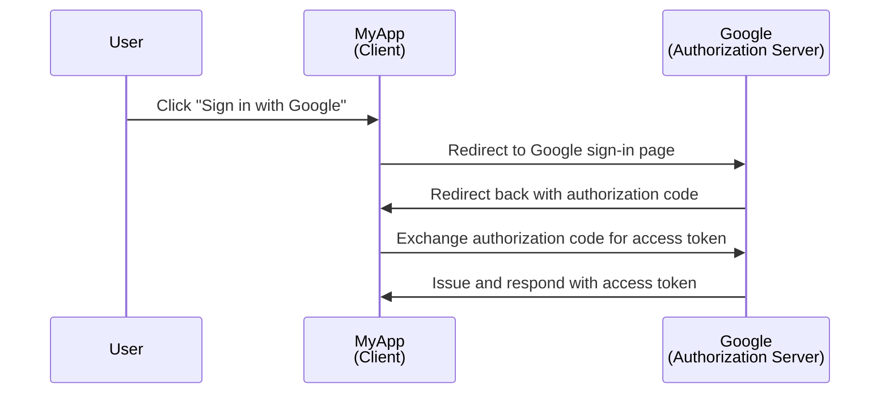
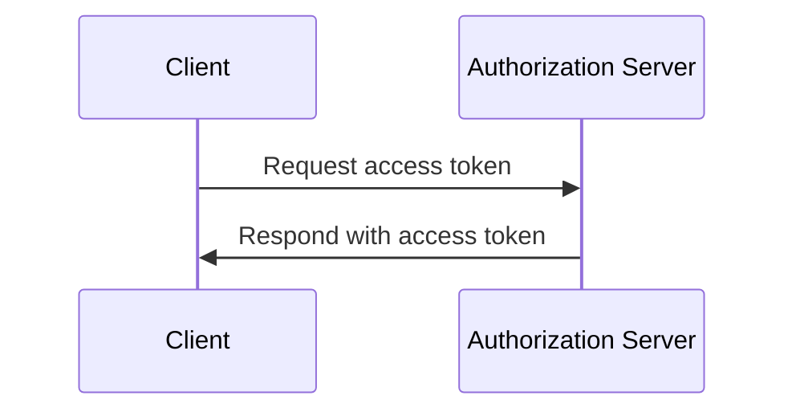

## What is a client?

A client, in the context of <Ref slug="oauth-2.0" /> and <Ref slug="openid-connect" />, is an application that requests authentication or authorization. For example, when a user clicks "Sign in with Google" on an application, the application is acting as a **client** that requests authorization from Google.

> "Client" and "application" are often used interchangeably in the context of <Ref slug="iam" />.

There are multiple categorizations of clients based on their capabilities and trust levels, but to the frameworks, a significant distinction is between public and private clients. It affects how the client can obtain tokens and the grant types it can use.

### Public clients

Public clients are applications that cannot cannot keep its credentials confidential, which means the resource owner (user) can access them. Examples of public clients include:

- Single-page applications (SPAs)
- Mobile apps
- Desktop apps

You may argue that mobile and desktop apps have secure storage capabilities, but most of frameworks consider them public clients because they are distributed to end-users and it's assumed that the end-users can access the credentials.

### Private clients

Private (confidential) clients are applications that can confidentially store sensitive information without exposing it to resource owners (end-users). Examples of private clients include:

- Web servers
- Backend services

## How does a client work?

### User authentication and authorization

When a client wants to authenticate a user, a client initiates an <Ref slug="authorization-request" /> to the <Ref slug="authorization-server" /> to obtain an <Ref slug="access-token" />. The client should include necessary parameters in the request, such as the client ID, redirect URI, and scopes. Here's a simplified sequence diagram of the authorization code flow:

In this example, Google acts as the **authorization server** that issues an access token to the **client** (MyApp) after the user successfully signs in. The client can then use the **access token** to fetch the user's profile (protected resource) on Google.

For OpenID Connect (OIDC) clients, the client needs to initiate an <Ref slug="authentication-request" /> to authenticate the user. It uses the same endpoint as the authorization request, but the parameters and the response are different.

### Machine-to-machine communication

For <Ref slug="machine-to-machine" /> communication, the client can use the <Ref slug="client-credentials-flow" /> to directly send a <Ref slug="token-request" /> to the authorization server. The client should include the client ID, client secret, and scopes in the request. Here's a simplified sequence diagram of the client credentials flow:

The authorization server will validate the client credentials and issue an access token if the client is authorized. Since the client needs to send the client secret, it's important to use the client credentials flow only for private clients.

## Security considerations

### Client types

The client type (public or private) affects the security considerations for the client.

- Public clients should not use the client credentials flow because they cannot securely store the client secret. Instead, the <Ref slug="authorization-code-flow" /> with <Ref slug="pkce" /> is recommended for public clients to authenticate users.
- Private clients can use the client credentials flow for machine-to-machine communication. They should securely store the client secret and use it only in secure environments.

### Token storage

Clients should use the highest level of possible security to store tokens. For example, in web applications, HTTP-only cookies are recommended for storing access tokens to prevent XSS attacks.

### Token expiration

Access tokens have a limited lifetime to reduce the risk of unauthorized access. Clients should handle token expiration gracefully by using <Ref slug="refresh-token">refresh tokens</Ref> to obtain new access tokens.

### Token revocation

Clients should be prepared to handle token revocation. If the user signs out or the authorization server revokes the token, the client should clear the token from the client-side storage.

<SeeAlso slugs={["oauth-2.0", "oauth-2.0-grant", "openid-connect", "authorization-request", "authentication-request"]} />

<Resources
  urls={[
    "https://blog.logto.io/secure-cloud-apps-with-oauth-and-openid-connect",
    "https://datatracker.ietf.org/doc/html/rfc6749",
    "https://openid.net/specs/openid-connect-core-1_0.html"
  ]}
/>
