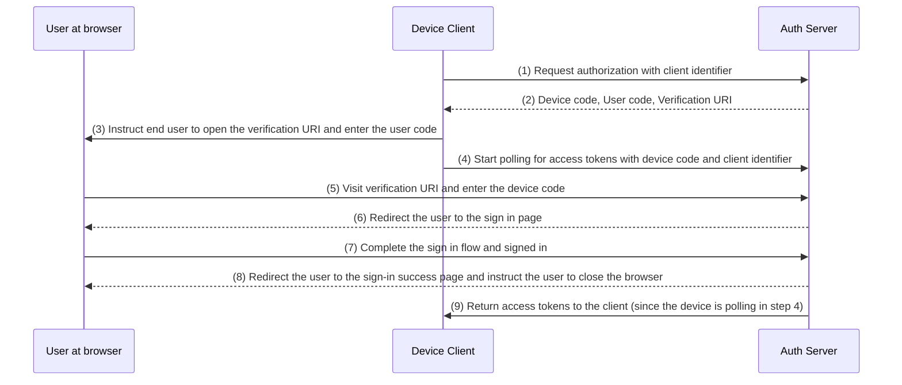

## What is device flow?

The [OAuth Device Authorization Flow](https://www.rfc-editor.org/rfc/rfc8628), also known as Device Flow, is an [OAuth 2.0](https://oauth.net/2/) implementation designed for devices with limited input capabilities (e.g., smart TVs, IoT devices, game consoles) or headless apps (e.g., CLI tools). It allows users to initiate authorization requests on these devices and then complete the process using a more input-capable device like a smartphone or laptop.

## When to use device flow?

1. **Input-constrained devices**
    - Signing in on Smart TVs (e.g., media apps)
    - Signing in on Game Consoles (e.g., game system or media apps)
    - Signing in on Meet Devices (e.g., official apps or video meeting apps)
    - Signing in on Wearable Devices (e.g., smartwatches with limited input)
    - Accessing  IoT devices (e.g., printers, video encoders, or speaker)
2. **Headless applications**
    - Command-Line Interface login (e.g., GitHub CLI or Stripe CLI)
3. **QR Code Login for Desktop Applications**
    - Quickly and securely sign in to desktop applications by scanning a QR code with your smartphone (e.g., Telegram, Steam sign-ins on desktop). This QR code sign-in flow can be considered as a variant of traditional OAuth 2.0 device flow.

## What does device flow end-user flow look like?

Ignoring the QR code sign-in variant, let’s focus on the standard OAuth 2.0 device flow. There are two types of devices involved:

### **Device code display device**

This is the input-limited device or headless application where the user needs to authorize access. It displays the [Device code](/#what-does-device-flow-workflow-look-like) and [Verification URL](/#what-does-device-flow-workflow-look-like), guiding the user on how to proceed.

The basic UI is:


To enhance the user experience, services often generate a QR code for the Verification URL:


For even more efficiency, replace the QR code resource in the `verification_uri` (e.g., `https://example.com/device`) with `verification_uri_complete` (e.g., `https://example.com/device?user_code=WDJB-MJHT`), which includes the device code in the URL, helping users to pre-fill the device code into fields.

### Authorization device

Following the instructions on the sign-in target device, the user will:

1. Use another device with browser access and input capabilities to open the Verification URL. 
2. Enter the displayed device code (which might be pre-filled) and continue.
3. If there is no existing sessions on the browser, user will first sign in to the service. 
4. A consent page will prompt the users to authorize the device sign-in.
5. Finally, a successfully page will be displayed after authorization.

Here are some established products’ device flow Verification URLs for your testing:

- Log in to [Youtube on smart TVs](https://www.youtube.com/watch?v=yTcuazSy5Cs): [youtube.com/activate](http://youtube.com/activate)
- Log in to Disney+ on smart TV: [disneyplus.com/begin](http://disneyplus.com/begin)
- Log in to [Shopify on Samsun Galaxy Watch](https://www.drmare.com/spotify-music/spotify-on-galaxy-watch.html): [spotify.com/pair](https://www.notion.so/d1143f2ff2f341cf81612f8ab7131278?pvs=21)
- Log in to [Zoom on meeting devices](https://developers.zoom.us/blog/device-authorization/): [zoom.us/oauth_device](http://zoom.us/oauth_device)
- Log in to [GitHub CLI](https://docs.github.com/en/apps/oauth-apps/building-oauth-apps/authorizing-oauth-apps#device-flow): [github.com/login/device](https://github.com/login/device)
- Utilize [Google device flow](https://www.oauth.com/oauth2-servers/device-flow/user-flow/): https://www.google.com/device

## What does device flow workflow look like?

First, you should understand the parameters of device authorization response, which is used to handle the information displayed on the device code display device:

| Parameter                              | Description                                                                                                                                                                    |
| -------------------------------------- | ------------------------------------------------------------------------------------------------------------------------------------------------------------------------------ |
| `device_code`                          | The device verification code.                                                                                                                                                  |
| `user_code`                            | The end-user verification code.                                                                                                                                                |
| `verification_uri`                     | The end-user verification URI on the authorization server.  The URI should be short and easy to remember as end users will be asked to manually type it into their user agent. |
| `verification_uri_complete` (optional) | A verification URI that includes the "user_code" (or other information with the same function as the "user_code"), which is designed for non-textual transmission.             |
| `expires_in`                           | The lifetime in seconds of the "device_code" and "user_code".                                                                                                                  |
| `interval`                             | The minimum amount of time in seconds that the client SHOULD wait between polling requests to the token endpoint.  If no value is provided, clients MUST use 5 as the default. |

```jsx
{
        "device_code": "GmRhmhcxhwAzkoEqiMEg_DnyEysNkuNhszIySk9eS",
        "user_code": "WDJBMJHT",
        "verification_uri": "https://custom.domain.com/device",
        "verification_uri_complete":
            "https://custom.domain.com/device?user_code=WDJB-MJHT",
        "expires_in": 900,
        "interval": 5
      }
```

When a user use the device flow for authentication, it mainly includes the following steps:



1. The device client request authorization from the auth server with a client identifier (usually the client id on the auth server platform).
2. The auth server responds to the device client with device code, user code and verification URI.
3. The device client displays the verification URI and user code to the user in the form of text (or a QR code, etc.), instructing the user to visit the URI and enter the code.
4. At the same time as step 3, the device client start polling for access tokens with device code and client identifier from the auth server and start waiting the user to review the authorization request and complete the user authorization.
5. The user visits the verification URI hosted by the auth server, via a browser in another device, and enter the user code.
6. The auth server redirects the user to the sign-in page and instructs the user to complete signing in.
7. The user completed the sign-in flow and signed in successfully.
8. The auth server redirects the user to the sign-in success page and instructs the user to close the browser
9. At the same time as step 8, the auth server returns access tokens to the device client since the client has been polling since step 4.

After these processes, the device client will be able to obtain the access token for subsequent services!

For more details, read [RFC 8628 OAuth 2.0 Device Authorization Grant](https://datatracker.ietf.org/doc/html/rfc8628#autoid-3).

## Terms to know

- OAuth 2.0
- [Authorization code flow](./authorization-code-flow)
- [Implicit flow](./implicit-flow)

## Related resources

- RFC 8628 OAuth Device Authorization Grant: https://datatracker.ietf.org/doc/html/rfc8628
- A brief introduction to OAuth 2.0 device flow: https://blog.logto.io/a-brief-introduction-to-oauth2-device-flow
