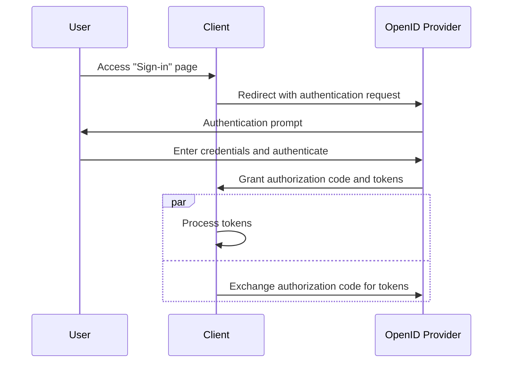

## What is hybrid flow?

The hybrid flow is an authentication process that combines the features of the <Ref slug="authorization-code-flow" /> and the <Ref slug="implicit-flow" />. It's worth noting that the hybrid flow is not part of the <Ref slug="oauth-2.0" /> specification but is an extension provided by <Ref slug="openid-connect" />.

This flow is designed to provide a balance between security and usability for user authentication. However, the hybrid flow is not recommended for new applications due to the [security considerations](#security-considerations) associated with the implicit flow. A popular alternative to the hybrid flow is to use the authorization code flow with <Ref slug="pkce" /> for better security.

## How does hybrid flow work?

Here are the main steps of the hybrid flow:

1. Similar to other OIDC flows, the hybrid flow starts by the <Ref slug="client" /> initiating an <Ref slug="authentication-request" /> to the <Ref slug="openid-connect" headingId="openid-provider-op" />.

    Note: The client should include the `response_type` parameter with the combination of `code` and at least one of `id_token` or `token`, which means there are three possible combinations:

      - `code id_token`: The client expects an authorization code and an ID token.
      - `code token`: The client expects an authorization code and an access token.
      - `code id_token token`: The client expects an authorization code, an ID token, and an access token.

    The requirement is self-explanatory: the client expects both an authorization code and one or more tokens, which map to the authorization code flow and the implicit flow, respectively.
2. The user authenticates on the <Ref slug="openid-connect" headingId="openid-provider-op" />.
3. The <Ref slug="openid-connect" headingId="openid-provider-op" /> redirects the user back to the client application with the authorization code and the requested tokens.
4. The client application processes the tokens and can use them to access protected resources on behalf of the user; it can also use the authorization code to obtain additional tokens via the <Ref slug="token-request" />.

Here's a simplified sequence diagram of the hybrid flow:



Here's a non-normative example of a hybrid flow authentication request:

```http
GET /authorize?response_type=code%20id_token
  &client_id=YOUR_CLIENT_ID
  &redirect_uri=https%3A%2F%2Fclient.example.com%2Fcallback
  &scope=openid%20profile%20email
  &nonce=123456
  &state=abc123 HTTP/1.1
Host: your-openid-provider.com
```

### Key parameters in a hybrid flow authentication request

The hybrid flow authentication request includes the following key parameters:

- **`response_type`**: The value should be a combination of `code` and at least one of `id_token` or `token`. For example, `code id_token` or `code token`.
- **`client_id`**: The client identifier issued by the <Ref slug="openid-connect" headingId="openid-provider-op" /> (authorization server).
- **`redirect_uri`**: The URI where the authorization server sends the user after the authentication process.
- **`scope`**: The requested <Ref slug="scope">scopes</Ref> (permissions) for the tokens.
- **`resource`**: The optional parameter that specifies the <Ref slug="resource-indicator" /> for the requested resources. The authorization server needs to support [RFC 8707](https://datatracker.ietf.org/doc/html/rfc8707) to use this parameter.

For the full list of parameters and their descriptions, see [Authentication using the Hybrid Flow](https://openid.net/specs/openid-connect-core-1_0.html#HybridFlowAuth).

## Security considerations

The hybrid flow includes the implicit flow, which is known for its security limitations. Tokens are still transmitted via the front channel (browser), which can expose them to potential attacks. Implicit flow will be deprecated in <Ref slug="oauth-2.1" /> due to these concerns.

<Ref slug="authorization-code-flow" /> with <Ref slug="pkce" /> is the recommended alternative to the hybrid flow. It provides a more secure way to authenticate users without exposing tokens in the front channel.

<SeeAlso slugs={["openid-connect", "oauth-2.1", "authorization-code-flow", "pkce", "implicit-flow"]} />

<Resources
  urls={[
    "https://blog.logto.io/implicit-flow-is-dead",
    "https://blog.logto.io/oauth-2-1",
    "https://openid.net/specs/openid-connect-core-1_0.html#HybridFlowAuth",
  ]}
/>
