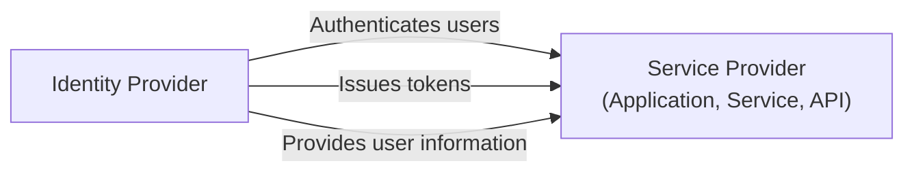
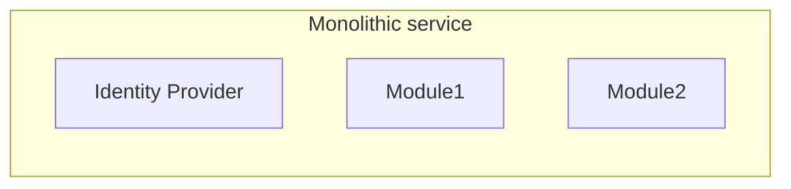
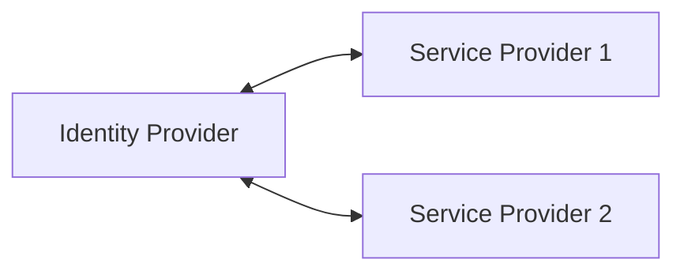

## What is an identity provider (IdP)?

In the realm of <Ref slug="iam" />, an identity provider (IdP) is the central service for managing identities. It is responsible for authenticating users, issuing identity tokens, and providing user information to <Ref slug="service-provider">service providers</Ref> (e.g., applications, services, APIs).

In addtion to <Ref slug="authentication" />, modern identity providers are also responsible for <Ref slug="authorization" /> (enforcing <Ref slug="access-control" /> policies) and supporting advanced features like <Ref slug="single-sign-on" /> and <Ref slug="multi-tenancy" />.

## Identity provider standards

Due to the nature of identity management and the need for interoperability, it will be impractical and inefficient to build identity providers without standards. Here are some typical scenarios:

- Two identity providers need to communicate with each other to exchange user information (e.g., social login).
- An application needs to authenticate users using multiple identity providers (e.g., federated identity).
- An identity provider needs to support multiple types of clients (e.g., web, mobile, IoT).

To address these scenarios, the industry has developed several popular standards for identity providers:

- <Ref slug="oauth-2.0" />: A widely used authorization framework that enables applications to obtain access on behalf of users or services.
- <Ref slug="openid-connect" />: An identity layer built on top of OAuth 2.0 that provides authentication and user information.
- <Ref slug="saml" />: A standard for exchanging authentication and authorization data between security domains.

For new applications, OpenID Connect (OIDC) is the recommended standard to use either for building an identity provider or integrating with existing identity providers.

## Identity provider architecture

The term "identity provider" does not specify a particular architecture or implementation. That is to say, an identity provider can also be a monolithic application, a microservice, or a cloud service.

Due to the complexity and criticality of identity management, modern applications tend to use specialized identity providers that are standalone services or vendor solutions.

## Identity provider features

Modern identity providers offer a wide range of features to support various use cases and requirements. Here are some common features:

- <Ref slug="authentication" />: Verify the identity of users using various methods (e.g., username/password, social login, <Ref slug="mfa" />).
- <Ref slug="authorization" />: Enforce access control policies and manage user permissions (e.g., <Ref slug="rbac" />, <Ref slug="abac" />).
- **User management**: Create, update, and delete user accounts and profiles; provide user data to <Ref slug="service-provider">service providers</Ref>.
- **Token management**: Issue and manage identity tokens (e.g., ID token, access token, refresh token).
- <Ref slug="single-sign-on" />: Enable users to authenticate once and access multiple applications.
- <Ref slug="multi-tenancy" />: Support multiple organizations or tenants with isolated user data and configurations.

<SeeAlso slugs={["service-provider", "iam", "openid-connect", "oauth-2.0"]} />

<Resources
  urls={[
    "https://blog.logto.io/secure-cloud-apps-with-oauth-and-openid-connect",
    "https://blog.logto.io/incorporate-identity-solution",
    "https://blog.logto.io/centralized-identity-system"
  ]}
/>
