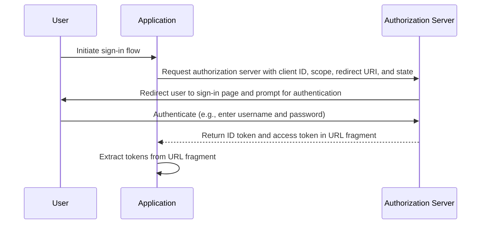

## What is implicit flow

The OIDC (OpenID Connect) Implicit Flow is an authentication process mainly used by client applications implemented in a browser using a scripting language, e.g., single-page applications (SPAs). It allows client applications to directly obtain ID tokens and access tokens from the authorization server without performing the client authentication.

## How does implicit flow work?

The main steps of the implicit flow are as follows:

1. **Sending authentication request**: The user initiates the flow by typically clicking a link or button in the application to sign in. The application sends an authentication request to authorization server's authorization endpoint. Authorization server validates the parameters and redirects the user to authenticate on the authorization server's sign-in page.
2. **User authentication**: The user authenticates on the authorization server (e.g., by entering username and password).
3. **Authorization server responds**: The authorization server returns an ID token and, if requested, an access token to the client application as URL fragment.
4. **Client processes tokens**: The client application extracts the tokens from the URL fragment.



### Authentication request

Request parameters are as follows:
- **client_id**: REQUIRED. Valid OAuth 2.0 client identifier, which is available in Logto as the application ID (or app ID).
- **scope**: REQUIRED. This value specifies a set of resources the user is requesting from the authorization server. E.g., `openid profile email`
- **response_type**: REQUIRED. The value is either `id_token` or `id_token token`. No access token is returned when the value is `id_token`.
- **redirect_uri**: REQUIRED. The URI to which the authentication response will be sent, and should exactly match the redirect URI the client pre-registered at the OpenID provider. E.g., `Sign-in redirect URI` in Logto Admin Console.
- **nonce**: REQUIRED. A random string used to mitigate replay attacks, which is passed through unmodified from the authentication request to the ID token claim.

### Example of an authentication request

```bash
curl -X GET "https://authorization-server.com/auth" \
-d "response_type=id_token token" \
-d "client_id=YOUR_APPLICATION_ID" \
-d "redirect_uri=https://yourapp.com/callback" \
-d "scope=openid profile email" \
-d "nonce=RANDOM_STRING"
```

## Limitations

The Implicit Flow was developed in a time when browsers did not widespreadly adopt Cross-Origin Resource Sharing (CORS). Therefore, sending POST requests to authorization server hosted on a different domain is prohibited.

Due to this limitation, authorization server directly returns the tokens in the URL fragment, which may expose them to the end-user and applications that have access to the end-user's User Agent.

Moreover, the client authentication is not performed in Implicit Flow, meaning that any application can pretend to be the that client requesting for authentication, as client ID is always exposed in browser based applications.

Due to the limitations above, Implicit Flow is usually considered less secure than Authorization Code Flow.

## Alternatives to implicit flow

Given the security limitations of the Implicit Flow, other flows are often recommended:
- **Authorization Code Flow**: This flow involves an additional step where the client exchanges an authorization code for tokens, providing an extra layer of security.
- **PKCE (Proof Key for Code Exchange)**: An extension to the Authorization Code Flow that adds an additional layer of security by using a code verifier and code challenge.

## Resources

- [Why you should use authorization code flow instead of implicit flow?](https://blog.logto.io/implicit-flow-is-dead)
- [OpenID Connect Core Specification](https://openid.net/specs/openid-connect-core-1_0.html#ImplicitFlow)
- [OAuth 2.0 Implicit Grant](https://tools.ietf.org/html/rfc6749#section-4.2)
- [Authorization Code Flow](https://openid.net/specs/openid-connect-core-1_0.html#CodeFlowAuth)
- [Authentication Request](https://openid.net/specs/openid-connect-core-1_0.html#AuthRequest)
