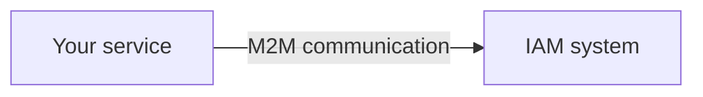
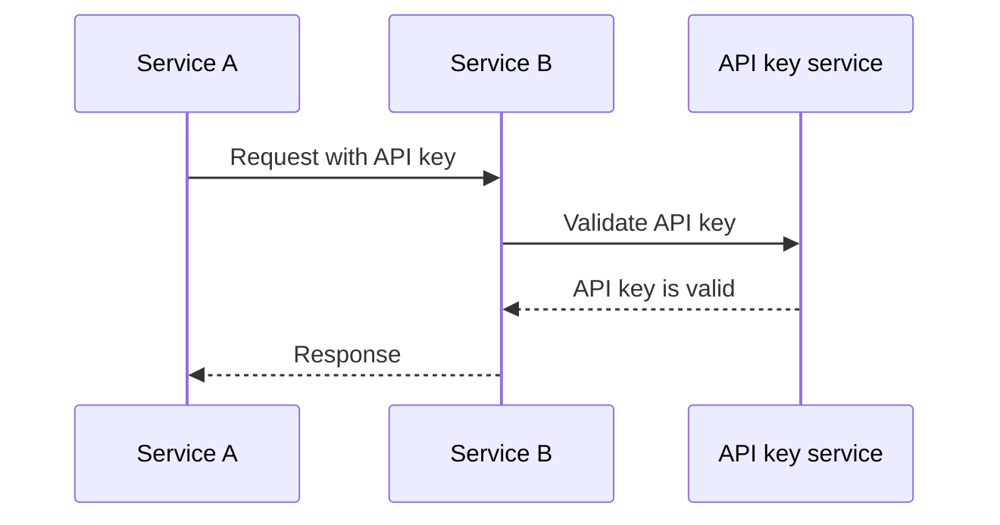
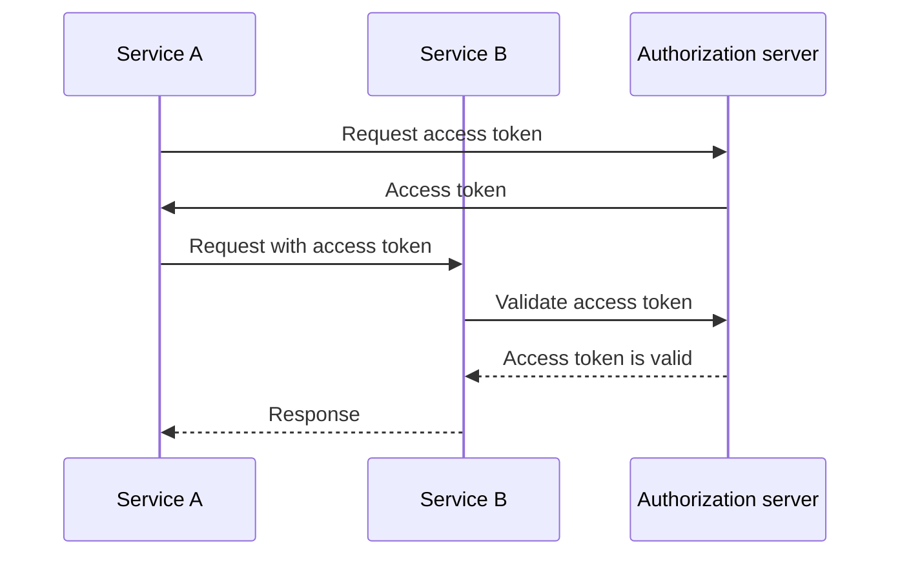
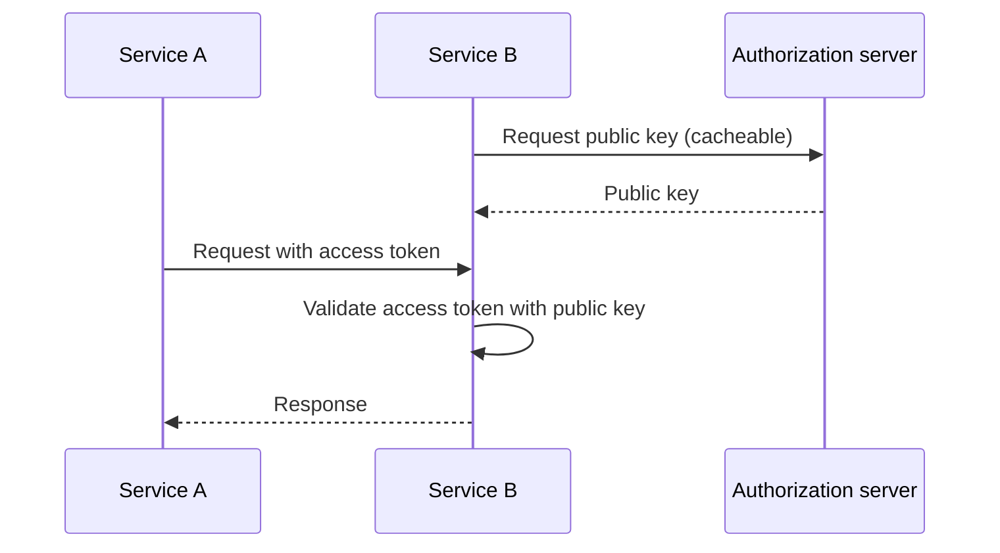

## What is machine-to-machine communication?

Machine-to-machine (M2M) communication refers to the automated exchange of data between devices without human intervention. In the context of authentication and authorization, M2M communication often involves a client application that needs to access resources, where the client application is a machine (service) or a machine acting on behalf of a user.

## Why do we need to deal with machine-to-machine communication?

When you only have one service without any dependencies, it most likely doesn't need to communicate with other services. As your system grows, or you want to integrate with an identity and access management system, you need to handle machine-to-machine communication.

However, it still looks simple - all you need to is to identify the service and authenticate it. But in reality, there are several challenges you need to address:

### 1. Authentication

How do you authenticate the service? You can't use a username and password, as there's no human to enter them. You need to use a different mechanism, such as API keys, client certificates, or OAuth client credentials.

### 2. Authorization

Once you authenticate the service, how do you determine what the service can do? You need to define the permissions and roles for the service, similar to how you define them for users. The final thing you want is to hardcode the permissions in your code.

### 3. Security

How do you ensure that the communication between services is secure? Will the credentials be updated regularly? How do you monitor and audit the communication?

### 4. Scalability

As the number of services grows, how do you manage the authentication and authorization for each service?

## The common approaches to machine-to-machine communication

With the challenges in mind, there are several common approaches in the industry:

### 1. API keys

API keys are a simple way to authenticate services. Each service can have one or more API keys, which are used for authentication (and sometimes authorization). You may see some services asking you to provide an API key in the request header, such as `X-API-Key: your-api-key`.

A non-normative example of how API keys work:

Advantages:

- Simple to implement and use.
- With safe random generation and long enough, API keys are hard to guess.
- Validation is dynamic, meaning you can revoke an API key at any time.

Disadvantages:

- Requires network communication to validate the API key.
- It's not self-contained, meaning a service is required for introspection.
- The other service has the same level of access as the service that owns the API key (it could be partially mitigated by using API gateway).
- It's hard to manage a large number of API keys across services.

### 2. OAuth client credentials

OAuth (or OIDC, since OpenID Connect is based on OAuth 2.0) client credentials is a more advanced way to authenticate services. It's based on the OAuth 2.0 framework, which is widely used for user authentication and authorization. With OAuth client credentials, a service can obtain an access token by presenting its client ID and client secret to the authorization server.

A non-normative example of how OAuth client credentials work:

Usually, the access token is a JSON Web Token (JWT), which contains information about the service and its permissions. Then the other service can validate the access token without communicating with the authorization server (as long as it has the public key to verify the JWT signature). The workflow becomes:

For more information about JSON Web Tokens, see <Ref slug="jwt" />.

Advantages (with JWT):

- Self-contained, meaning the other service can immediately know the necessary information like permissions without additional network communication.
- The access token can be short-lived, reducing the risk of misuse.
- The other service doesn't need to know the client secret, only the public key to verify the JWT signature.
- The access token can be used to audit the service's actions (e.g., which service accessed which resource).
- It's easier to manage a large number of services, as it sets a clear boundary between services and permissions.

Disadvantages:

- A little more complex to implement and use than API keys.
- If the other service only performs offline validation, it may not know if the access token is revoked.

### 3. Mutual TLS

Mutual TLS (mTLS) is a way to authenticate services using client certificates. With mTLS, each service holds a client certificate with a private key, and the other service verifies the certificate using the public key. However, mTLS focuses on the TLS layer, meaning it alone usually doesn't suit the application-level authentication and authorization.

For advanced use cases, mTLS can be combined with certificate-bound access tokens to further secure the communication. See [RFC 8705: OAuth 2.0 Mutual-TLS Client Authentication and Certificate-Bound Access Tokens](https://datatracker.ietf.org/doc/html/rfc8705) for more information.

Advantages:

- Strong authentication, as it's based on public-key cryptography.
- The communication is encrypted and secure by default.
- The client certificate can be used to identify the service, similar to how a JWT works.

Disadvantages:

- More complex to implement and manage than API keys and OAuth client credentials.
- The client certificate needs to be updated regularly.
- More technical knowledge is required to manage client certificates properly.
- The other service may not support mTLS, meaning you need to have a fallback mechanism.
