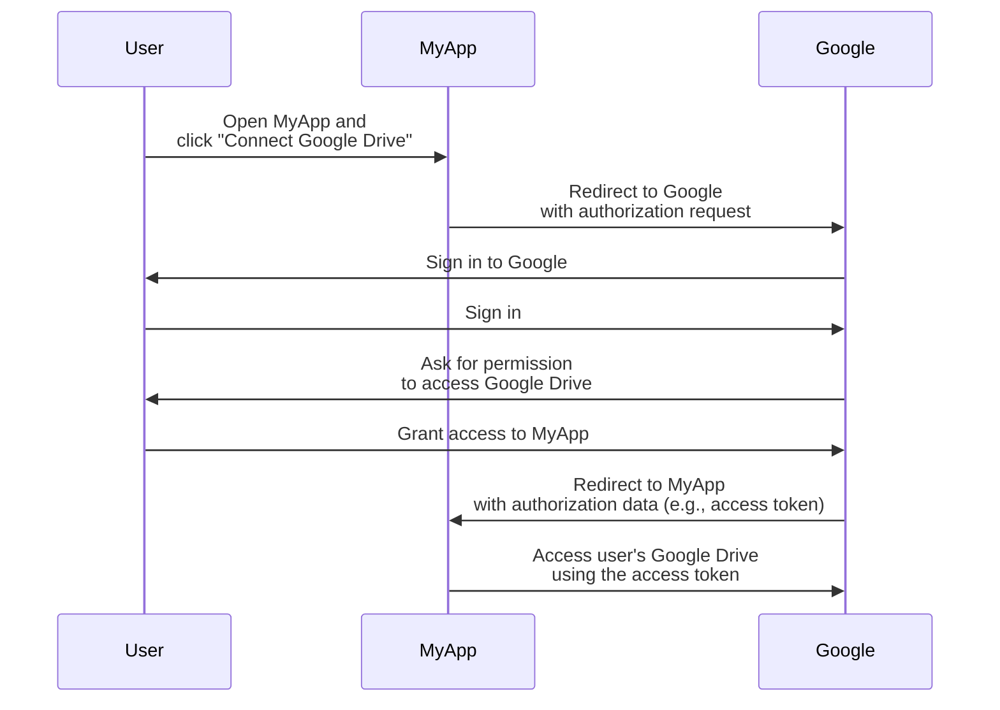
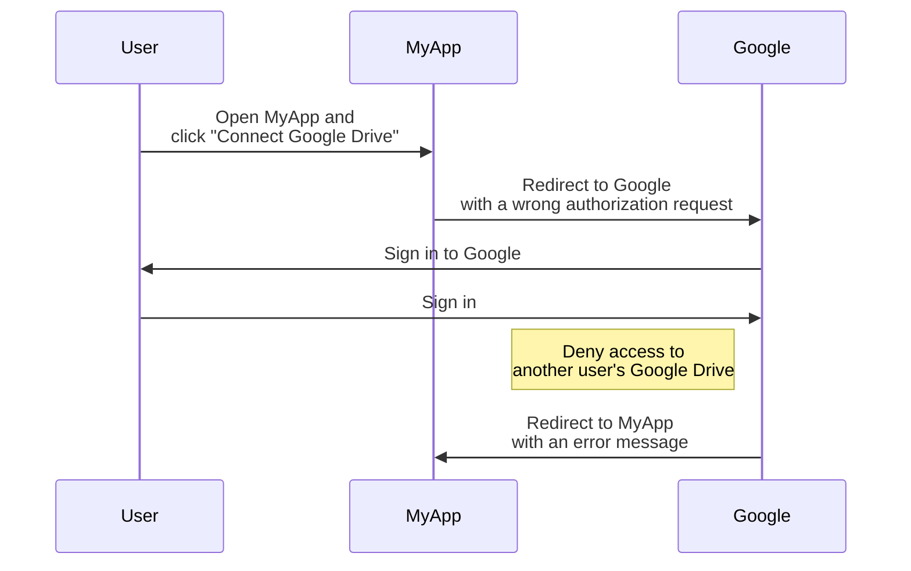
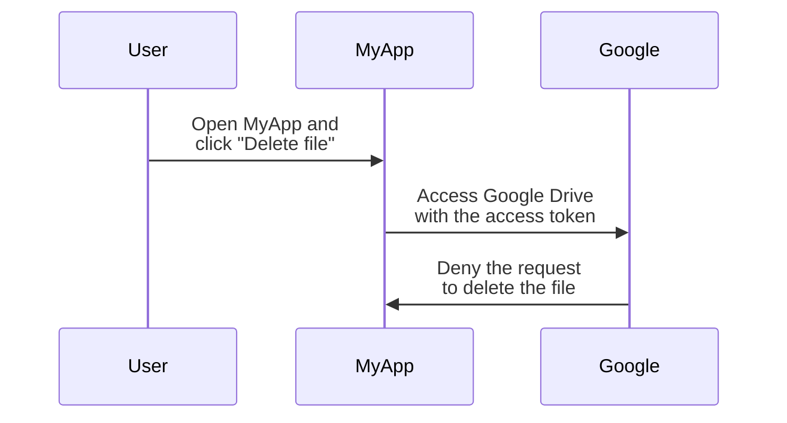

## What is OAuth 2.0?

OAuth 2.0 is the de facto standard for authorization and is widely used across the web. It allows an application to securely obtain limited access to protected resources on another application, such as a user's profile or data, without exposing credentials like passwords.

Let's see a real-world example to understand better. You have a web application MyApp that wants to access the user's Google Drive. Instead of asking the user to share their Google Drive credentials, MyApp can use OAuth 2.0 to request access to Google Drive on behalf of the user. Here's a simplified flow:

In this flow, MyApp never sees the user's Google Drive credentials. Instead, it receives an <Ref slug="access-token" /> from Google that allows it to access Google Drive on behalf of the user.

### Key components of OAuth 2.0

For the above example, MyApp is the <Ref slug="client" />, Google is both the <Ref slug="authorization-server" /> and the <Ref slug="resource-server" />, and the user is the <Ref slug="resource-owner" />. The flow involves all the key components of OAuth 2.0:

- **Client**: The application that wants to access the protected resources. "Client" and "application" are often used interchangeably.
- **Resource owner**: The user who owns the protected resources. The resource owner can grant (authorize) or deny access to the client.
- **Authorization server**: The server that performs authorization (usually with authentication) and issues access tokens to the client.
- **Resource server**: The server that hosts the protected resources. It verifies the access token and serves the protected resources to the client.

## OAuth 2.0 grants (flows)

<Ref slug="oauth-2.0-grant">Grant</Ref> builds the foundation of OAuth 2.0 and defines how the client can obtain an access token from the authorization server. The basic OAuth 2.0 specification defines four grants: 

- <Ref slug="authorization-code-flow">Authorization code grant</Ref>
- <Ref slug="implicit-flow">Implicit grant</Ref>
- [Resource owner password credentials (ROPC) grant](https://datatracker.ietf.org/doc/html/rfc6749#section-4.3)
- <Ref slug="client-credentials-flow">Client credentials grant</Ref>

Without going into the details of each grant, we can expect these grants into two categories:

- **Authorization grants**: Used when the client needs to access resources on behalf of a user, i.e., user authorization is required.
- **Client credentials grant**: Used when the client needs to access resources on its own behalf. This grant is suitable for <Ref slug="machine-to-machine" /> communication.

### Authorization grants

Regardless of the grant type, authorization grants have the following common steps:

1. The client initiates an <Ref slug="authorization-request" /> to the authorization server.
2. The authorization server authenticates the user (resource owner) and asks for permission to access the resources.
3. The user grants permission to the client.
4. The authorization server issues an access token to the client.
5. The client uses the access token to access the protected resources on the <Ref slug="resource-server" />.

Note that the exact steps and parameters may vary depending on the grant type. For example, the <Ref slug="authorization-code-flow">authorization code grant</Ref> involves more steps like code generation and exchange.

### Client credentials grant

The <Ref slug="client-credentials-flow">client credentials grant</Ref> is much simpler and doesn't involve user authorization. Here's a simplified flow:

1. The client sends a <Ref slug="token-request" /> to the authorization server.
2. The authorization server authenticates the client and issues an access token.
3. The client uses the access token to access the protected resources on the <Ref slug="resource-server" />.

---

For in-depth discussions on OAuth 2.0 grants, see <Ref slug="oauth-2.0-grant" /> and the specific grant articles.

## Access control with OAuth 2.0

OAuth 2.0 defines the <Ref slug="scope" /> parameter to specify the permissions the client is requesting. The authorization server may fully or partially ignore the requested scopes and grant access based on its own access control policies.

However, OAuth 2.0 leaves the authorization server its own discretion on how to enforce <Ref slug="access-control" />. It means the authorization server can decide what resources the subject (user or client) can access and what actions they can perform on those resources.

Let's still use the Google Drive example. MyApp may initiate an authorization request to access another user's Google Drive by mistake. In this case, Google's authorization server should deny the request because the user doesn't have the necessary permissions to access another user's Google Drive.

Another case is when MyApp receives an access token from Google that allows it to read files from the user's Google Drive. However, MyApp tries to delete a file instead of reading it. The resource server (Google) should deny the request.

Both cases demonstrate why <Ref slug="access-control" /> is required when implementing OAuth 2.0. The <Ref slug="authorization-server" /> and the <Ref slug="resource-server" /> should work together to enforce access control policies and protect the resources.

### Access control models

To properly handle access control, it is recommended to use the standard access control models like <Ref slug="rbac" /> and <Ref slug="abac" />. These models have been proven to be effective in the industry and provide the scalability for future requirements.

## OAuth 2.1

<Ref slug="oauth-2.1" /> is a proposed update to the OAuth 2.0 specification that aims to improve security and usability according to the industry experience over the years. While OAuth 2.1 is not finalized yet, we can still learn about the proposed changes and understand how they may affect the current OAuth 2.0 implementations. OAuth 2.1 can be treated as a formalization of the best practices and security recommendations that have been widely adopted in the industry.

## OAuth 2.0 and OpenID Connect (OIDC)

OAuth 2.0 only defines the authorization process and doesn't cover user authentication or identity. For this reason, <Ref slug="openid-connect" /> was introduced as an identity layer on top of OAuth 2.0. OIDC extends OAuth 2.0 to provide user authentication and identity information in the form of <Ref slug="id-token" />.

OpenID Connect extends two OAuth 2.0 grants (authorization code and implicit) to include ID tokens, and introduces a new grant called the <Ref slug="hybrid-flow">hybrid flow</Ref> that combines both.

That is to say, all your OAuth 2.0 knowledge and practices can be directly applied to OIDC; all OAuth 2.0 extensions such as <Ref slug="pkce" /> and <Ref slug="resource-indicator" /> can be used in OIDC as well.

<SeeAlso slugs={["oauth-2.0-grant", "oauth-2.1", "openid-connect"]} />

<Resources
  urls={[
    "https://blog.logto.io/secure-cloud-apps-with-oauth-and-openid-connect",
    "https://blog.logto.io/oauth-2-1",
    "https://datatracker.ietf.org/doc/html/rfc6749",
    "https://datatracker.ietf.org/doc/draft-ietf-oauth-v2-1/",
  ]}
/>
