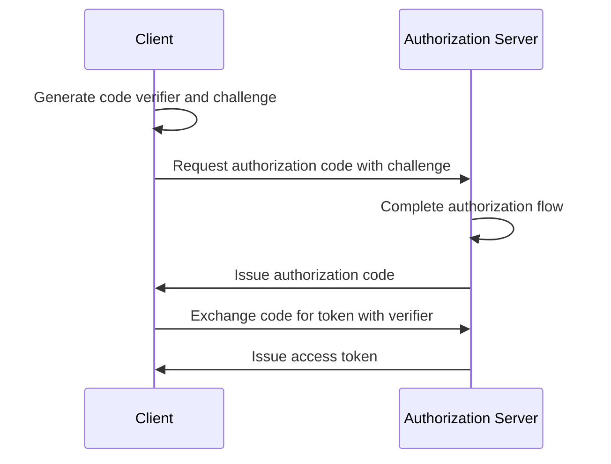

## What is OAuth 2.1?

OAuth 2.1 is a proposed update to the <Ref slug="oauth-2.0" /> authorization framework. It involves a series of changes and recommendations to the existing OAuth 2.0 specification which consolidates the best practices and security improvements that have been widely adopted in the industry over the years.

The primary updates of OAuth 2.1 are to:

1. Deprecate <Ref slug="implicit-flow">implicit grant</Ref> and [Resource Owner Password Credentials (ROPC) grant](https://datatracker.ietf.org/doc/html/rfc6749#section-4.3) due to security concerns.
2. Enforce the use of <Ref slug="pkce" /> for all clients, including <Ref slug="client" headingId="confidential-clients">confidential (private) clients</Ref>.
3. Exact matching of <Ref slug="redirect-uri">redirect URIs</Ref>.
4. Clear definition of <Ref slug="client">client</Ref> types (public and confidential clients).
5. Security requirements for <Ref slug="refresh-token">refresh tokens</Ref>.

## Deprecation of implicit grant

The implicit grant was designed for single-page applications (SPAs) and browser-based applications that cannot securely store client secrets. However, its security risks have led to its deprecation: the grant returns the access token in the front channel (URL fragment), which can be exposed to attackers through browser history and referrer headers.

OAuth 2.1 recommends using the <Ref slug="authorization-code-flow">authorization code grant</Ref> with <Ref slug="pkce" /> for browser-based applications.

## Deprecation of ROPC grant

The ROPC grant allows the client to exchange the user's credentials directly for an access token. It was designed for legacy applications that cannot support the authorization code flow. However, the grant poses security risks by:

- Exposing the user's credentials to the client.
- Bypassing the authorization server's consent screen.
- Limiting the authorization server's ability to enforce other security measures, such as <Ref slug="mfa" />.

OAuth 2.1 recommends using the <Ref slug="authorization-code-flow">authorization code grant</Ref> with <Ref slug="pkce" /> for user authentication and authorization.

## Enforcing PKCE for all clients

<Ref slug="pkce" /> is a security extension to the authorization code flow that mitigates the risk of authorization code interception attacks. It involves the client generating a code verifier and a code challenge, and the authorization server verifying the challenge during the token exchange.

Here's a simplified sequence diagram of the authorization code flow with PKCE:

It was initially recommended for <Ref slug="client" headingId="public-clients">public clients</Ref> to use PKCE, but OAuth 2.1 extends this recommendation to a mandatory requirement for all clients, including <Ref slug="client" headingId="confidential-clients">confidential (private) clients</Ref>.

## Exact matching of redirect URIs

<Ref slug="redirect-uri">Redirect URIs</Ref> are used by the client to receive authorization responses from the authorization server. OAuth 2.1 introduces a new requirement that the redirect URI used in the authorization request must match the redirect URI registered by the client with the <Ref slug="authorization-server" /> exactly, including the scheme, host, and path.

In some OAuth 2.0 implementations, the redirect URI matching was lenient, allowing partial matches or wildcard characters. However, this flexibility can introduce security risks, such as open redirect vulnerabilities.

## Clear definition of client types

OAuth 2.0 does not explicitly define client types. You may see various categorizations in the industry, such as by access level (public vs. confidential) or by application type (web app vs. mobile app). To the OAuth framework, it does not matter how the client is implemented (since they are more about the client's business attributes), but the access level makes a difference in the security requirements.

Thus, OAuth 2.1 introduces a clear definition of client types:

- <Ref slug="client" headingId="public-clients" />: Clients that CANNOT maintain the confidentiality of its credentials (e.g., SPAs, mobile apps).
- <Ref slug="client" headingId="confidential-clients" />: Clients that CAN maintain the confidentiality of its credentials (e.g., server-side web apps, native desktop apps).

## Security requirements for refresh tokens

<Ref slug="refresh-token">Refresh tokens</Ref> are long-lived tokens used by the client to obtain new access tokens without user interaction. In the mean time, they are also high-value targets for attackers. As public clients cannot securely store credentials, OAuth 2.1 specifies that the <Ref slug="authorization-server" /> should using one of the following methods to secure refresh tokens:

- Issue <Ref slug="refresh-token" headingId="sender-constrained-refresh-tokens">sender-constrained refresh tokens</Ref>.
- Use <Ref slug="refresh-token" headingId="refresh-token-rotation">refresh token rotation</Ref> to limit the usability and lifetime of refresh tokens.

## OAuth 2.1 and OpenID Connect (OIDC)

Since <Ref slug="openid-connect" /> is built on top of OAuth 2.0, the changes introduced in OAuth 2.1 also apply to OIDC. For example, all OIDC clients should use authorization code flow with PKCE for user authentication and authorization.

<SeeAlso slugs={["oauth-2.0", "authorization-code-flow", "pkce", "implicit-flow", "openid-connect"]} />

<Resources
  urls={[
    "https://datatracker.ietf.org/doc/draft-ietf-oauth-v2-1/",
    "https://blog.logto.io/oauth-2-1",
  ]}
/>
