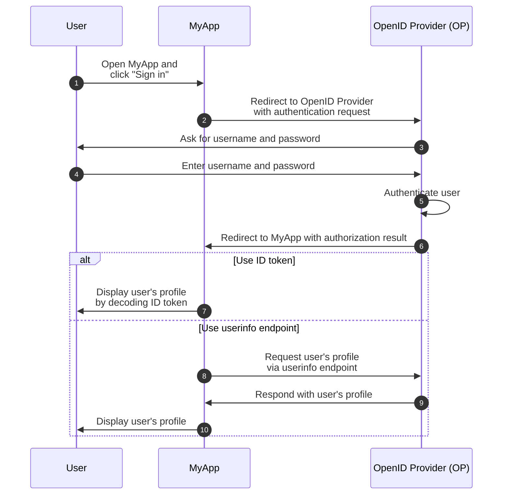
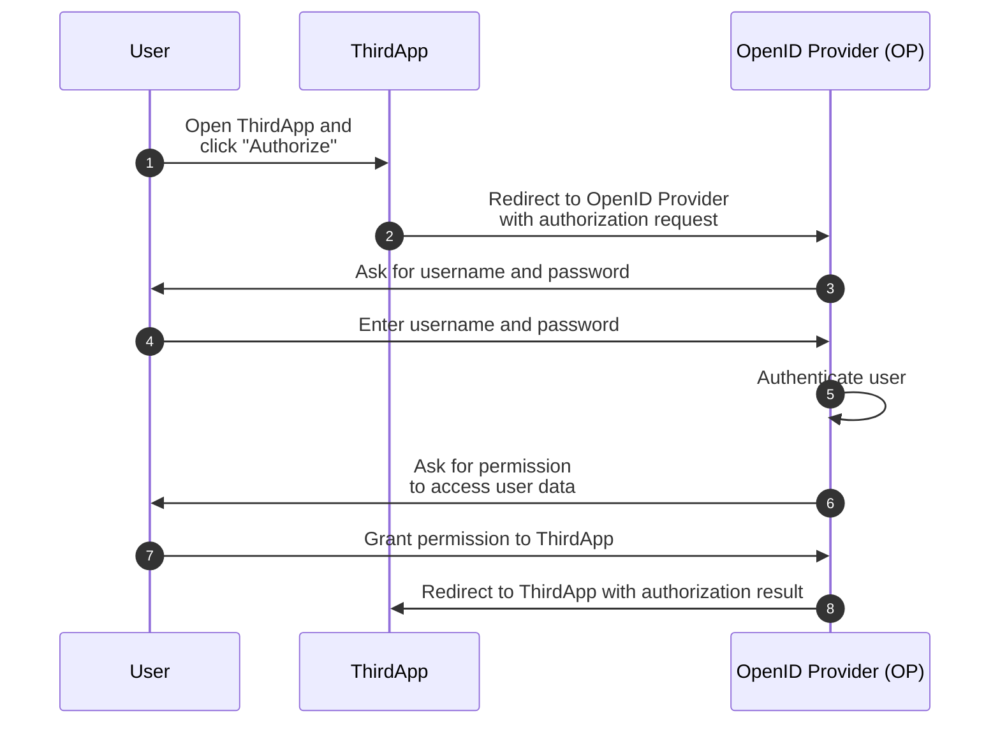

## What is OpenID Connect (OIDC)?

OpenID Connect (OIDC) adds the authentication capabilities to <Ref slug="oauth-2.0" />, an authorization framework, by introducing an identity layer on top of it. OIDC allows clients to authenticate users and obtain identity information in the form of <Ref slug="id-token">ID tokens</Ref> and <Ref slug="userinfo-endpoint" /> responses.

Let's take a look at an example. Suppose you have a web application called MyApp and users can sign in using username and password; after signing in, they can access their profile information. Here's a simplified flow:



Some terms may be new to you, so let's clarify them:

### OpenID Provider (OP)

An OpenID Provider (OP) is an <Ref slug="identity-provider" /> that implements the OIDC and OAuth 2.0 specification. That is to say, an OP is also an OAuth 2.0 <Ref slug="authorization-server" />.

OPs are responsible for authenticating users and issuing ID tokens and access tokens to clients.

### Tokens

- <Ref slug="id-token">ID tokens</Ref> are <Ref slug="jwt">JSON Web Tokens</Ref> used to represent user identity information, such as name, email, and profile picture.
- <Ref slug="access-token">Access tokens</Ref> are used to access protected resources on behalf of the user (the same as in OAuth 2.0), for example, the userinfo endpoint.

### Authentication request and result

- <Ref slug="authentication-request" /> is a request made by the client to the OP to authenticate the user. It includes parameters to specify certain requirements and will affect the authentication process.
- Depending on the authentication request, the authentication result can vary. For now, just need to know that the result carries necessary information for the client to identify the user.

### Userinfo endpoint

<Ref slug="userinfo-endpoint" /> is an OIDC-specific endpoint that allows clients to retrieve user profile information. It's an alternative to using ID tokens since the userinfo endpoint typically provides more detailed user information than the ID token.

OIDC leaves the OpenID Provider (OP) to decide what information to include in the ID token and userinfo response. So before parsing the ID token or calling the userinfo endpoint, you should check the OP's documentation to understand what information is available.

## Term differences between OAuth 2.0 and OIDC

Since OIDC is built on top of OAuth 2.0, many terms are shared between the two specifications. However, while OAuth 2.0 focuses on authorization, OIDC introduces authentication and identity, making some terms unsuitable in the context of OIDC. Here are some notable differences:

| OAuth 2.0             | OpenID Connect (OIDC)  |
|-----------------------|------------------------|
| Authorization server  | OpenID Provider (OP)   |
| Authorization request | Authentication request |
| Grant                 | Flow                   |

In essence, the above terms may point to the same subject, but they have different meanings in the context of OAuth 2.0 and OIDC:

- **OpenID Provider (OP)** is an OAuth 2.0 <Ref slug="authorization-server" /> that has the capability to authenticate users and issue ID tokens.
- **<Ref slug="authentication-request" />** is an OAuth 2.0 <Ref slug="authorization-request" /> that uses OIDC-specific parameters to request end-user authentication and obtain an ID token.
- **Flow** is a more general term used in OIDC to describe the user authentication and authorization process, which may involve multiple steps and interactions rather than a single request-response cycle. It's essentially the same as an <Ref slug="oauth-2.0-grant" />.

## OIDC flows

As the example above shows, OIDC flows are initiated by the client (e.g., MyApp) with an authentication request to the OP. The authentication request specifies the flow to use, which can be one of the following:

- **<Ref slug="authorization-code-flow" />**: The most secure and recommended flow for user authentication and authorization. <Ref slug="pkce" /> is enforced for all clients in <Ref slug="oauth-2.1" />.
- **<Ref slug="implicit-flow" />**: A simplified flow that is deprecated in OAuth 2.1 due to security concerns.
- **<Ref slug="hybrid-flow" />**: An OIDC flow that combines the authorization code flow with the implicit flow. It's also not recommended for new applications due to security concerns.

Authorization code flow and implicit flow are extended from OAuth 2.0 to include ID tokens, while the hybrid flow is an OIDC-specific flow that combines both. Click the links above to learn more about each flow.

## OIDC scopes and claims

Like OAuth 2.0, OIDC uses <Ref slug="scope" /> values to specify the permissions the client is requesting. Since <Ref slug="id-token">ID tokens</Ref> are <Ref slug="jwt">JSON Web Tokens</Ref>, they can include <Ref slug="claim">claims</Ref> (name-value pairs) that represent user identity information according to the requested scopes in the <Ref slug="authentication-request" />. Such claims are also returned in the <Ref slug="userinfo-endpoint" /> response.

OIDC defines several standard scopes and corresponding claims that clients can request in the authentication request:

- **openid**: Indicates that the client is an OIDC client and requests an ID token.
- **profile**: Requests access to the user's default profile claims, which are: `name`, `family_name`, `given_name`, `middle_name`, `nickname`, `preferred_username`, `profile`, `picture`, `website`, `gender`, `birthdate`, `zoneinfo`, `locale`, and `updated_at`.
- **email**: Requests access to the user's `email` and `email_verified` claims.
- **address**: Requests access to the user's `address` claim.
- **phone**: Requests access to the user's `phone_number` and `phone_number_verified` claims.
- **offline_access**: Requests a refresh token to allow the client to obtain new access tokens without user interaction.

Check out [Standard Claims](https://openid.net/specs/openid-connect-core-1_0.html#StandardClaims) and [Requesting Claims using Scope Values](https://openid.net/specs/openid-connect-core-1_0.html#ScopeClaims) in the OIDC specification for more information on scopes and claims. Also check <Ref slug="offline-access" /> for a detailed explanation of the `offline_access` scope.

> [!Note]
> OpenID Providers (OPs) may support additional scopes and claims beyond the standard ones. Check the OP's documentation for more details.

## Authorization in OIDC

If you're familiar with OAuth 2.0, you may notice that the above example doesn't involve any <Ref slug="authorization" /> process. The example omitted the user consent part because we assumed that MyApp is a first-party application which doesn't involve third-party access to user data. Authorization is still being enforced by the OP, but it's not explicitly shown in the flow.

The user consent part is required when a third-party client (e.g., an application that isn't owned by the OP) requests access to user data. In such cases, the OP will ask the user to grant permission to the client before issuing the ID token or access token. Let's say there's a third-party application called ThirdApp that wants to access user data:



Once the authorization process is complete and the ThirdApp receives the authorization result (usually an <Ref slug="access-token" />), it can access the user's data from the <Ref slug="resource-server" />.

See <Ref slug="oauth-2.0" /> for more information on OAuth 2.0 and authorization flows.

### Scopes

Similar to OAuth 2.0, OIDC uses <Ref slug="scope" /> values to specify the permissions the client is requesting. We've covered the standard scopes and claims in [OIDC scopes and claims](#oidc-scopes-and-claims). It's worth noting that these scopes and claims should be treated as reserved values in OIDC, which means you should NOT use them for business-specific purposes.

In practice, your OpenID Provider (OP) may support custom scopes and claims for your business needs. Consult the OP's documentation for more information on custom scopes and claims. If you don't define custom scopes and claims, the OP may directly ignore them or return an error response.

### Resource indicators

Since the framework like OIDC and the OP may reserve certain scopes and claims for specific purposes, usually the OP recommends using a prefix or namespace to avoid conflicts with reserved values when defining custom scopes and claims. For example, you can prefix your custom scopes with `myapp:` to indicate that they are specific to your application.

```json
{
  "scope": "myapp:custom_scope"
}
```

However, this cannot guarantee that your custom scopes and claims won't conflict with future reserved values, and it may bloat the token size. An OAuth 2.0 extension called <Ref slug="resource-indicator">resource indicators</Ref> provides a more flexible and scalable way to achieve the same goal. Resource indicators are URIs that represent the requested resources, and they can be the actual API endpoints to reflect the real-world resources. For example, you can use `https://api.myapp.com` as a resource indicator to represent the API resources that your client wants to access.

Again, since OIDC is built on top of OAuth 2.0, you can use resource indicators in OIDC authentication requests when it has been properly configured. Here's non-normative example of an authentication request with a resource indicator:

```http
GET /authorize?response_type=code
  &client_id=YOUR_CLIENT_ID
  &redirect_uri=https%3A%2F%2Fclient.example.com%2Fcallback
  &scope=openid%20profile
  &resource=https%3A%2F%2Fapi.example.com HTTP/1.1
Host: your-openid-provider.com
```

To use resource indicators, you need to first confirm that your OP supports this extension (RFC 8707). If supported, you should register a resource indicator URI with the OP and use it in the `resource` parameter of the authentication request.

Check out <Ref slug="resource-indicator" /> for detailed information on resource indicators.

## OIDC security considerations

### Secure communication

All communications between the client, OP, and resource server should be secured using HTTPS to prevent any eavesdropping or tampering with the data.

### Choose secure flows

When implementing OIDC, it's recommended to use:

- <Ref slug="authorization-code-flow" /> with <Ref slug="pkce" /> for user authentication and authorization (enforced in <Ref slug="oauth-2.1" />).
- <Ref slug="client-credentials-flow" /> for machine-to-machine communication.

Implicit flow and hybrid flow are deprecated due to security concerns, so avoid using them for new applications and consider migrating existing applications to more secure flows.

### ID token validation

When receiving an ID token from the OP, the client should validate the token to ensure its integrity and authenticity. The validation process should AT LEAST include the following checks:

- **Issuer**: The `iss` claim should match the OP's issuer URL.
- **Audience**: The `aud` claim should match the client's client ID.
- **Expiration**: The `exp` claim should be in the future.
- **Signature**: The token should be signed by the OP's <Ref slug="signing-key" />.

### Access token usage

Access tokens are used to access protected resources on behalf of the user. Clients should treat access tokens as sensitive information and follow these best practices:

- **Token storage**: Store access tokens securely and avoid exposing them to unauthorized parties.
- **Token expiration**: Access tokens should set a short expiration time (e.g., 1 hour) to reduce the risk of unauthorized access if the token is compromised.
- **Token revocation**: Implement token revocation mechanisms to invalidate access tokens when necessary.

### User consent

When a third-party client requests access to user data, the OP should ensure that the user is aware of the requested permissions and grants consent. The user consent process should be transparent and provide clear information about the data being accessed and how it will be used.

<SeeAlso slugs={["oauth-2.0", "authorization-code-flow", "implicit-flow", "hybrid-flow", "pkce", "resource-indicator"]} />

<Resources
  urls={[
    "https://blog.logto.io/secure-cloud-apps-with-oauth-and-openid-connect",
    "https://openid.net/specs/openid-connect-core-1_0.html",
  ]}
/>
