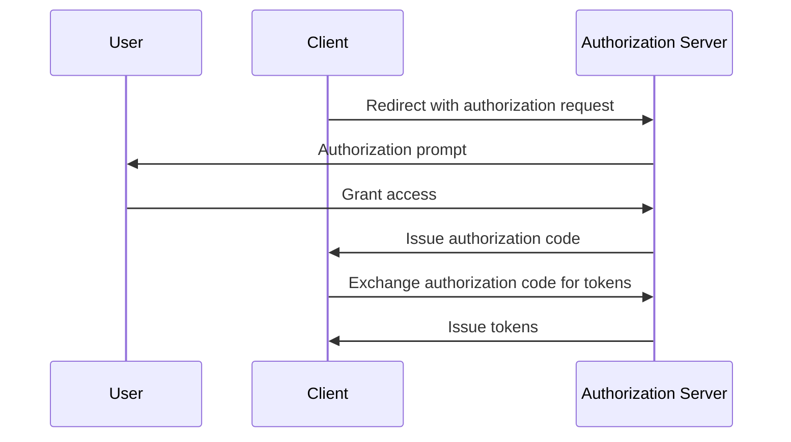

## What is Proof Key for Code Exchange (PKCE)?

Proof Key for Code Exchange (PKCE) serves as a security extension for <Ref slug="authorization-code-flow" /> in <Ref slug="oauth-2.0" />. It is designed to protect authorization codes from interception and misuse, especially in public clients where the client secret is not secure.

From <Ref slug="oauth-2.1" />, PKCE is enforced for all types of clients, including <Ref slug="client" headingId="public-clients" /> and <Ref slug="client" headingId="private-clients">private (confidential) clients</Ref>.

## How does PKCE work?

PKCE introduces a few additional steps to the authorization code flow to ensure that the <Ref slug="client" /> that exchanges the authorization code is the same client that initiated the flow.

> [!Note]
> PKCE is also applicable to <Ref slug="openid-connect" /> flows that rely on the authorization code flow. For simplicity, we will focus on the OAuth 2.0 implementation.

Let's quickly review the standard authorization code flow before diving into PKCE:



Now, let's see how PKCE enhances the authorization code flow.

### 1. Preparing the authorization request

#### 1.1. Client generates a code verifier

Before initiating the <Ref slug="authorization-request" />, the client should generate a random string called **code verifier**. The string should be a high-entropy cryptographic random URL-safe string with a minimum length of 43 characters and a maximum length of 128 characters.
  
Here's an example of generating a code verifier in JavaScript:

```javascript
// `js-base64` is a universal library that can be used in both Node.js and browsers
import { fromUint8Array } from 'js-base64';

// The second argument `true` indicates that the output should be URL-safe
const codeVerifier = fromUint8Array(crypto.getRandomValues(new Uint8Array(64)), true);
```

#### 1.2. Client creates a code challenge

The client should hash the **code verifier** using a cryptographic hash function, such as SHA-256, and encode the hash in URL-safe Base64 string. The resulting string is called the **code challenge**.

Here's an example of creating a code challenge in JavaScript:

```javascript
// `js-base64` is a universal library that can be used in both Node.js and browsers
import { fromUint8Array } from 'js-base64';

const encodedCodeVerifier = new TextEncoder().encode(codeVerifier);
const codeChallenge = new Uint8Array(await crypto.subtle.digest('SHA-256', encodedCodeVerifier));

// The second argument `true` indicates that the output should be URL-safe
return fromUint8Array(codeChallenge, true);
```

#### 1.3. Client includes the code challenge in the authorization request

When the client initiates the authorization request, it includes the parameters `code_challenge` and `code_challenge_method` in the request. The `code_challenge` parameter contains the **code challenge** generated in the previous step, and the `code_challenge_method` parameter specifies the hashing algorithm used to create the **code challenge** (e.g., `S256` for SHA-256).

The supported `code_challenge_method` values are `plain` and `S256`, where `plain` indicates that the **code challenge** is sent as-is without any hashing. Usually, `S256` is recommended for better security.

Here's a non-normative example of an authorization request with PKCE:

```http
GET /authorize?response_type=code
  &client_id=YOUR_CLIENT_ID
  &redirect_uri=https%3A%2F%2Fclient.example.com%2Fcallback
  &scope=openid%20profile
  &code_challenge=YOUR_CODE_CHALLENGE
  &code_challenge_method=S256
  &state=abc123
  &nonce=123456 HTTP/1.1
```

### 2. Exchanging the authorization code for tokens

The client should save the **code verifier** for later use and proceed with the authorization flow as usual. Once the client receives the authorization code, it should send the <Ref slug="token-request" /> with the **code verifier** to the authorization server.

Here's a non-normative example of a token request with PKCE:

```http
POST /token HTTP/1.1
Host: your-authorization-server.com
Content-Type: application/x-www-form-urlencoded

grant_type=authorization_code
  &code=YOUR_AUTHORIZATION_CODE
  &redirect_uri=https%3A%2F%2Fclient.example.com%2Fcallback
  &client_id=YOUR_CLIENT_ID
  &code_verifier=YOUR_CODE_VERIFIER
```

The authorization server will verify the **code challenge** against the **code verifier** to ensure that the client is the same entity that initiated the flow. If the verification fails, the authorization server will reject the token request.

## How PKCE enhances security

The primary security benefit of PKCE is that it prevents authorization code interception attacks, which can occur in public clients. For example, if an attacker intercepts the authorization code, they cannot exchange it for tokens without the **code verifier**. PKCE ensures that only the client that initiated the flow can complete the token exchange.

<SeeAlso slugs={['oauth-2.1', 'authorization-code-flow']} />

<Resources
  urls={[
    "https://blog.logto.io/how-pkce-protects-the-authorization-code-flow-for-native-apps",
    "https://datatracker.ietf.org/doc/html/rfc7636",
  ]}
/>
