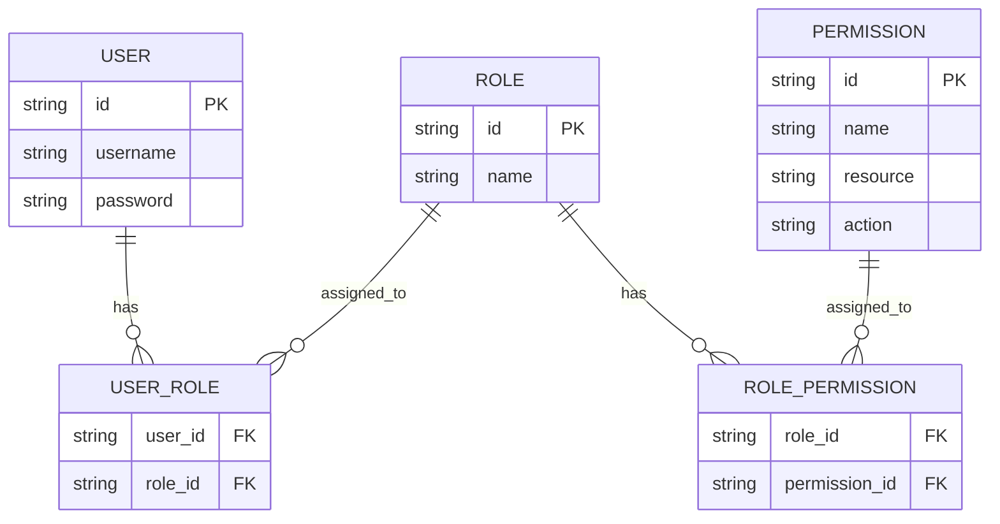
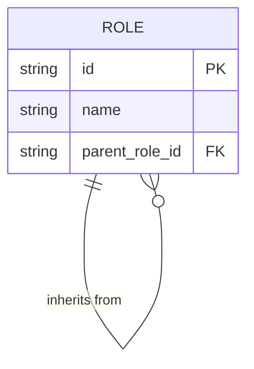
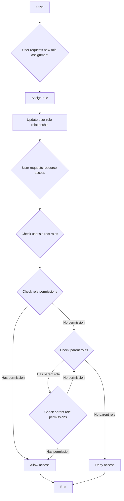
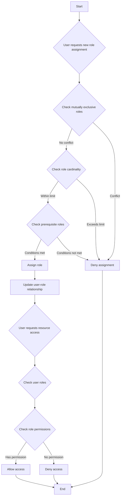

## What is role-based access control (RBAC)?

Role-based access control (RBAC) is a widely adopted access control model that introduces the concept of "roles" to decouple users from permissions, resulting in a flexible and efficient permission management system.

The core idea behind RBAC is simple yet powerful: instead of directly assigning permissions to users, permissions are assigned to roles, which are then assigned to users. This indirect method of permission allocation greatly simplifies the process of managing access rights.

### Key concepts in RBAC

The RBAC model revolves around four main elements:

1. Users: Individuals within the system, typically real people.
2. Roles: Representations of job functions or responsibilities within an organization.
3. Permissions: Authorizations to perform specific operations on particular resources.
4. Sessions: Dynamic environments where users activate certain roles.

The basic workflow of RBAC can be summarized as follows:
1. Define roles based on organizational structure or business requirements.
2. Assign appropriate permissions to each role.
3. Assign one or more roles to users based on their responsibilities.
4. When a user attempts to access a resource, the system checks if their assigned roles have the necessary permissions.

### Types of RBAC

#### RBAC0: The foundation

RBAC0 is the basic model that defines the core concepts of users, roles, permissions, and sessions. It serves as the foundation for all other RBAC models.

Key features:
- User-role association: Many-to-many relationship
- Role-permission association: Many-to-many relationship



This diagram illustrates the basic structure of RBAC0, showing the relationships between users, roles, and permissions.

Key operations:
1. Assigning roles to users
2. Assigning permissions to roles
3. Checking if a user has a specific permission

While RBAC0 provides a solid starting point, it has some limitations:
1. Role explosion: As system complexity increases, the number of roles can grow rapidly.
2. Permission redundancy: Different roles may require similar sets of permissions, leading to duplication.
3. Lack of hierarchy: It cannot represent inheritance relationships between roles.

#### RBAC1: Introducing role hierarchies

RBAC1 builds upon RBAC0 by adding the concept of role inheritance.

```plaintext
RBAC1 = RBAC0 + Role Inheritance
```

Key features:
- Role hierarchy: Roles can have parent roles
- Permission inheritance: Child roles inherit all permissions from their parent roles



This diagram shows how roles can inherit from other roles in RBAC1.

Key operations:



This flowchart illustrates the process of role assignment and permission checking in RBAC1, including the role inheritance aspect.

RBAC1 offers several advantages:
1. Reduced number of roles: Fewer base roles can be created through inheritance
2. Simplified permission management: Easier to reflect organizational hierarchies

However, RBAC1 still has some limitations:
1. Lack of constraint mechanisms: Unable to restrict users from simultaneously holding potentially conflicting roles
2. Performance considerations: Permission checks may require traversing the entire role hierarchy

#### RBAC2: Implementing constraints

RBAC2 is also based on RBAC0 but introduces the concept of constraints.

```plaintext
RBAC2 = RBAC0 + Constraints
```

Key features:
1. Mutually exclusive roles: Users cannot be assigned to these roles simultaneously
2. Role cardinality: Limits the number of users that can be assigned to a particular role
3. Prerequisite roles: Users must have a specific role before being assigned to another



This flowchart demonstrates the process of role assignment and access control in RBAC2, incorporating the various constraints.

RBAC2 enhances security by preventing excessive concentration of permissions and allows for more precise access control. However, it increases system complexity and may impact performance due to the need to check multiple constraint conditions for each role assignment.

### RBAC3: The comprehensive model

RBAC3 combines the features of RBAC1 and RBAC2, offering both role inheritance and constraint mechanisms：

```plaintext
RBAC3 = RBAC0 + Role Inheritance + Constraints
```

This comprehensive model provides maximum flexibility but also presents challenges in implementation and performance optimization.

## What are the advantages of RBAC (role-based access control)?

1. Simplified permission management: Bulk authorization through roles reduces the complexity of managing individual user permissions.
2. Enhanced security: More precise control over user permissions lowers security risks.
3. Reduced administrative costs: Modifying role permissions automatically affects all associated users.
4. Alignment with business logic: Roles often correspond to organizational structures or business processes, making them easier to understand and manage.
5. Support for separation of duties: Critical responsibilities can be separated through constraints like mutually exclusive roles.

## What are the practical implementation considerations?

When implementing RBAC in real-world scenarios, developers should consider these key aspects:

1. Database design: Utilize relational databases to effectively store and query RBAC structures.

2. Performance optimization: Implement caching strategies and optimize permission checks, especially for complex RBAC3 models.

3. API and frontend integration: Design clear APIs for managing users, roles, and permissions, and consider how to use RBAC in frontend applications.

4. Security and auditing: Ensure the security of the RBAC system itself and implement detailed logging and auditing functions.

5. Scalability: Design with future expansions in mind, such as supporting more complex permission rules or integrating with other systems.

6. User experience: Design intuitive interfaces for system administrators to easily configure and maintain the RBAC structure.

## Related resources

- [RBAC and ABAC: The access control models you should know](https://blog.logto.io/rbac-and-abac)
- [Mastering RBAC in Logto: A Comprehensive Real-World Example](https://blog.logto.io/mastering-rbac)
- [Organization and role-based access control: How to design your authorization model for your product](https://blog.logto.io/organization-and-role-based-access-control)
- [Logto Docs: Role-based access control (RBAC)](https://docs.logto.io/docs/recipes/rbac/)
- [Wikipedia: Role-based access control](https://en.wikipedia.org/wiki/Role-based_access_control)
