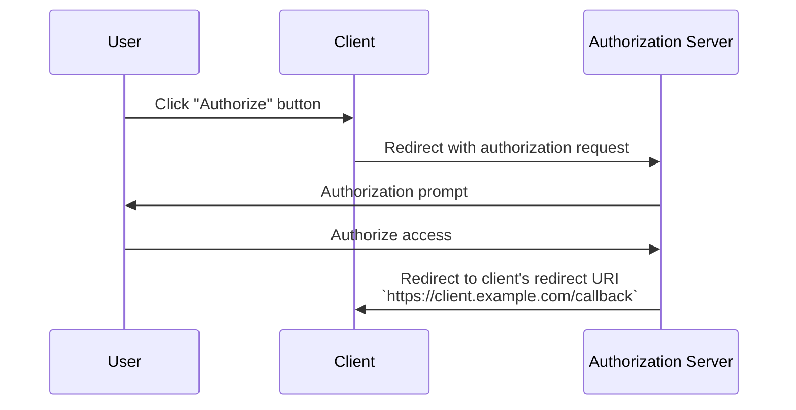

## What is a redirect URI?

A redirect URI, also known as a callback URL or redirect URL, is a URI to indicate where the <Ref slug="authorization-server" /> should redirect the user-agent after the <Ref slug="authorization-request" /> is completed.

> Universal Resource Identifier (URI) are often mixed up with URL (Uniform Resource Locator). For more information, check out [Unveiling URI, URL, and URN](https://blog.logto.io/unveiling-uri-url-and-urn).

Let's take a look at an example of an authorization request that includes a redirect URI:

```http
GET /authorize?response_type=code
  &client_id=YOUR_CLIENT_ID
  &redirect_uri=https%3A%2F%2Fclient.example.com%2Fcallback
  &scope=openid%20profile%20email
  &state=abc123
  &nonce=123456 HTTP/1.1
```

In this example, the raw value of the `redirect_uri` parameter is `https%3A%2F%2Fclient.example.com%2Fcallback`, which is URL-encoded. The actual value is `https://client.example.com/callback`.

## How does a redirect URI work?

> In the context of <Ref slug="openid-connect" />, the workflow for OAuth 2.0's <Ref slug="authorization-request" /> and <Ref slug="authorization-server" /> applies similarly. The redirect URI functions in the same manner as it does in OAuth 2.0, for both <Ref slug="authentication-request" /> and <Ref slug="openid-connect" headingId="openid-provider-op" />.

Let's say that the <Ref slug="client" /> initiates the authorization request from the URL `https://client.example.com`. After the user completes the authorization process, the authorization server will redirect the user-agent (browser) back to `https://client.example.com/callback`.



It's straightforward that the redirect URI is essential for the authorization server to redirect the user-agent back when the authorization process is complete. In addition, the redirect URI is also used to receive the authorization code or tokens, depending on the flow.

Here's a non-normative example of what the actual redirect in a <Ref slug="authorization-code-flow" /> might look like:

```http
HTTP/1.1 302 Found
Location: https://client.example.com/callback?code=AUTHORIZATION_CODE&state=abc123
```

Note that the URL parameters `code` and `state` that are appended by the authorization server are included in the redirect URI. The client needs to extract the `code` and `state` parameters from the URL to continue the authorization process.

## Why do we need a redirect URI?

As we can see in the above example, the authorization server needs to know where to redirect after a successful authorization request. It is especially useful when there are multiple clients (i.e., <Ref slug="single-sign-on" />), and each client has a different redirect URI.

With <Ref slug="authorization-code-flow" />, the redirect URI is also used to pass the authorization code back to the client, instead of using the front-channel (browser) to prevent exposing the tokens to potential attacks.

Thre was possible to use the [Resource Owner Password Credentials (ROPC) grant](https://datatracker.ietf.org/doc/html/rfc6749#section-4.3) to obtain tokens for the user without a redirect URI. However, it is deprecated in <Ref slug="oauth-2.1" /> due to security concerns.

## Security considerations

The redirect URI is a critical parameter and is a common target for attackers. Here are some security considerations to keep in mind:

- **Whitelist redirect URIs**: The client should only accept redirect URIs that are registered with the authorization server. This prevents attackers from redirecting users to malicious sites.
- **Use HTTPS**: Always use HTTPS for the redirect URI to secure the communication between the client and the authorization server.
- **Exact match**: The redirect URI should match exactly with the registered URI. Authorization servers may enforce strict matching rules that disallow broad matching patterns and 
- **State parameter**: Use the `state` parameter to prevent <Ref slug="csrf" /> attacks. The client should validate the `state` parameter to ensure it matches the value sent in the authorization request.

<SeeAlso slugs={["csrf", "oauth-2.1", "authorization-code-flow"]} />

<Resources
  urls={[
    "https://blog.logto.io/oauth-2-1",
    "https://blog.logto.io/csrf",
    "https://blog.logto.io/redirect-uri-in-authorization-code-flow",
  ]}
/>
