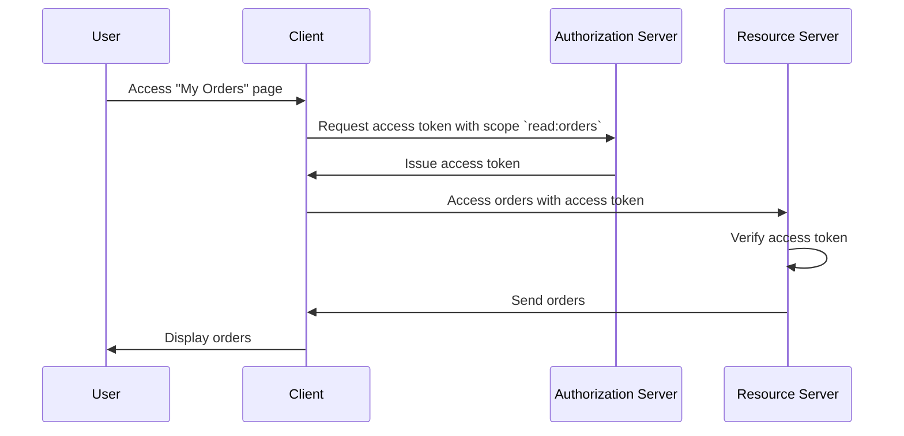

## What is a resource server?

In the context of <Ref slug="oauth-2.0" />, a **resource server** is a server that hosts the **protected resources** that the <Ref slug="client" /> wants to access. The resource server is also responsible for verifying the <Ref slug="access-token" /> and serving the protected resources to the client according to the <Ref slug="access-control" /> policies.

For example, consider a web application MyApp that wants to access the user's Google Drive. In this scenario:

- **MyApp** is the client that wants to access the protected resources.
- **Google** is the resource server that hosts the user's Google Drive.
- **Google** is also the <Ref slug="authorization-server" /> that issues the access token to MyApp.

Let's consider another example where an e-commerce website wants to access a user's order history from an internal order service. In this case:

- **E-commerce website** is the client that wants to access the protected resources.
- **Order service** is the resource server that hosts the user's order history.
- If the e-commerce website integrates with an OAuth 2.0 service or OpenID provider, that service (provider) acts as the authorization server.

## How does a resource server work?

OAuth 2.0 defines the roles of the resource server and the authorization server separately to provide a clear separation of concerns. However, it does not define a specific representation of the resource server in the framework, referring to it as a virtual concept that hosts the protected resources; the <Ref slug="client" /> needs to specify <Ref slug="scope">scopes</Ref> for the protected resources it wants to access.

Let's say the client wants to access the user's order history from the order service. A non-normative example of sending a <Ref slug="token-request" /> to access the orders might look like this:



In the above sequence diagram, the client requests an access token with the `read:orders` scope from the authorization server. We assume all the parties have aligned on the meaning of the `read:orders` scope: it specifies that the client wants to perform `read` actions on the `orders` served by the resource server. The client then uses the access token to access the orders from the resource server.

> [!Note]
> The meaning and structure of scopes are not defined by OAuth 2.0 and should be agreed upon by the client, authorization server, and resource server.

The resource server is responsible for verifying the access token and determining whether the client has the necessary permissions to access the requested resources according to the <Ref slug="access-control" /> policies. Depending on the implementation, the access token may be an <Ref slug="opaque-token" /> or a <Ref slug="jwt" />.

## Naming conventions

It is flexible to name the resource server according to the context of the application. Since OAuth 2.0 does not define a specific representation of the resource server in the <Ref slug="scope" /> parameter, you can see multiple conventions in the industry:

- Omitting the resource server name and using only the action: For example, `read` and `write`.
- `[verb]:[resource]`: A common convention is to use the `verb` and `resource` combination to specify the actions the client can perform on the resource. For example, `read:orders` and `write:profile`. Sometimes they are reversed as `orders:read` and `profile:write`.
- `[uri]:[action]`: Another convention is to use the URI of the resource and the action the client can perform. For example, `https://api.example.com/orders:read` and `https://api.example.com/profile:write`.

## Resource indicators

Let's see an example of the scope parameter in an <Ref slug="authentication-request" /> (decoded):

```plaintext
openid profile email https://api.example.com/orders:read
```

In this example, the `scope` parameter includes the `openid`, `profile`, and `email` scopes, which are <Ref slug="openid-connect" /> standard scopes, along with the `https://api.example.com/orders:read` scope that specifies the resource server's location and the permission to read the resources.

It looks okay in this specific case, but as the number of resources and scopes grows, it can become challenging to manage and understand the scopes. To address this issue, OAuth 2.0 introduced an extension called <Ref slug="resource-indicator">resource indicators</Ref> (RFC 8707) that allows clients to use URIs to specify the resources they want to access, making resource servers more explicit in the process.

After adding a resource indicator parameter to the authentication request (`resource=https://api.example.com/orders`), the scope parameter can be simplified to:

```plaintext
openid profile email read
```

Which looks cleaner and is easier to manage.

> [!Note]
> Not all authorization servers (OpenID providers) support the resource indicator extension. Please double check your authorization server's documentation before using it.

<SeeAlso slugs={["access-control", "resource-indicator", "resource-owner", "client"]} />

<Resources
  urls={[
    "https://datatracker.ietf.org/doc/html/rfc8707",
  ]}
/>
