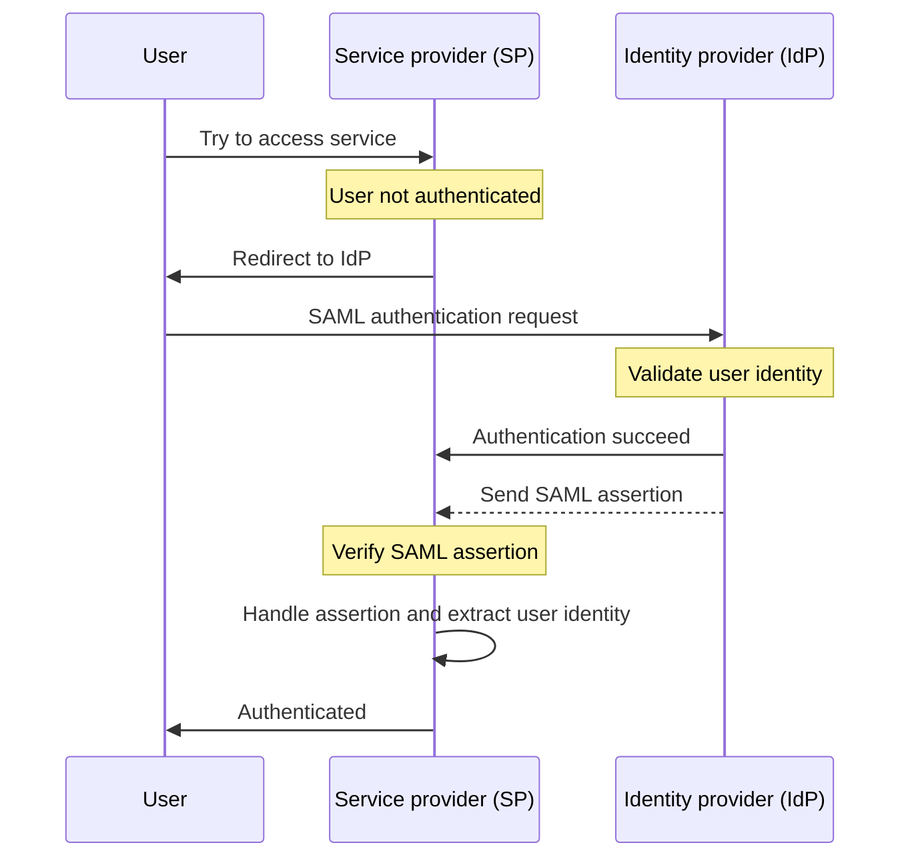

## What is SAML?

SAML (usually referred to as SAML 2.0) is an XML-based standard for exchanging authentication and authorization data between two parties: the <Ref slug="identity-provider" /> and the <Ref slug="service-provider" />. It is widely used for identity federation and <Ref slug="enterprise-sso" /> solutions.

As the name suggests, SAML conveys assertions about the user's identity and attributes. These assertions are digitally signed and optionally encrypted to ensure their integrity and confidentiality.

## How does SAML work?

Before diving into the SAML authentication flow, we need to understand how identity providers and service providers can recognize and trust each other. This trust is established through metadata exchange, where both parties share information about:

- **Entity ID**: A unique identifier for the identity provider or service provider.
- **Public key**: Used for verifying the digital signatures in SAML assertions.
- **Endpoints**: URLs for different SAML operations, such as authentication requests and responses.

Once the trust is established, the SAML authentication flow can proceed:

### RelayState

In the SAML flow, the `RelayState` parameter is used to maintain the user's state across the authentication process. It acts as a reference to the original request made by the user before being redirected to the identity provider. The service provider can use this parameter to redirect the user back to the original page or resource after successful authentication.

RelayState is also used to prevent <Ref slug="csrf" /> attacks by ensuring that the user is redirected back to the correct page after authentication.

### SAML assertions

SAML assertions are the core component of the SAML protocol. They contain information about the user's identity, attributes, and authentication status. There are three types of SAML assertions:

- **Authentication assertion**: Indicates that the user has been authenticated by the identity provider.
- **Attribute assertion**: Contains additional information about the user, such as roles, permissions, and profile data.
- **Authorization decision assertion**: Specifies the user's access rights to specific resources.

## Considerations for adopting SAML

SAML is widely adopted in enterprise environments since its inception in the early 2000s. Here are some key considerations when adopting SAML for your applications:

- Complexity: SAML implementations can be complex when integrating with your applications, especially compared to modern frameworks like <Ref slug="oauth-2.0" /> and <Ref slug="openid-connect" />.
- Transport efficiency: SAML messages can be large due to XML formatting, which may impact network performance.
- Security: SAML assertions must be protected from tampering and eavesdropping. Ensure that your SAML implementation follows best practices for encryption and digital signatures.

Despite these considerations, SAML remains a robust and widely used standard for secure identity federation and single sign-on solutions in enterprise environments. However, for new applications or services, you may want to consider modern alternatives like OAuth 2.0 and OpenID Connect for a more lightweight and developer-friendly approach to authentication and authorization.

<SeeAlso slugs={["enterprise-sso", "oauth-2.0", "openid-connect"]} />

<Resources
  urls={[
    "https://blog.logto.io/saml-security-cheat-sheet",
    "https://blog.logto.io/picking-your-sso-method",
    "https://blog.logto.io/differences-between-saml-and-oidc",
  ]}
/>
