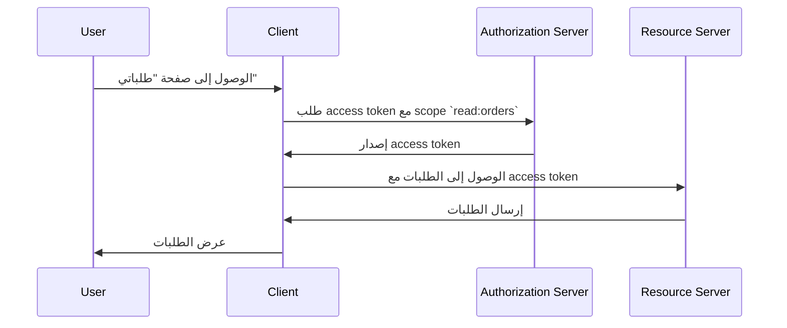

## ما هو التحكم في الوصول (Access control)؟

يتضمن التحكم في الوصول ثلاثة مكونات رئيسية:

- **Subject (الجهة المُخولة)**: كيان يقوم باتخاذ إجراءات على الموارد. يمكن أن تكون الجهات المُخولة هي المستخدمين، الخدمات، أو الأجهزة.
- **Resource (المورد)**: كيان تتم حمايته بواسطة التحكم في الوصول. يمكن أن تكون الموارد ملفات، قواعد بيانات، واجهات برمجة التطبيقات (APIs)، أو أي أصول رقمية أخرى.
- **Action (الإجراء)**: عملية يمكن للجهة المُخولة تنفيذها على المورد. يمكن أن تكون الإجراءات قراءة، كتابة، تنفيذ، أو أي عملية أخرى.

> التحكم في الوصول (Access control) يحدد التقييد الانتقائي للوصول إلى **الموارد** بناءً على **الجهة المُخولة** و **الإجراء**.

فيما يلي بعض الأمثلة الواقعية على التحكم في الوصول:

- يمكن للمستخدم (الجهة المُخولة) قراءة (الإجراء) طلباته (المورد) في نظام التجارة الإلكترونية.
- لا يمكن للمستخدم (الجهة المُخولة) حذف (الإجراء) ملف تعريف مستخدم آخر (المورد) في شبكة اجتماعية.
- يمكن لخدمة (الجهة المُخولة) كتابة (الإجراء) البيانات إلى قاعدة بيانات (المورد) في بنية الخدمات الدقيقة.

في بعض الأحيان، يتم تجاهل المورد في التنفيذات التقنية ويتم تعريف التحكم في الوصول على أنه تقييد من (الجهة المُخولة) يمكنه تنفيذ ما هي الإجراءات. على سبيل المثال، لا يحدد إطار العمل الأساسي لـ OAuth 2.0 إلا الإجراءات باستخدام scope (الأذونات) ولا يحدد الموارد.

يمكن أن يختلف الدعم للتحكم في الوصول اعتمادًا على <Ref slug="authorization-server" /> أو <Ref slug="identity-provider" />. قد تدعم بعض الأنظمة [مؤشرات الموارد لـ OAuth 2.0](https://datatracker.ietf.org/doc/html/rfc8707)، وهي امتداد لـ OAuth 2.0 يسمح للعملاء بتحديد الموارد التي يريدون الوصول إليها.

## نماذج التحكم في الوصول (Access control Models) ||access-control-models||

يعد تقرير القيود عبر عدد قليل من الجهات المُخولة والموارد أمرًا بسيطًا، ولكنه غير قابل للتوسع. لذلك، قامت الصناعة بتطوير العديد من نماذج التحكم في الوصول لإدارته بشكل فعال. في سياق <Ref slug="iam" />، فيما يلي بعض نماذج التحكم في الوصول الشائعة:

- <Ref slug="rbac" />: نموذج يخصص الأذونات للأدوار، ثم يخصص الأدوار للجهات المُخولة. على سبيل المثال، قد يكون لدى دور المسؤول حق الوصول إلى جميع الموارد، بينما قد يكون لدى دور المستخدم حق الوصول إلى موارد محدودة.
- <Ref slug="abac" />: نموذج يستخدم سمات (خصائص) الجهة المُخولة، المورد، والبيئة لاتخاذ قرارات التحكم في الوصول. على سبيل المثال، قد يكون لدى مستخدم لديه السمة "department=engineering" حق الوصول إلى موارد الهندسة.

كما يوجد نماذج أخرى للتحكم في الوصول مثل [التحكم في الوصول المستند إلى السياسات (PBAC)](https://csrc.nist.gov/glossary/term/policy_based_access_control). لكل نموذج نقاط قوته وضعفه، ويعتمد اختيار النموذج على حالتك واستخدامك والمتطلبات.

## التحكم في الوصول (Access control) في OAuth 2.0

في سياق OAuth 2.0، يتم تنفيذ التحكم في الوصول عادةً باستخدام <Ref slug="scope">scope</Ref>. عادةً ما تكون قيمة scope عبارة عن سلسلة تجمع بين المورد والإجراء. على سبيل المثال، `read:orders` أو `write:profile`.

> [!Note]
> مصطلح "scope" يمكن تبادله مع "الأذونات" في معظم الحالات.

من الجدير بالملاحظة أن OAuth 2.0 لا يحدد هيكل ومعنى scope. يتم ترك تفسير scope لـ <Ref slug="resource-server" />، ويتم ترك إصدار scope لـ <Ref slug="authorization-server" />.

على سبيل المثال، يحتاج مستخدم (الجهة المُخولة) إلى الوصول إلى طلباته (المورد) في نظام التجارة الإلكترونية. من خلال الاستفادة من OAuth 2.0، يمكنك تعريف scope `read:orders` وسيقوم تطبيق ويب (العميل) بطلب هذا scope من الخادم المصرح. وهنا تدفق مبسط:

في هذا التدفق، اعتمادًا على بنية التقنية، يمكن أن يكون خادم الموارد خدمة واجهة برمجة التطبيقات (API) أو يمكن أن يكون العميل (تطبيق الويب) نفسه طالما كان لديه القدرة على الوصول إلى المورد (الطلبات).

### معلمة مؤشر الموارد (Resource Indicator)

على الرغم من أن الأشخاص غالبًا ما يعرفون scope بالموارد والإجراء (مثل `read:orders`، حيث إن `orders` هو المورد و `read` هو الإجراء)، فإن قابلية التوسع لهذا النهج محدودة عندما ينمو عدد الموارد والإجراءات. يقدم RFC 8707 معلمة `resource` (أي <Ref slug="resource-indicator">مؤشرات الموارد</Ref>) لـ OAuth 2.0، مما يسمح للعملاء بتحديد الموارد التي يريدون الوصول إليها.

يوضح RFC أن معلمة `resource` يجب أن تكون URI تمثل المورد. على سبيل المثال، بدلاً من استخدام `orders` ببساطة، يمكنك استخدام `https://api.example.com/orders`. تساعد هذه الطريقة في تجنب التعارض في الأسماء وتعزز دقة تطابق الموارد عن طريق السماح باستخدام عنوان URL للمورد الفعلي.

### دعم خادم التفويض (Authorization Server)

لا يحدد OAuth 2.0 كيفية إجراء التحكم في الوصول من قبل خادم التفويض. يترك تفاصيل التنفيذ وفقًا لتقدير خادم التفويض. وبالتالي، يمكن أن يؤثر اختيار خادم التفويض بشكل كبير على نظام التحكم في الوصول. على سبيل المثال، قد تدعم بعض خوادم التفويض مؤشرات الموارد، بينما قد لا يدعمها البعض الآخر. من المهم تقرير النموذج الذي يجب استخدامه بناءً على متطلبات عملك، ثم اختيار خادم التفويض الذي يدعم هذا النموذج. إذا لم تكن متأكدًا من نموذج التحكم في الوصول، فإن <Ref slug="rbac" /> كافٍ في معظم الحالات.

<SeeAlso slugs={["rbac", "abac", "resource-indicator", "authorization"]} />

<Resources
  urls={[
    "https://blog.logto.io/mastering-rbac",
    "https://blog.logto.io/rbac-and-abac",
    "https://datatracker.ietf.org/doc/html/rfc8707",
    "https://blog.logto.io/organization-and-role-based-access-control",
  ]}
/>
