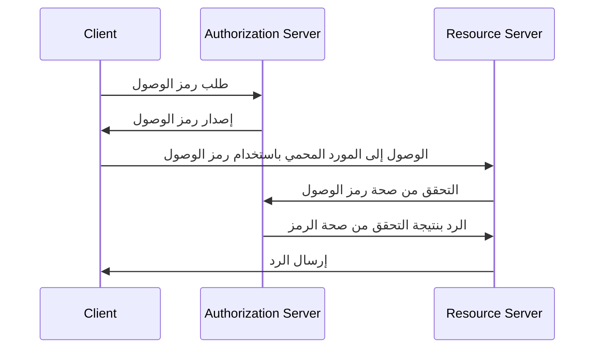
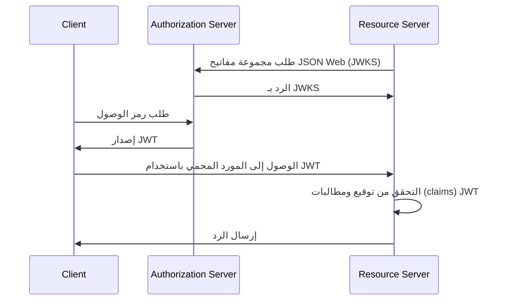
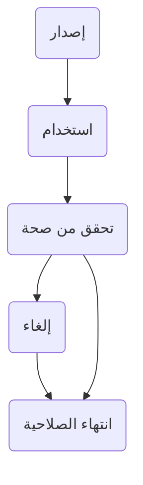

## ما هو رمز الوصول (Access token)؟

رمز الوصول (Access token) هو اعتماد، عادةً ما يكون سلسلة من الأحرف، يستخدم للوصول إلى الموارد المحمية. في سياق OAuth 2.0 و OpenID Connect (OIDC)، قد تصدر <Ref slug="authorization-server">خوادم الترخيص (authorization servers)</Ref> رموز الوصول للعملاء (التطبيقات) بعد المصادقة (authentication) والترخيص بنجاح.

على الرغم من أن المذكرات الفنية لـ OAuth 2.0 و OIDC لا تحدد تفاصيل تنفيذ رموز الوصول، فهناك نوعان شائعان من رموز الوصول المستخدمة في الواقع:

- <Ref slug="opaque-token" />: سلسلة عشوائية لا معنى لها ("غير شفافة") للعميل. يقدم العميل الرمز إلى خادم الموارد، الذي يقوم بالتحقق من صحة الرمز مع خادم الترخيص (authorization server).
- <Ref slug="jwt" />: رمز مستقل يحتوي على <Ref slug="claim">مطالبات (claims)</Ref> (مثل معرف المستخدم، وقت انتهاء الصلاحية) مع توقيع رقمي. يمكن لخادم الموارد التحقق من صحة الرمز دون تقديم طلب إضافي إلى خادم الترخيص (authorization server).

## كيف يعمل رمز الوصول (Access token)؟

وفقًا لنوع رمز الوصول (access token)، قد يختلف تدفق استخدام رمز الوصول.

إليك مثال مبسط لاستخدام رمز وصول غير شفاف (opaque token):

إليك مثال مبسط لاستخدام JWT:

الفرق بين النوعين من رموز الوصول هو كيفية تحقق خادم الموارد من صحة الرمز:

- يجب على خادم الموارد تقديم طلب إضافي إلى خادم الترخيص (authorization server) للتحقق من صحة الرمز غير الشفاف (opaque token) في كل مرة يستلم فيها الرمز.
- يمكن لخادم الموارد التحقق من صحة JWT دون تقديم طلب إضافي إلى خادم الترخيص (authorization server) لأن الرمز يحتوي على جميع المعلومات الضرورية ويمكن لخادم الموارد تخزين المفتاح العام من مجموعة مفاتيح خادم الترخيص JSON Web Key Set (JWKS).

رموز الوصول (Access tokens) عادة ما تكون قصيرة الأجل ولها وقت انتهاء صلاحية (مثل ساعة واحدة). يجب على العملاء طلب رمز وصول جديد عند انتهاء صلاحية الرمز الحالي.

## أي نوع من الرموز (token) يجب أن أستخدم؟

الاختيار بين رمز غير شفاف (opaque token) و JWT يعتمد على حالة الاستخدام ومتطلبات الأمان للتطبيق. إليك مقارنة بين النوعين من الرموز:

|                | رمز غير شفاف (Opaque Token)     | JWT                                                           |
|----------------|--------------------------------|---------------------------------------------------------------|
| الشكل          | سلسلة عشوائية                  | كائنات JSON مستقلة                                           |
| الأداء         | يتطلب طلب إضافي                | تحقق أسرع                                                    |
| مستقل          | لا                             | نعم                                                           |
| حجم الرمز      | أصغر                           | أكبر                                                          |
| الإلغاء        | فوري                           | يتطلب انتهاء صلاحية الرمز أو تفاعل خادم الترخيص              |
| قابلية التمديد | محدود                          | مطالبات مخصصة                                                |
| بدون دولة      | لا                             | نعم                                                           |
| الأمان         | يتطلب تحقق من صحة الرمز        | يتطلب تحقق من صحة التوقيع                                   |
| معياري         | لا                             | نعم (RFC 7519)                                                |

لمزيد من المعلومات حول اختيار بين النوعين من الرموز، راجع [Opaque token vs JWT](https://blog.logto.io/opaque-token-vs-jwt).

## أدوار خادم الترخيص (authorization server) وخادم الموارد (resource server)

في معظم الحالات، يتحمل <Ref slug="authorization-server" /> المسؤوليات التالية:

- إصدار رموز الوصول للعملاء بعد المصادقة (authentication) والترخيص بنجاح. قد يقوم خادم الترخيص بتقليل النطاقات (scopes) أو رفض طلب الرمز بناءً على سياسات التحكم في الوصول (access control) (مثل موافقة المستخدم، <Ref slug="rbac" />، <Ref slug="abac" />).
- التحقق مما إذا كان رمز الوصول قد تم إصداره بواسطة خادم الترخيص ولم ينته صلاحيته أو يُلغى (<Ref slug="token-introspection" />).
- تقديم المعلومات عن الرمز (مثل النطاقات، وقت انتهاء الصلاحية) عبر فحص الرمز أو <Ref slug="userinfo-endpoint" />.

يمكنك ملاحظة أن خادم الترخيص لا يفسر معنى رمز الوصول. على سبيل المثال، قد يحتوي رمز الوصول (access token) على نطاق `read:orders`، لكن خادم الترخيص لا يعرف ماذا يعني النطاق. يتحمل خادم الموارد مسؤولية تفسير رمز الوصول وفرض <Ref slug="access-control" /> بناءً على نطاقات الرمز. هذا يعني أن <Ref slug="resource-server" /> عادة ما يتحمل المسؤوليات التالية:

- التحقق من صحة <Ref slug="claim">المطالبات (claims)</Ref> في رمز الوصول (مثل وقت انتهاء الصلاحية، مؤشر المورد، النطاقات).
- فرض التحكم في الوصول (access control) بناءً على مطالبات (claims) الرمز (غالبًا النطاقات).
- تقديم الموارد المحمية إذا كان رمز الوصول صالحًا.

## دورة حياة رمز الوصول (Access token)

تشمل دورة حياة رمز الوصول عادة المراحل التالية:

<SeeAlso slugs={['opaque-token', 'jwt', 'token-introspection', 'userinfo-endpoint', 'access-control']} />

<Resources
  urls={[
    "https://blog.logto.io/opaque-token-vs-jwt",
    "https://blog.logto.io/oauth2-token-introspection",
    "https://blog.logto.io/understanding-tokens-in-oidc",
    {
      url: "https://datatracker.ietf.org/doc/html/rfc6749#section-1.4",
      result: {
        ogTitle: "OAuth 2.0 Access Token",
      },
    },
    "https://datatracker.ietf.org/doc/html/rfc7662",
  ]}
/>