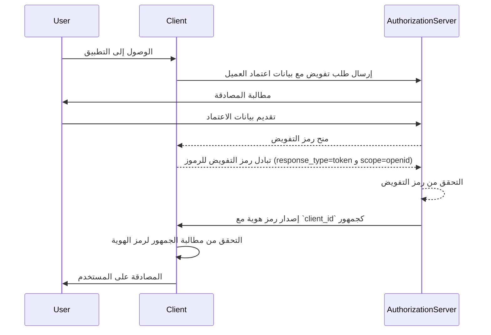
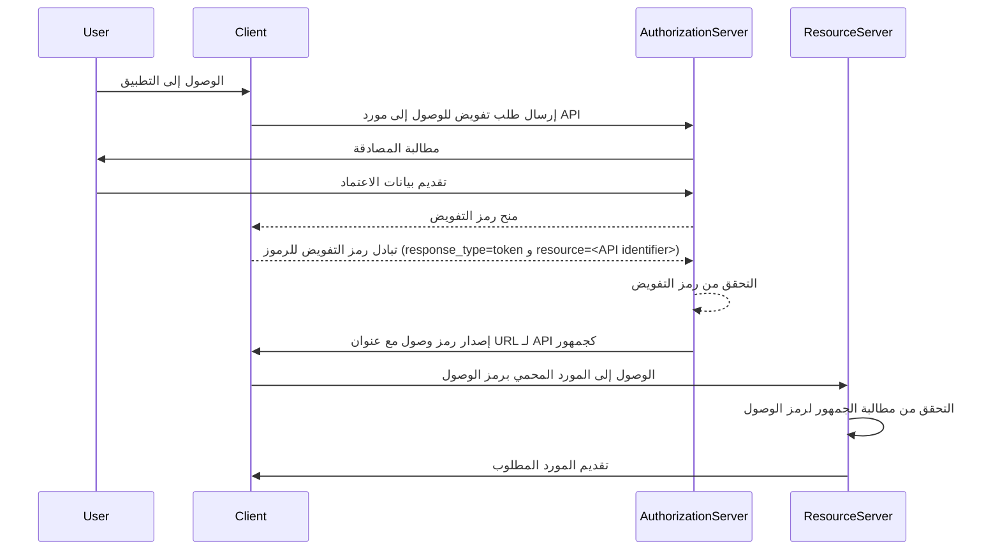

## ما هو الجمهور (Audience)؟

في سياق المصادقة (authentication) والتفويض (authorization)، يعتبر الجمهور (audience) مكونًا رئيسيًا يحدد المستلمين المقصودين لرمز تفويض. يشار إليه باسم مطالبة [aud](https://datatracker.ietf.org/doc/html/rfc7519#section-4.1.3) في <Ref slug="jwt" />، يضمن هذا الادعاء أن الرمز مميز يقبل فقط من قبل الخدمة أو التطبيق المعين. عادة، تحتوي مطالبة الجمهور (audience claim) على إما معرف العميل (client_id) للتطبيق الذي يقصد الرمز المميز له أو عنوان URL يمثل API أو المورد الذي يتم تفويض الرمز المميز للوصول إليه. عن طريق تحديد الجمهور، يعمل كعنصر تحكم أمني لمنع إساءة الاستخدام من قبل الخدمات أو المستخدمين غير المصرح لهم.

## كيف يعمل الجمهور (Audience)؟

عندما يطلب عميل رمز مميز للوصول (access token) من خادم التفويض (authorization server)، يتم تضمين مطالبة الجمهور في استجابة الرمز المميز. ثم يتم التحقق من قيمة الجمهور هذه من قبل خادم الموارد (resource server) عند تقديم الرمز المميز. يتحقق خادم الموارد مما إذا كانت مطالبة الجمهور (audience claim) في الرمز المميز تتطابق مع معرفه الخاص أو معرف الخدمة التي يحميها. إذا لم يفعل، سيتم رفض الرمز المميز، مما يعزز الأمان في الأنظمة الموزعة، لا سيما في السيناريوهات التي تتضمن عدة خدمات صغيرة (microservices) أو APIs. عن طريق التحكم في مطالبة الجمهور، يمكن للمطورين ضمان استخدام الرموز في السياق الصحيح، مما يضيف طبقة إضافية من الحماية إلى عمليات المصادقة والتفويض الخاصة بتطبيقهم.

- **الطالب**: يحدد تطبيق العميل قيمة الجمهور عند طلب الرمز المميز.
- **المرسل**: يتضمن خادم التفويض مطالبة الجمهور في استجابة الرمز المميز.
- **المحقق**: يتحقق متلقي الرمز المميز من مطالبة الجمهور لدى معرفه الخاص. إذا تطابقت مطالبة الجمهور مع معرف المستلم، يعتبر الرمز المميز صالحًا. وإلا، يتم رفضه.

## مثال على الجمهور في JWT

### مطالبة الجمهور في رمز ID لـ OpenID Connect (OIDC)

```json
{
  "header": {
    "alg": "RS256",
    "typ": "JWT",
    "kid": "abc123"
  },
  "payload": {
    "iss": "https://auth.logto.io",
    "sub": "test_user",
    "aud": "client_id_foo",
    "exp": 1516239022,
    "iat": 1516239022,
    "nonce": "n-0S6_WzA2Mj",
    "primary_email": "foo@logto.io",
    "email_verified": true,
    "username": "foo"
  },
  "signature": "..."
}
```

يعد <Ref slug="id-token" /> في OpenID Connect (OIDC) رمز أمان يحتوي على معلومات حول المستخدم الذي تم مصادقته، يتم تسليمه إلى تطبيق العميل بعد مصادقة ناجحة. على خلاف الرموز المميزة للوصول (access tokens)، التي تُستخدم لمنح الإذن للوصول إلى الموارد، تم تصميم رموز الهوية لنقل معلومات هوية المستخدم إلى الطرف المعتمد (العميل). عادة ما يتم ترميز هذه الرموز كـ JWTs (رموز ويب JSON) وتتضمن مطالب مثل معرف المستخدم (مطلب sub)، جهة الإصدار (مطلب iss)، والجمهور (مطلب aud) من بين مطالب أخرى.

في هذه الحالة، تحدد مطالبة `aud` الجمهور المقصود لرمز الهوية (ID token)، وهو تطبيق العميل. عادة ما تتوافق قيمة مطالبة `aud` مع `client_id` للتطبيق الذي طلب الرمز. عندما يتلقى تطبيق العميل رمز الهوية، يمكنه التحقق من مطالبة الجمهور لضمان إصدار الرمز لاستهلاكه. تساعد هذه الخطوة في التحقق في منع إساءة استخدام الرمز والوصول غير المصرح به إلى معلومات المستخدم، مما يعزز أمان عملية المصادقة.



### مطالبة الجمهور في رمز وصولّ

```json
{
  "header": {
    "alg": "RS256",
    "typ": "JWT",
    "kid": "abc123"
  },
  "payload": {
    "iss": "https://auth.logto.io",
    "sub": "test_user",
    "aud": "https://example.logto.app/api/users",
    "exp": 1516239022,
    "iat": 1516239022,
    "scope": "read write",
    "client_id": "client_id_foo"
  },
  "signature": "..."
}
```

على خلاف رموز الهوية، تُستخدم رموز الوصول (access tokens) لتفويض الوصول إلى الموارد المحمية، مثل APIs أو الخدمات. تحدد مطالبة `aud` في رمز الوصول المستلم المقصود للرمز، وهو في الغالب API أو الخدمة التي تم تفويض الرمز للوصول إليها. عادة، يستضيف خادم الموارد الذي يحتوي على API على مجال مختلف عن تطبيق العميل الذي طلب الرمز المميز. في هذه الحالة، بدلاً من `client_id`، تحتوي مطالبة `aud` على عنوان URL لنقطة نهاية API التي يتم توجيه الرمز المميز إليها. يُعرف هذا العنوان غالبًا باسم مؤشر المورد (resource indicator) أو معرف API الذي يحدد المورد المستهدف بشكل فريد.

عندما يتلقى خادم الموارد رمز وصول، يتحقق من مطالبة `aud` للتأكد من أن الرمز موجه للاستهلاك الخاص به. عن طريق التحقق من الجمهور، يمكن لخادم الموارد منع الوصول غير المصرح به إلى موارده وفرض سياسات التحكم في الوصول بناءً على الجمهور المقصود للرمز. يساعد هذا الآلية في حماية البيانات الحساسة وضمان استخدام رموز الوصول في السياق المناسب، مما يعزز أمان النظام بأكمله.



## الأسئلة الشائعة (FAQs)

### لماذا تعتبر مطالبة الجمهور مهمة في عملية التحقق من الرمز؟

تعتبر مطالبة الجمهور عنصرًا حيويًا في عملية التحقق من الرمز لأنها تضمن قبول الرمز فقط من قبل المستلم المقصود. عن طريق التحقق من مطالبة الجمهور، يمكن للمستلم منع إساءة استخدام الرمز والوصول غير المصرح به إلى الموارد. يعد هذا التحكم في الأمان مهمًا بشكل خاص في الأنظمة الموزعة حيث يتفاعل العديد من الخدمات مع بعضها البعض، حيث يساعد على فرض سياسات التحكم في الوصول وحماية البيانات الحساسة.

### هل يمكن أن يحتوي الرمز المميز على جمهور متعدد؟

لأسباب أمنية، يوصى بأن يحتوي الرمز المميز على جمهور واحد لمنع الغموض وضمان استخدام الرمز في السياق الصحيح. ومع ذلك، قد تحتاج بعض السيناريوهات إلى رموز مع جمهور متعدد، مثل عندما يكون الرمز موجهًا للعديد من الخدمات أو APIs ضمن نفس المجال. في مثل هذه الحالات، يجب على المطورين مراعاة تداعيات استخدام رموز متعدد الجمهور وتنفيذ تدابير أمان مناسبة لتخفيف المخاطر المحتملة.

### ماذا يجب أن أستخدم كمحدد API في مطالبة الجمهور؟

عند تحديد مطالبة الجمهور في رمز مميز للوصول (access token) يمثل API أو خدمة، يُوصى باستخدام URI مطلق يحدد المورد بشكل فريد. يمكن أن يكون هذا URI عنوان URL الأساسي لنقطة نهاية API أو مسار مورد معين سبق وأن فُوّض للرمز المميز للوصول إليه. باستخدام URI كمحدد API، يمكنك ضمان أن مطالبة الجمهور غير غامضة وتمثل بدقة المستلم المقصود للرمز.