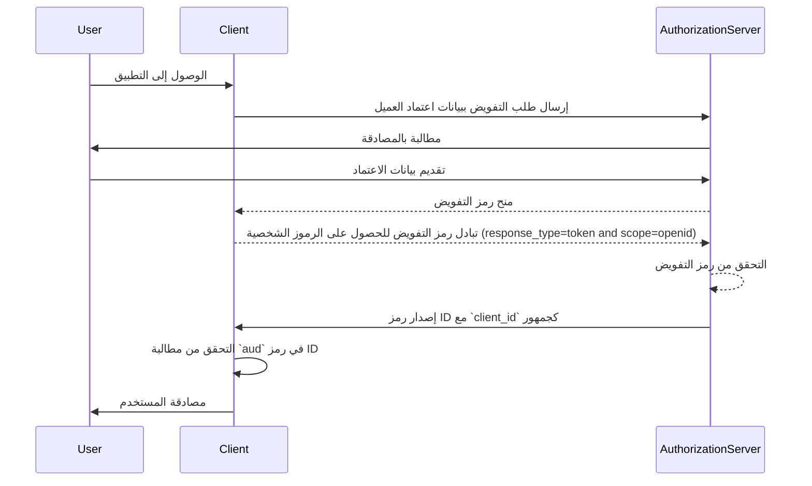
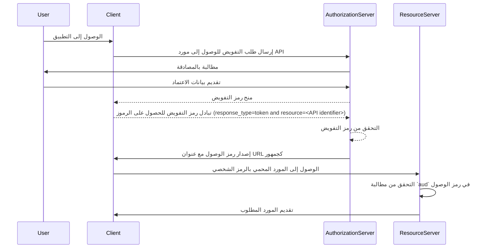

## ما هو الجمهور (Audience)؟

في سياق <Ref slug="authentication" /> و<Ref slug="authorization" />، يُعتبر الجمهور (audience) مكونًا أساسيًا يحدد المتلقين المستهدفين لرمز التفويض. يُشار إليه كمطالبة [aud](https://datatracker.ietf.org/doc/html/rfc7519#section-4.1.3) في <Ref slug="jwt" />، تضمن هذه المطالبة أن يتم قبول الرمز الشخصي فقط من قبل الخدمة أو التطبيق المعين. عادةً ما تحتوي مطالبة الجمهور على client_id للتطبيق الذي يُقصد بالرمز الشخصي أو عنوان URL يمثل API أو المورد الذي يحق للرمز الشخصي الوصول إليه. من خلال تحديد الجمهور، يعمل كتحكم أمني لمنع إساءة الاستخدام من قبل الخدمات أو المستخدمين غير المصرح لهم.

## كيف يعمل الجمهور (Audience)؟

عندما يطلب عميل <Ref slug="access-token" /> من خادم التفويض، يتم تضمين مطالبة الجمهور في استجابة الرمز الشخصي. بعد ذلك، يقوم خادم الموارد بالتحقق من قيمة الجمهور عندما يُقدم الرمز الشخصي. يقوم خادم الموارد بالتحقق مما إذا كانت مطالبة الجمهور في الرمز الشخصي تتطابق مع المعرّف الخاص به أو معرّف الخدمة التي يقوم بحمايتها. إذا لم تتطابق، سيتم رفض الرمز الشخصي، مما يعزز الأمان في الأنظمة الموزعة، خصوصًا في السيناريوهات التي تتضمن خدمات أو واجهات برمجية متعددة. من خلال التحكم في مطالبة الجمهور، يمكن للمطورين ضمان استخدام الرموز في السياق الصحيح، مضيفًا طبقة حماية إضافية لعمليات المصادقة والتفويض في تطبيقهم.

- **الطالب**: يحدد تطبيق العميل قيمة الجمهور عند طلب رمز.
- **الجهة المصدرة (Issuer)**: يتضمن خادم التفويض مطالبة الجمهور في استجابة الرمز الشخصي.
- **المُحقِّق**: يتحقق متلقي الرمز الشخصي من مطالبة الجمهور وفقًا لمعرّفه الخاص. إذا تطابقت مطالبة الجمهور مع معرّف المتلقي، يُعتبر الرمز صالحًا. وإلا، يتم رفضه.

## مثال على جمهور في JWT

### مطالبة الجمهور في رمز ID في OpenID Connect (OIDC)

```json
{
  "header": {
    "alg": "RS256",
    "typ": "JWT",
    "kid": "abc123"
  },
  "payload": {
    "iss": "https://auth.logto.io",
    "sub": "test_user",
    "aud": "client_id_foo",
    "exp": 1516239022,
    "iat": 1516239022,
    "nonce": "n-0S6_WzA2Mj",
    "primary_email": "foo@logto.io",
    "email_verified": true,
    "username": "foo"
  },
  "signature": "..."
}
```

يُعتبر <Ref slug="id-token" /> في <Ref slug="openid-connect" /> رمز أمان يحتوي على معلومات حول المستخدم المصادق عليه، تُسلم إلى تطبيق العميل بعد مصادقة ناجحة. وعلى عكس الرموز الشخصية التي تُستخدم لمنح الإذن للوصول إلى الموارد، صُممت رموز ID خصيصًا لنقل معلومات هوية المستخدم إلى الطرف المعتمد (العميل). عادةً ما تُشفّر هذه الرموز كـ JWTs وتحتوي على مطالبات مثل موصل تعريف المستخدم (مطالبة sub)، الجهة المصدرة (مطالبة iss)، والجمهور (مطالبة aud) وغيرها.

في هذه الحالة، تحدد مطالبة `aud` الجمهور المستهدف لرمز ID، وهو تطبيق العميل. عادةً ما تتوافق قيمة مطالبة `aud` مع `client_id` للتطبيق الذي طلب الرمز. عندما يستقبل تطبيق العميل رمز الـ ID، يمكنه التحقق من مطالبة الجمهور لضمان أن الرمز قد أُصدر لاستهلاكه. تساعد هذه الخطوة في التحقق من منع إساءة استخدام الرمز والوصول غير المصرح به إلى معلومات المستخدم، مما يعزز أمان عملية المصادقة.



### مطالبة الجمهور في رمز الوصول (access token)

```json
{
  "header": {
    "alg": "RS256",
    "typ": "JWT",
    "kid": "abc123"
  },
  "payload": {
    "iss": "https://auth.logto.io",
    "sub": "test_user",
    "aud": "https://example.logto.app/api/users",
    "exp": 1516239022,
    "iat": 1516239022,
    "scope": "read write",
    "client_id": "client_id_foo"
  },
  "signature": "..."
}
```

على عكس رمز ID، تُستخدم <Ref slug="access-token" /> لتفويض الوصول إلى الموارد المحمية، مثل واجهات برمجة التطبيقات (APIs) أو الخدمات. تحدد مطالبة `aud` في رمز الوصول الجهة المستقبلة المقصودة للرمز، والتي تكون عادةً API أو الخدمة التي يُصرح للرمز الشخصي بالوصول إليها. عادةً، يكون لدى خادم الموارد الذي يستضيف API مجال مختلف عن تطبيق العميل الذي طلب الرمز. في هذه الحالة، بدلاً من `client_id`، تحتوي مطالبة `aud` على عنوان URL لنقطة نهاية API التي يستهدفها الرمز. يُعرف هذا العنوان غالبًا بمؤشر المورد أو معرف API الذي يحدد المورد المستهدف بشكل فريد.

عندما يستقبل خادم الموارد رمز الوصول، يتحقق من مطالبة `aud` لضمان أن الرمز مخصص لاستهلاكه. من خلال التحقق من الجمهور، يمكن لخادم الموارد منع الوصول غير المصرح به إلى موارده وفرض سياسات التحكم في الوصول بناءً على الجمهور المقصود للرمز. يساعد هذا النظام في حماية البيانات الحساسة وضمان استخدام رموز الوصول في السياق المناسب، مما يعزز أمن النظام بأكمله.



## الأسئلة الشائعة

### لماذا تُعد مطالبة الجمهور مهمة في التحقق من الرموز؟

تُعد مطالبة الجمهور مهمة في التحقق من الرموز لأنها تضمن أن يُقبل الرمز الشخصي فقط من قبل الجهة المستقبلة المقصودة. من خلال التحقق من مطالبة الجمهور، يمكن للمتلقي منع إساءة استخدام الرمز والوصول غير المصرح به إلى الموارد. يُعتبر هذا التحكم الأمني مهمًا بشكل خاص في الأنظمة الموزعة حيث تتفاعل عدة خدمات مع بعضها البعض، حيث يساعد في فرض سياسات التحكم في الوصول وحماية البيانات الحساسة.

### هل يمكن أن تحتوي الرموز على عدة جماهير؟

لأسباب أمنية، يُوصى بأن يحتوي الرمز الشخصي على جمهور واحد لمنع الغموض وضمان استخدام الرمز الشخصي في السياق الصحيح. ومع ذلك، قد تتطلب بعض السيناريوهات رموزًا بأكثر من جمهور، مثل عندما يُقصد بالرمز عدة خدمات أو APIs ضمن نفس المجال. في مثل هذه الحالات، يجب على المطورين التفكير بعناية في تداعيات استخدام الرموز متعددة الجمهور وتنفيذ الإجراءات الأمنية المناسبة للتخفيف من المخاطر المحتملة.

### ماذا يجب أن أستخدم كمحدد لـ API في مطالبة الجمهور؟

عند تحديد مطالبة الجمهور في رمز الوصول الذي يمثل API أو خدمة، يُوصى باستخدام URI مطلق يحدد المورد بشكل فريد. يمكن لهذا URI أن يكون عنوان URL الأساسي لنقطة نهاية API أو مسار مورد محدد يحق للرمز الشخصي الوصول إليه. من خلال استخدام URI كمحدد API، يمكنك التأكد من أن مطالبة الجمهور غير غامضة وتمثل بدقة المتلقي المقصود للرمز.