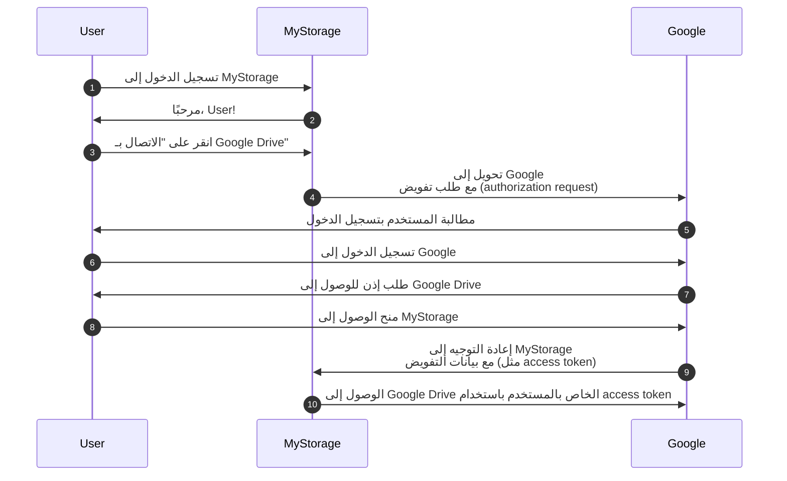

## توضيح (Auth)

هذه الصفحة توضيح لمصطلح "auth". غالبًا ما يُستخدم كاختصار لـ:

- <Ref slug="authentication" />: عملية التحقق من ملكية الهوية (مثل المستخدم أو الخدمة). يجيب عن السؤال "ما هي الهوية التي تملكها؟"
- <Ref slug="authorization" />: عملية تحديد ما هي الإجراءات التي يمكن للهوية تنفيذها على المورد. يجيب عن السؤال "ماذا يمكنك أن تفعل؟"

> [!Note]
> أحيانًا، تُعرف المصادقة (authentication) والتفويض (authorization) بـ "AuthN" و "AuthZ" على التوالي.

هذان المفهومان كلاهما ضروري في مجال <Ref slug="iam" />، ولكنهما مختلفان أساسًا. لنرى مثالاً: تطبيق الويب MyStorage لديه القدرة على تحميل الملفات والاتصال بـ Google Drive. ستكون عملية المستخدم النموذجية كما يلي:

في هذا التسلسل، يقوم المستخدم بخطوتين من المصادقة (authentication): واحدة مع MyStorage (الخطوة 1) وأخرى مع Google (الخطوة 6)؛ وخطوة واحدة من التفويض (authorization): منح الوصول إلى Google Drive (الخطوة 8).

## ماذا تقصد؟

عندما ترى مصطلح "auth"، من المهم توضيح ما إذا كان يشير إلى المصادقة (authentication) أو التفويض (authorization)؛ وإلا، قد تتوقع أن يتم تغطية كلا العمليتين (تمامًا كما تفعل هذه الصفحة).

<SeeAlso slugs={["authentication", "authorization", "iam", "oauth-2.0", "openid-connect"]} />
