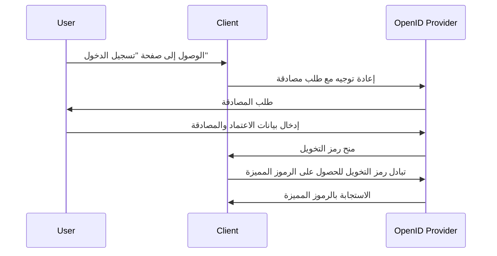

## ما هو طلب المصادقة (authentication request)؟

بينما يمكن أن يختلف معنى طلب المصادقة (authentication request) تبعاً للسياق، سوف نركز على التعريف في مواصفة OpenID Connect (OIDC). في OIDC، طلب المصادقة هو <Ref slug="authorization-request" /> إلى الخادم التخويلي لمصادقة المستخدم.

يبدو التعريف القياسي مربكاً للغاية لأن مصطلحات مشابهة، مثل "طلب التخويل (authorization request)"، تُستخدم. يعود السبب في ذلك إلى أن OIDC تم بناؤه فوق OAuth 2.0 المصمم أساساً للتخويل، وترث OIDC مصطلحات OAuth 2.0 وتوسعها لدعم المصادقة.

لتوضيح ذلك، دعونا نضيف بعض السياق إلى التعريف:

> طلب المصادقة (OpenID Connect) هو طلب تخويل (OAuth 2.0) إلى الخادم التخويلي (OpenID Connect) لمصادقة المستخدم.

يصبح أطول! الآن دعونا نزيل كل الأقواس:

> طلب المصادقة هو طلب إلى الخادم لمصادقة المستخدم.

بعد إزالة جميع السمات، يصبح التعريف مباشراً. هنا تفصيل المصطلحات:

- **طلب المصادقة**: المصطلح من مواصفة OIDC.
- <Ref slug="authorization-request" />: المصطلح من مواصفة OAuth 2.0. تعيد OIDC استخدام المواصفة وتوسعها.
- <Ref slug="authorization-server" />: المصطلح من مواصفة OAuth 2.0. تستخدم OIDC أيضاً المصطلح <Ref slug="openid-connect" headingId="openid-provider-op" /> للإشارة إلى نفس الكيان القادر على مصادقة المستخدمين.

في الأقسام التالية، سوف نستخدم "مزود OpenID (OP)" للإشارة إلى الخادم التخويلي الذي يدعم OIDC.

## كيف يعمل طلب المصادقة (authentication request)؟

عندما يريد تطبيق العميل مصادقة مستخدم، فإنه يبدأ بطلب مصادقة (authentication request) إلى مزود OpenID (OP). كما ذكرنا سابقاً، طلب المصادقة أيضاً هو طلب التخويل في OAuth 2.0؛ لذلك يمكن استخدام أنواع منح OAuth 2.0 معينة لإكمال عملية المصادقة.

تعريف OIDC ثلاثة أنواع منح (تدفقات) لدعم المصادقة:

1. <Ref slug="authorization-code-flow" />: تدفق المصادقة الأكثر توصيلاً. يتم استخدامه عادة مع <Ref slug="pkce" /> لأفضل أمان ومناسب لمعظم التطبيقات.
2. <Ref slug="implicit-flow" />: تدفق مبسط تم إخراجه من الاستخدام في <Ref slug="oauth-2.1" /> بسبب مخاوف أمنية.
3. <Ref slug="hybrid-flow" />: مزيج من تدفق رمز التخويل وتدفق مبسط.

طلب المصادقة هو الخطوة الأولى في تدفق المصادقة لـ OIDC. المعايير الفعلية التي يجب تضمينها والخطوات التي يجب اتباعها تعتمد على التدفق الذي تختاره. انقر على أسماء التدفقات أعلاه لمعرفة المزيد عن كل تدفق.

إليك مثال مبسط لطلب مصادقة باستخدام تدفق رمز التخويل:

بمجرد أن يتلقى العميل الرموز المميزة، يمكنه استخدامها (مثل <Ref slug="access-token" />) للوصول إلى الموارد المحمية (مثل API) نيابة عن المستخدم.

### المعايير الرئيسية في طلب المصادقة

إليك بعض المعايير الرئيسية في طلب المصادقة:

- **`response_type`**: نوع الاستجابة التي يتوقعها العميل من خادم التخويل. يمكن أن تكون `code` لتدفق رمز التخويل، `id_token` لتدفق مبسط، أو `code id_token` لتدفق هجينة.
- **`client_id`**: معرف العميل الصادر عن مزود OpenID (OP).
- **`redirect_uri`**: URI الذي سيتم فيه إعادة توجيه وكيل المستخدم بعد طلب المصادقة.
- **`scope`**: النطاقات <Ref slug="scope">المرغوبة</Ref> (الأذونات) لـ <Ref slug="id-token" /> و<Ref slug="access-token" />.
- **`resource`**: المعيار اختياري يحدد <Ref slug="resource-indicator" /> للموارد المطلوبة. يحتاج خادم التخويل لدعم [RFC 8707](https://datatracker.ietf.org/doc/html/rfc8707) لاستخدام هذا المعيار.

لاحظ أن المعايير أعلاه ليست شاملة. قبل إجراء طلب مصادقة، يجب أن تشير إلى القائمة الكاملة للمعايير للتدفق المحدد الذي تستخدمه.

<SeeAlso slugs={["openid-connect", "oauth-2.0", "authorization-code-flow", "implicit-flow", "hybrid-flow"]} />

<Resources
  urls={[
    "https://openid.net/specs/openid-connect-core-1_0.html",
  ]}
/>