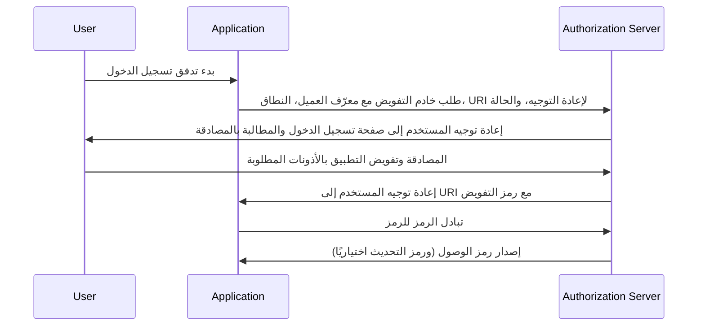

## ما هو تدفق رمز التفويض (Authorization code flow)؟

تدفق رمز التفويض (authorization code flow) (المعروف أيضًا باسم تفويض الرمز الرمزي)، معرف في [OAuth 2.0 RFC 6749، القسم 4.1](https://datatracker.ietf.org/doc/html/rfc6749#section-4.1)، هو آلية تفويض OAuth 2.0 مستخدمة على نطاق واسع تتيح للتطبيقات الحصول على رمز وصول (access token) نيابة عن المستخدم. هذا التدفق مناسب بشكل خاص للتطبيقات السرية (مثل تطبيقات الويب التقليدية التي تعمل على الخوادم) حيث يمكن حماية سر العميل بشكل آمن.

يعتبر تدفق رمز التفويض طريقة قوية وآمنة للحصول على رموز الوصول في OAuth 2.0، مما يجعله خيارًا مفضلًا للعديد من تطبيقات الويب. فهم هذا التدفق ضروري للمطورين العاملين مع OAuth 2.0 وتكاملات API.

## كيف يعمل تدفق رمز التفويض (Authorization code flow)؟

يتضمن تدفق رمز التفويض الخطوات التالية:

1. **بدء التدفق**: يبدأ المستخدم التدفق عادة بالنقر على رابط أو زر في التطبيق لتسجيل الدخول. يقوم التطبيق بإعادة توجيه المستخدم إلى نقطة الاتصال الخاصة بخادم التفويض، مع تضمين معرّف العميل (client ID)، النطاق المطلوب (scope)، URI لإعادة التوجيه، ومعامل الحالة. يتحقق خادم التفويض من صحة المعاملات ويطلب من المستخدم المصادقة على صفحة تسجيل الدخول الخاصة به.
2. **مصادقة المستخدم والتفويض (authentication and authorization)**: يصادق المستخدم مع خادم التفويض ويمنح التطبيق إذنًا للوصول إلى الموارد المطلوبة.
3. **توليد الرمز وإعادة التوجيه**: يولد خادم التفويض رمز التفويض ويعيد توجيه المستخدم إلى التطبيق باستخدام URI لإعادة التوجيه المقدم سابقًا. يتم تضمين رمز التفويض في سلسلة الاستعلام لـ URI لإعادة التوجيه.
4. **تبادل الرموز**: يستخرج التطبيق رمز التفويض من سلسلة الاستعلام ويقوم بإجراء طلب POST إلى نقطة الاتصال الخاصة بخادم التفويض لتبادل رمز التفويض برمز للوصول. يجب على التطبيق أيضًا تضمين معرّف العميل، سر العميل، URI لإعادة التوجيه، ورمز التفويض في الطلب.
5. **استرجاع رمز الوصول (access token)**: يتحقق خادم التفويض من صحة رمز التفويض ويصدر رمز وصول (ورمز تحديث اختياريًا) إلى التطبيق عند التحقق بنجاح. يمكن للتطبيق بعد ذلك استخدام رمز الوصول لإجراء طلبات API مصرح بها نيابة عن المستخدم.

يمكن توضيح الخطوات من خلال مخطط تسلسل التالي:



## طلب المصادقة (Authentication request)

معاملات الطلب كالتالي:

- **client_id**: مطلوب. معرّف عميل OAuth 2.0 صحيح.
- **scope**: مطلوب. يحدد هذا القيمة مجموعة الموارد التي يطلب المستخدم الوصول إليها من خادم التفويض. على سبيل المثال، `openid profile email`.
- **response_type**: مطلوب. يجب أن تكون القيمة `code` للدلالة على أن التطبيق يتوقع رمز تفويض.
- **redirect_uri**: مطلوب. URI الذي سيتم إرسال استجابة المصادقة إليه، ويجب أن يتطابق بالضبط مع URI لإعادة التوجيه الذي قام العميل بالتسجيل المسبق به في خادم التفويض.
- **state**: موصى به. قيمة مبهمة تُستخدم للحفاظ على الحالة بين الطلب ورد الاتصال. تُستخدم أيضًا لمنع هجمات <Ref slug="csrf" />.
- **nonce**: اختياري. سلسلة عشوائية تُستخدم لربط جلسة العميل مع رمز معرف (ID token) ولتخفيف هجمات إعادة التشغيل.
- **prompt**: اختياري. قائمة مفصولة بمسافات، حساسة لحالة الأحرف، لقيم السلسلة التي تحدد ما إذا كان خادم التفويض يطالب المستخدم النهائي بإعادة المصادقة والموافقة. القيم المحددة هي:
  - **none**: يجب على خادم التفويض ألا يعرض أي صفحات واجهة مستخدم للمصادقة أو الموافقة. يتم إرجاع خطأ إذا لم يكن المستخدم النهائي قد تمت المصادقة عليه مسبقًا أو لم يكن لدى العميل موافقة مهيأة مسبقًا للمطالبات المطلوبة أو لم يفِ بالشروط الأخرى لمعالجة الطلب. سيكون رمز الخطأ عادةً `login_required`، `interaction_required`. يمكن استخدام هذا كطريقة للتحقق من وجود مصادقة و/أو موافقة موجودة.
  - **login**: يجب على خادم التفويض مطالبة المستخدم النهائي بإعادة المصادقة. إذا لم يتمكن من إعادة مصادقة المستخدم النهائي، يجب إرجاع خطأ، عادةً `login_required`.
  - **consent**: يجب على خادم التفويض مطالبة المستخدم النهائي بالموافقة قبل إرجاع المعلومات إلى العميل. إذا لم يتمكن من الحصول على الموافقة، يجب إرجاع خطأ، عادةً `consent_required`.
  - **select_account**: يجب على خادم التفويض مطالبة المستخدم النهائي باختيار حساب مستخدم. يمكّن هذا المستخدم النهائي الذي لديه حسابات متعددة في خادم التفويض من اختيار بين الحسابات المتعددة التي قد يكون لديه جلسات حالية لها. إذا لم يتمكن من الحصول على اختيار الحساب الذي قام به المستخدم النهائي، يجب إرجاع خطأ، عادةً `account_selection_required`.

[التعريف الكامل لمعلمات الطلب](https://openid.net/specs/openid-connect-core-1_0.html#AuthRequest)

### مثال على طلب مصادقة (Authentication request example)

```bash
curl -X GET "https://authorization-server.com/auth" \
  -d "response_type=code" \
  -d "client_id=YOUR_APPLICATION_ID" \
  -d "redirect_uri=https://yourapp.com/callback" \
  -d "scope=openid profile email" \
  -d "state=RANDOM_STRING_FOR_STATE"
```

استجابة ناجحة شائعة:

```http
HTTP/1.1 302 Found
Location: https://yourapp.com/callback?
  code=YOUR_AUTHORIZATION_CODE
  &state=RANDOM_STRING_FOR_STATE
```

## طلب تبادل الرموز (Token exchange request)

بمجرد استجابة طلب المصادقة بنجاح، سيتم إعادة توجيه العميل تلقائيًا إلى URI لاستدعاء `https://yourapp.com/callback`، مع الكود كمعامل URI.

من المتوقع أن يقوم العميل بالحصول على `code` ومعالجته من خلال طلب تبادل الرموز اللاحق، للتبادل للحصول على رمز الوصول.

### مثال على طلب تبادل الرموز (Token exchange request example)

```bash
curl -X POST "https://authorization-server.com/token" \
  -H "Content-Type: application/x-www-form-urlencoded" \
  -d "client_id=YOUR_CLIENT_ID" \
  -d "code=YOUR_AUTHORIZATION_CODE" \
  -d "redirect_uri=https://yourapp.com/callback" \
  -d "grant_type=authorization_code" \
```

## الفوائد

- **تحسين الأمان**: لا يتم كشف سر العميل أبدًا للمتصفح الخاص بالمستخدم، مما يقلل من خطر انتحال هوية العميل.
- **رمز التفويض لمرة واحدة**: مدة صلاحية رمز التفويض قصيرة ويمكن استخدامه مرة واحدة فقط، مما يقلل من خطر الاعتراض وهجمات إعادة التشغيل.
- **الرموز قصيرة العمر (Short-lived tokens)**: عادة ما تكون رموز الوصول التي تم إصدارها في هذا التدفق قصيرة العمر (عادة ساعة واحدة)، مما يقلل من خطر الوصول غير المصرح به إذا تم اختراق الرمز.
- **رمز التحديث (Refresh token)**: يمكن لخادم التفويض إصدار رمز تحديث اختياريًا، مما يتيح للتطبيق الحصول على رمز وصول جديد دون الحاجة إلى تفاعل المستخدم.

## ما هو الفرق بين تدفق رمز التفويض وتدفق الضمني (implicit flow)؟

الفرق الرئيسي بين تدفق رمز التفويض وتدفق الضمني هو كيفية الحصول على رمز الوصول:

- **تدفق رمز التفويض**: يتلقى تطبيق العميل رمز التفويض أولاً من نقطة الاتصال بالتفويض، ثم يقوم بتبادله للحصول على رمز وصول في طلب POST لاحق إلى نقطة الاتصال بالرمز.
- **تدفق الضمني (Implicit flow)**: يتلقى تطبيق العميل رمز الوصول مباشرة من نقطة الاتصال بالتفويض.

## ما هو الفرق بين تدفق رمز التفويض وتدفق بيانات اعتماد العميل (client credentials flow)؟

الفرق الرئيسي بين تدفق رمز التفويض وتدفق بيانات اعتماد العميل هو السياق الذي يُستخدم فيه التدفق:

- **تدفق رمز التفويض**: يُستخدم عندما يحتاج تطبيق العميل إلى الوصول إلى الموارد نيابة عن مستخدم. يتضمن التدفق مصادقة المستخدم والتفويض.
- **تدفق بيانات اعتماد العميل**: يُستخدم عندما يحتاج تطبيق العميل إلى الوصول إلى الموارد بالنيابة عن نفسه. يتضمن التدفق مصادقة العميل ولكن ليس مصادقة المستخدم، وهو مناسب بشكل أفضل للاتصالات بين الآلات (machine-to-machine).

## ما هي حالات الاستخدام الشائعة لتدفق رمز التفويض (Authorization code flow)؟

- تطبيقات الويب التقليدية التي تتطلب مصادقة المستخدم والوصول إلى APIs.
- التطبيقات التي تحتاج إلى الوصول إلى بيانات المستخدم من الخدمات الخارجية بشكل آمن.

<SeeAlso slugs={['device-flow', 'implicit-flow', 'client-credentials-flow']} />

<Resources urls={['https://datatracker.ietf.org/doc/html/rfc6749']} />