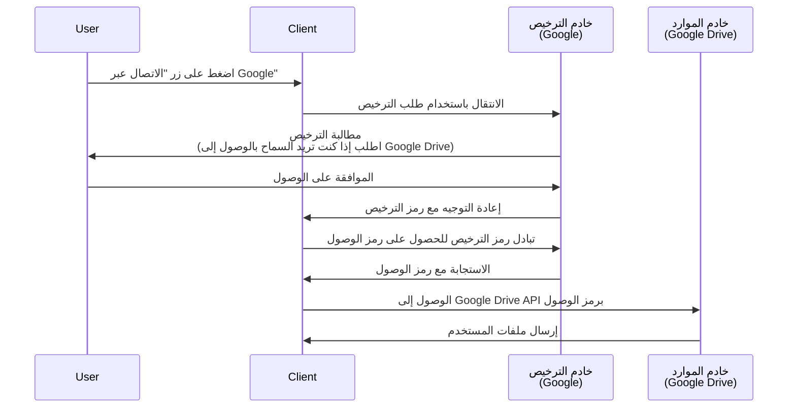

## ما هو طلب الترخيص (Authorization request)؟

اعتمادًا على السياق، يمكن أن يشير مصطلح "طلب الترخيص (Authorization request)" إلى أشياء مختلفة. في هذه المقالة، سنركز على التعريف في مواصفات <Ref slug="oauth-2.0" />.

في OAuth 2.0، هناك عدة أنواع تفويض (تدفقات) تحدد كيف يمكن لـ <Ref slug="client" /> الحصول على ترخيص من المستخدم للوصول إلى الموارد المحمية.

> ![ملاحظة]
> غالبًا ما يتم الخلط بين "طلبات الترخيص (Authorization requests)" و "طلبات المصادقة (Authentication Requests)" في سياق <Ref slug="openid-connect" />. انظر <Ref slug="authentication-request" /> للحصول على تفاصيل خاصة بـ OIDC.

## كيف يعمل طلب الترخيص (Authorization request)؟

عندما يريد عميل (تطبيق) الوصول إلى موارد محمية نيابة عن مستخدم، يبدأ طلب ترخيص إلى <Ref slug="authorization-server" />. يجب على العميل تحديد نوع التفويض المطلوب جنبًا إلى جنب مع المعلمات اللازمة في الطلب.

إليك بعض أنواع التفويض (التدفقات) المعتادة لترخيص المستخدم النهائي في OAuth 2.0:

- <Ref slug="authorization-code-flow" />: التدفق الأكثر توصية لترخيص المستخدمين النهائيين. يُستخدم عادةً مع <Ref slug="pkce" /> لتحسين الأمان وهو مناسب لمعظم التطبيقات.
- <Ref slug="implicit-flow" />: تدفق مبسط تم إهماله في <Ref slug="oauth-2.1" /> بسبب القلق من الأمور الأمنية.
- [تفويض اعتمادات كلمة مرور مالك المورد (ROPC)](https://datatracker.ietf.org/doc/html/rfc6749#section-4.3): تفويض (تدفق) حيث يتم تبادل بيانات اعتماد المستخدم مباشرة للحصول على رمز وصول. لا يُوصى بهذا التدفق نظرًا لمخاطره الأمنية.

هناك أيضًا امتدادات أخرى، مثل <Ref slug="device-flow" /> للأجهزة ذات القدرات الإدخال المحدودة. لكل تدفق خصائصه وحالات استخدامه. بالنسبة لمعظم تطبيقات الويب، يُوصَى بتدفق رمز التفويض.

> يتم عادةً تنفيذ ترخيص <Ref slug="machine-to-machine" /> باستخدام <Ref slug="client-credentials-flow" /> الذي لا يتضمن تفاعلًا مع المستخدم.

على سبيل المثال، قد يطلب عميل (تطبيق) الترخيص للوصول إلى ملفات Google Drive للمستخدم. إليك رسم بياني مبسط لتدفق رمز الترخيص:

بمجرد الحصول على <Ref slug="access-token" />، يمكن للعميل استخدامه للوصول إلى ملفات Google Drive الخاصة بالمستخدم نيابة عن المستخدم.

### المعلمات الرئيسية في طلب الترخيص (Authorization request)

عادةً ما يتضمن طلب ترخيص OAuth 2.0 المعلمات التالية:

- **`response_type`**: نوع الاستجابة التي يتوقعها العميل. القيم الشائعة هي `code` لتدفق رمز الترخيص و `token` لتدفق الضمني.
- **`client_id`**: معرف العميل الذي يصدره خادم الترخيص.
- **`redirect_uri`**: URI حيث يرسل خادم الترخيص المستخدم بعد عملية الترخيص.
- **`scope`**: <Ref slug="scope">النطاقات</Ref> المطلوبة (الاذونات) لرمز الوصول.
- **`resource`**: المعلمة الاختيارية التي تحدد <Ref slug="resource-indicator" /> للموارد المطلوبة. يحتاج خادم الترخيص إلى دعم [RFC 8707](https://datatracker.ietf.org/doc/html/rfc8707) لاستخدام هذه المعلمة.

المعلمات المذكورة أعلاه ليست شاملة. تعتمد المعلمات والقيم الفعلية على نوع التفويض ومتطلبات التطبيق الخاصة.

<SeeAlso slugs={["oauth-2.0", "authentication-request", "authorization-code-flow", "implicit-flow", "device-flow"]} />

<Resources
  urls={[
    { url: "https://datatracker.ietf.org/doc/html/rfc6749#section-4", result: {
      ogTitle: "Obtaining Authorization in OAuth 2.0",
      ogDescription: " لطلب رمز وصول، يحصل العميل على تصريح من مالك المورد."
    } }
  ]}
/>
