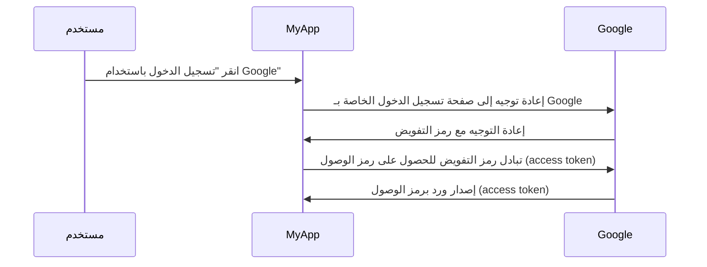

## ما هو خادم التفويض (Authorization server)؟

يمكن أن يكون مصطلح "خادم التفويض (authorization server)" مصطلحًا عامًا يشير إلى أي خادم يقوم بالتفويض. سنركز على التعريف في سياق إطار عملي <Ref slug="oauth-2.0" /> و<Ref slug="openid-connect" />.

في OAuth 2.0، يعد خادم التفويض (authorization server) مكونًا يصدر <Ref slug="access-token">رموز الوصول (access tokens)</Ref> إلى <Ref slug="client">العملاء</Ref> بعد مصادقتهم وتفويضهم بنجاح. تستخدم رموز الوصول (access tokens) من قبل العملاء للوصول إلى الموارد المحمية نيابة عن المستخدم (مالك المورد).

هل هناك الكثير من المصطلحات؟ لنرَ مثالاً من العالم الحقيقي: يقوم مستخدم بالنقر على "تسجيل الدخول باستخدام Google" في تطبيق "MyApp" الذي يستخدم <Ref slug="authorization-code-flow" /> لتسجيل الدخول عبر Google.

في هذا المثال، تعمل Google كخادم تفويض (authorization server) الذي يصدر رمز الوصول (access token) إلى العميل (MyApp) بعد أن يقوم المستخدم بتسجيل الدخول بنجاح. يمكن للعميل بعد ذلك استخدام رمز الوصول (access token) لجلب ملف تعريف المستخدم (المورد المحمي) على Google.

### خادم التفويض (Authorization server) في OpenID Connect (OIDC)

نظرًا لأن OpenID Connect مبنية على أعلى OAuth 2.0، فإنها تعيد استخدام بعض المصطلحات والمفاهيم من OAuth 2.0. تضيف OIDC القدرة على المصادقة إلى خادم التفويض (authorization server) في OAuth 2.0، مما يجعل خادم التفويض (authorization server) أيضًا <Ref slug="openid-connect" headingId="openid-provider-op" />. لتجنب الغموض، نوصي دائمًا باستخدام مصطلح "مزود OpenID" عند الإشارة إلى خادم التفويض (authorization server) في OIDC.

بالإضافة إلى إصدار رموز الوصول (access tokens)، يصدر مزود OpenID (خادم التفويض authorization server) في OIDC أيضًا <Ref slug="id-token">رموز الهوية (ID tokens)</Ref> للعملاء. تحتوي رموز الهوية (ID tokens) على معلومات المستخدم وتستخدم لمصادقة المستخدمين.

## كيف يعمل خادم التفويض (Authorization server)؟

يجب أن يدعم خادم التفويض (authorization server) <Ref slug="oauth-2.0-grant">منح OAuth 2.0 (التدفقات)</Ref> لإصدار رموز الوصول (access tokens) للعملاء. يتكون نوع المنحة (Grant type) عادةً من سلسلة من الخطوات التي يتبعها العميل وخادم التفويض (authorization server) للحصول على رمز الوصول (access token).

- بالنسبة لتفويض المستخدم، تتطلب معظم أنواع المنح من العميل بدء <Ref slug="authorization-request" /> إلى خادم التفويض (authorization server). في المثال أعلاه لتسجيل الدخول باستخدام Google، الخطوة "إعادة توجيه إلى صفحة تسجيل الدخول الخاصة بـ Google" هي طلب تفويض (authorization request) يبدأ بواسطة العميل.
- بالنسبة لتفويض <Ref slug="machine-to-machine" />، يمكن للعميل استخدام <Ref slug="client-credentials-flow" /> لإرسال <Ref slug="token-request" /> مباشرةً إلى خادم التفويض (authorization server).

يجب أيضًا أن يقوم خادم التفويض (authorization server) بالتحقق من صحة طلب العميل، ومصادقة العميل، والتحقق من هوية المستخدم قبل إصدار رمز الوصول (access token). قد يفرض أيضًا تدابير أمنية إضافية، مثل <Ref slug="pkce" /> لتدفق رمز التفويض (authorization-code-flow).

## حالات استخدام خادم التفويض (Authorization server)

كما يوحي الاسم، تُستخدم خوادم التفويض (authorization servers) للتعامل مع <Ref slug="authorization" />. قد يتضمن خادم التفويض (authorization server) الأطراف الأولى والثالثة:

- مثال تسجيل الدخول باستخدام Google أعلاه.
- موقع تجارة إلكترونية (عميل) يطلب الوصول إلى معلومات دفع المستخدم (المورد المحمي) من موقع آخر.
- تطبيق جوال (عميل) يطلب الوصول إلى بيانات موقع المستخدم (المورد المحمي) من مزود خدمة الموقع.

أو يمكن استخدامه فقط للتفويض الداخلي، مثل:

- يحتاج المستخدم إلى الوصول إلى طلباته (المورد المحمي) في موقع التجارة الإلكترونية (عميل).
- تحتاج خدمة (عميل) إلى الوصول إلى قاعدة بيانات (مورد محمي) في بنية الخدمات المصغرة.

في التطبيقات الحديثة، يمكن أن يكون خادم التفويض (authorization server) أيضًا <Ref slug="identity-provider" /> يدعم أيضًا <Ref slug="openid-connect" /> لمصادقة المستخدمين.

<SeeAlso slugs={["oauth-2.0", "authorization-request", "access-token"]} />
 
<Resources
  urls={[
    "https://blog.logto.io/ciam-102-authz-and-rbac",
    "https://tools.ietf.org/html/rfc6749",
  ]}
/>
