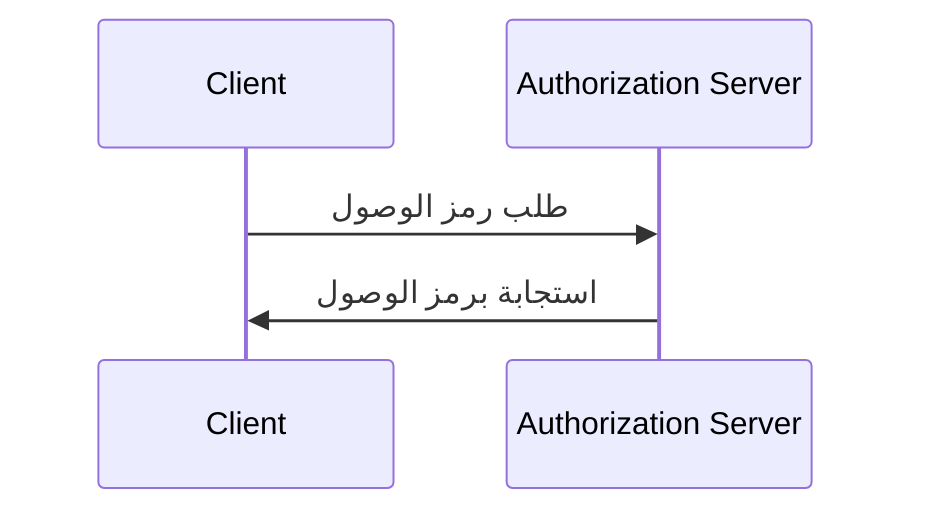
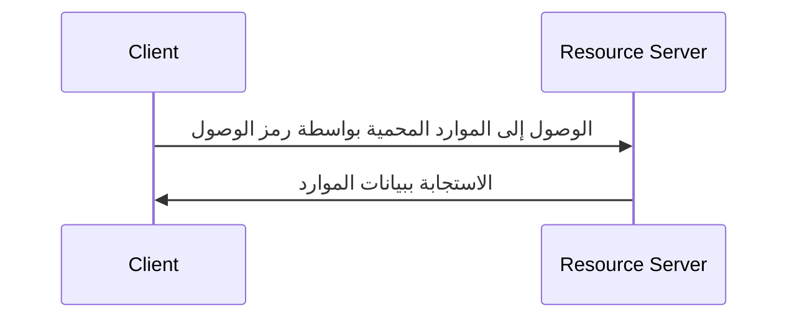

## ما هو تدفق بيانات الاعتماد للعميل؟

تدفق بيانات الاعتماد للعميل (المنح) هو نوع من <Ref slug="oauth-2.0-grant" /> الذي يسمح للعملاء السريين بالحصول على <Ref slug="access-token">رموز الوصول</Ref> للوصول إلى الموارد المحمية. عادةً، يتم استخدام هذا التدفق في عمليات الاتصال <Ref slug="machine-to-machine" />، حيث يكون العميل هو الخادم أو الخدمة.

> [!ملاحظة]
> تدفق بيانات الاعتماد للعميل غير مناسب لتفويض المستخدم النهائي. لتفويض المستخدم النهائي، يجب عليك استخدام <Ref slug="authentication-request" /> أو <Ref slug="authorization-request" />.

## كيف يعمل تدفق بيانات الاعتماد للعميل؟

تدفق بيانات الاعتماد للعميل هو عملية بسيطة مكونة من خطوتين:

1. **طلب الرمز**: يرسل العميل <Ref slug="token-request" /> ببيانات اعتماده (معرف العميل وسر العميل) والنطاقات المطلوبة (<Ref slug="scope">scopes</Ref>).
2. **استجابة الرمز**: يقوم <Ref slug="authorization-server" /> بالتحقق من صحة بيانات اعتماد العميل ويصدر رمز الوصول إذا كان العميل مصرح له بذلك.

إليك تمثيل بسيط لتسلسل تدفق بيانات الاعتماد للعميل:



إليك مثال غير معياري لطلب رمز في تدفق بيانات الاعتماد للعميل:

```http
POST /token HTTP/1.1
Host: your-authorization-server.com
Content-Type: application/x-www-form-urlencoded

grant_type=client_credentials
  &client_id=YOUR_CLIENT_ID
  &client_secret=YOUR_CLIENT_SECRET
  &scope=read write
```

سيقوم خادم التفويض بالتحقق من صحة بيانات اعتماد العميل ويصدر رمزًا إذا كان العميل مصرح له. بمجرد أن يحصل العميل على رمز الوصول، يمكنه استخدامه للوصول إلى الموارد المحمية (على سبيل المثال، API) نيابةً عن نفسه. إليك مثال على كيفية استخدام العميل لرمز الوصول للوصول إلى API:



يرجى ملاحظة أنه يجب على <Ref slug="resource-server" /> التحقق من صحة رمز الوصول وتطبيق سياسات <Ref slug="access-control" /> للتأكد من أن العميل يمتلك الأذونات اللازمة للوصول إلى الموارد.

### معايير رئيسية في طلب رمز تدفق بيانات الاعتماد للعميل

على عكس تدفقات OAuth 2.0 الأخرى، يحتوي تدفق بيانات الاعتماد للعميل على <Ref slug="token-request" /> بسيط مع المعايير الرئيسية التالية:

- **`grant_type`**: يجب تعيين نوع المنح إلى `client_credentials` للإشارة إلى تدفق بيانات الاعتماد للعميل.
- **`client_id`**: معرف العميل الذي أصدره خادم التفويض.
- **`client_secret`**: سر العميل الذي أصدره خادم التفويض.
- **`scope`**: النطاقات المطلوبة <Ref slug="scope">scopes</Ref> (الأذونات) لرمز الوصول.
- **`resource`**: المعلمة الاختيارية التي تحدد <Ref slug="resource-indicator" /> للموارد المطلوبة. يجب على خادم التفويض دعم [RFC 8707](https://datatracker.ietf.org/doc/html/rfc8707) لاستخدام هذه المعلمة.

## اعتبارات الأمان

### العملاء السريين

تدفق بيانات الاعتماد للعميل مناسب لـ<Ref slug="client" headingId="confidential-clients" /> (العملاء السريين) الذين يمكنهم تخزين سر العميل بأمان. إذا كان العميل هو عميل عام (على سبيل المثال، تطبيق صفحة واحدة)، فلا ينبغي استخدام تدفق بيانات الاعتماد للعميل لأن سر العميل يمكن أن يتم كشفه.

### انتهاء صلاحية الرمز

على الرغم من أن رمز الوصول الذي تم الحصول عليه في تدفق بيانات الاعتماد للعميل يمكن أن يكون له وقت انتهاء صلاحية طويل، إلا أنه يوصى باستخدام رموز وصول قصيرة العمر (على سبيل المثال، 1 ساعة) لتقليل خطر الوصول غير المصرح به إذا تم اختراق الرمز.

### دوران سر العميل

لتعزيز الأمان، يوصى بتدوير سر العميل بشكل دوري. يجب أن يدعم خادم التفويض دوران سر العميل دون التأثير على قدرة العميل في الحصول على رموز الوصول. على سبيل المثال، يجب أن يدعم خادم التفويض عدة أسرار للعملاء لضمان التوافق مع الإصدارات السابقة خلال عملية التدوير.

<SeeAlso slugs={["machine-to-machine", "token-request", "access-token", "scope", "resource-indicator"]} />

<Resources
  urls={[
    "https://blog.logto.io/programmatic-authentication-methods",
    { 
      url: "https://datatracker.ietf.org/doc/html/rfc6749#section-4.4",
      result: {
        ogTitle: "Client Credentials Grant",
        ogDescription: "يمكن للعميل طلب رمز الوصول باستخدام بيانات اعتماده فقط (أو وسائل المصادقة الأخرى المدعومة) عندما يطلب العميل الوصول إلى الموارد المحمية تحت سيطرته، أو تلك الخاصة بصاحب مورد آخر تم ترتيبها مسبقًا مع خادم التفويض."
      }
    }
  ]}
/>