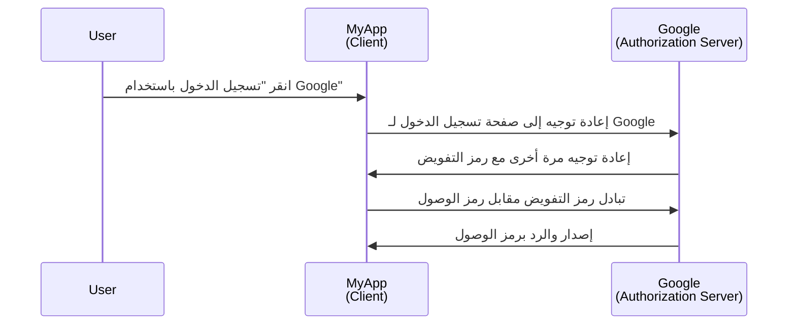
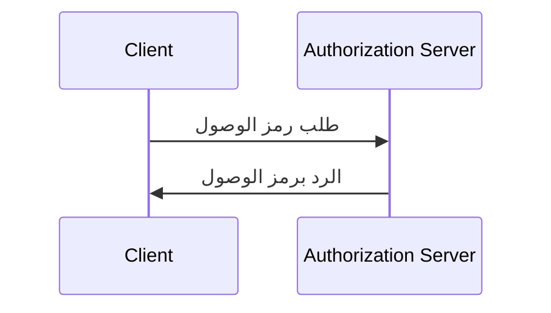

## ما هو العميل (Client)؟

العميل، في سياق <Ref slug="oauth-2.0" /> و <Ref slug="openid-connect" />، هو تطبيق يطلب المصادقة (authentication) أو التفويض (authorization). على سبيل المثال، عندما ينقر المستخدم على "تسجيل الدخول باستخدام Google" على تطبيق ما، يعمل التطبيق كـ **العميل (Client)** الذي يطلب التفويض من Google.

> غالبًا ما يتم استخدام "العميل (Client)" و"التطبيق" بالتبادل في سياق <Ref slug="iam" />.

هناك أنواع متعددة من تصنيفات العملاء تستند إلى قدراتهم ومستويات الثقة بهم، ولكن فيما يتعلق بالإطارات، يوجد تمييز كبير بين العملاء العلنيين والسرّيين. يؤثر ذلك على كيفية حصول العميل على الرموز وأنواع المنح التي يمكنه استخدامها.

### العملاء العلنيون ||public-clients||

العملاء العلنيون هم تطبيقات لا يمكنها الاحتفاظ بأوراق اعتمادها سرية، مما يعني أن مالك المورد (المستخدم) يمكنه الوصول إليها. تشمل أمثلة العملاء العلنيين:

- التطبيقات ذات الصفحة الواحدة (SPAs)
- تطبيقات الجوال
- تطبيقات سطح المكتب

يمكنك القول بأن تطبيقات الجوال وسطح المكتب لديها قدرات تخزين آمنة، ولكن معظم الأطر تعتبرها عملاء علنيين لأنها تُوزع إلى المستخدمين النهائيين ويُفترض أن المستخدمين النهائيين يمكنهم الوصول إلى الأوراق الاعتمادية.

### العملاء السريون ||confidential-clients||

العملاء السريون (الخاصة) هم تطبيقات يمكنها تخزين المعلومات الحساسة بشكل سري دون كشفها لأصحاب الموارد (المستخدمين النهائيين). أمثلة على العملاء السريين تشمل:

- خوادم الويب
- خدمات الخلفية

## كيف يعمل العميل (Client)؟

### مصادقة المستخدم والتفويض

عندما يريد العميل مصادقة المستخدم، يقوم العميل ببدء <Ref slug="authorization-request" /> إلى <Ref slug="authorization-server" /> للحصول على <Ref slug="access-token" />. يجب أن يتضمن العميل المعلمات الضرورية في الطلب، مثل معرف العميل، و redirect URI، و scopes. إليك مخطط تسلسلي مبسط لتدفق رمز التفويض:

في هذا المثال، يعمل Google كـ **خادم التفويض (authorization server)** الذي يصدر رمز وصول إلى **العميل (Client)** (MyApp) بعد أن يقوم المستخدم بتسجيل الدخول بنجاح. يمكن للعميل بعد ذلك استخدام **رمز الوصول (access token)** لجلب ملف تعريف المستخدم (المورد المحمي) على Google.

بالنسبة إلى عملاء OpenID Connect (OIDC)، يحتاج العميل إلى بدء <Ref slug="authentication-request" /> لمصادقة المستخدم. يستخدم نفس نقطة النهاية مثل طلب التفويض، لكن المعلمات والاستجابة مختلفة.

### الاتصال من جهاز إلى جهاز

بالنسبة إلى <Ref slug="machine-to-machine" /> الاتصال، يمكن للعميل استخدام <Ref slug="client-credentials-flow" /> لإرسال <Ref slug="token-request" /> مباشرة إلى خادم التفويض. يجب أن يتضمن العميل معرف العميل، والسر الأمان الخاص بالعميل، و scopes في الطلب. إليك مخطط تسلسلي مبسط لتدفق أوراق اعتماد العميل:

سيقوم خادم التفويض بالتحقق من صحة أوراق اعتماد العميل وإصدار رمز وصول إذا تم تفويض العميل. نظرًا لأن العميل يحتاج إلى إرسال السر الأمان الخاص به، فمن المهم استخدام تدفق أوراق اعتماد العميل فقط للعملاء السريين.

## اعتبارات الأمان

### أنواع العملاء

يؤثر نوع العميل (علني أو خاص) على اعتبارات الأمان للعميل.

- لا ينبغي للعملاء العلنيين استخدام تدفق أوراق اعتماد العميل لأنها لا تستطيع تخزين السر الأمان بشكل آمن. بدلاً من ذلك، يُوصى باستخدام <Ref slug="authorization-code-flow" /> مع <Ref slug="pkce" /> للعملاء العلنيين لمصادقة المستخدمين.
- يمكن للعملاء السريين استخدام تدفق أوراق اعتماد العميل للاتصال من جهاز إلى جهاز. ينبغي عليهم تخزين السر الأمان بشكل آمن واستخدامه فقط في البيئات الآمنة.

### تخزين الرموز

يجب على العملاء استخدام أعلى مستوى ممكن من الأمان لتخزين الرموز. على سبيل المثال، في تطبيقات الويب، يُوصى باستخدام ملفات تعريف الارتباط HTTP-only لتخزين رموز الوصول لمنع هجمات XSS.

### انتهاء صلاحية الرموز

تحتوي رموز الوصول على فترة صلاحية محدودة لتقليل خطر الوصول غير المصرح به. ينبغي على العملاء التعامل مع انتهاء صلاحية الرموز بشكل سلس باستخدام <Ref slug="refresh-token">رموز التحديث</Ref> للحصول على رموز وصول جديدة.

### إلغاء الرموز

يجب على العملاء أن يكونوا مستعدين للتعامل مع إلغاء الرموز. إذا قام المستخدم بتسجيل الخروج أو ألغى خادم التفويض الرمز، يجب على العميل مسح الرمز من تخزين الجانب العميل.

<SeeAlso slugs={["oauth-2.0", "oauth-2.0-grant", "openid-connect", "authorization-request", "authentication-request"]} />

<Resources
  urls={[
    "https://blog.logto.io/secure-cloud-apps-with-oauth-and-openid-connect",
    "https://datatracker.ietf.org/doc/html/rfc6749",
    "https://openid.net/specs/openid-connect-core-1_0.html"
  ]}
/>
