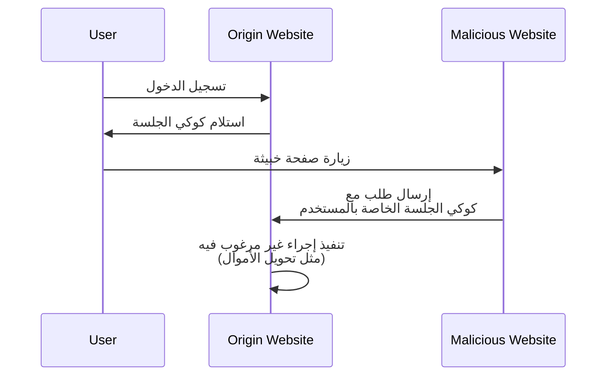

## ما هو تزوير الطلب عبر المواقع (CSRF)؟

عند تطوير تطبيقات الويب، يُعتبر CSRF مصطلحًا غالبًا ما يُسمع ويثير خوف المطورين والمحترفين في مجال الأمان. إنه نوع من الهجمات التي تخدع المستخدمين المصادق عليهم لتنفيذ إجراءات غير مرغوب فيها على تطبيق ويب دون موافقة.

يُعرف CSRF أيضًا باسم "هجوم بنقرة واحدة" أو "ركوب الجلسة" لأنه يعتمد على الجلسة النشطة للمستخدم لأداء أعمال خبيثة.

## كيف يعمل CSRF؟

يعمل هجوم CSRF عن طريق استغلال الثقة التي يوليها تطبيق الويب لمتصفح المستخدم. إليك كيف يحدث ذلك عادةً:



قد تكون لديك بعض الأسئلة حول هذا التسلسل. دعونا نستكشف الأسباب وراء ذلك.

### لماذا يمكن للموقع الخبيث إرسال طلب إلى موقع الأصل؟

تُعتبر سياسة نفس الأصل (SOP) ميزة أمان في المتصفحات تحد من كيفية تفاعل مستند أو سكربت محمل من أصل واحد مع مورد (مثل الكوكيز، DOM) من أصل آخر. ومع ذلك، لا تمنع SOP المتصفح من إرسال طلبات إلى أصل آخر.

لذا، على الرغم من أن الموقع الخبيث لا يمكنه قراءة أو تعديل كوكي الجلسة مباشرة، إلا أنه يمكنه إرسال طلبات إلى موقع الأصل باستخدام جلسة المستخدم النشطة.

قد تجادل بأن معظم تطبيقات الويب تستخدم أيضًا [CORS](https://developer.mozilla.org/en-US/docs/Web/HTTP/CORS) لمنع الطلبات غير المصرح بها عبر الأصول، ولكن لا يزال لـ CSRF طريقة لتخطيها:

1. هجمات الإرسال عبر GET: يمكن للموقع الخبيث خداع المستخدم لزيارة عنوان URL ينفذ إجراءً على موقع الأصل:

    - إعادة توجيه إلى `https://example.com/transfer?amount=1000&to=attacker`.
    - وسم صورة يتم تحميلها `https://example.com/transfer?amount=1000&to=attacker`.

    هذه سبب مهم لعدم وجود تأثيرات جانبية في طلبات GET.

2. هجمات النموذج: يمكن للموقع الخبيث إنشاء نموذج مخفي يرسل بيانات إلى موقع الأصل. على سبيل المثال، طلب POST إلى `https://example.com/transfer` مع حقول نموذج مخفية.

### لماذا يحتوي الموقع الخبيث على كوكي الجلسة الخاصة بالمستخدم؟

يقوم متصفح المستخدم تلقائيًا بإرسال الكوكيز إلى موقع الأصل عند إرسال الطلبات. هذه هي كيفية معرفة موقع الأصل أن المستخدم مصادق ويمكنه تنفيذ إجراءات نيابة عنه.

في الواقع، لا "يمتلك" الموقع الخبيث كوكي الجلسة؛ بل يستغل سلوك المتصفح لإرسال الكوكي مع الطلب.

## كيف يمكن منع هجمات CSRF؟

يتطلب منع هجمات CSRF نهجًا متعدد الطبقات يشمل الخادم والعميل. إليك بعض التقنيات الشائعة للتخفيف من ثغرات CSRF:

### استخدم رموز CSRF المضادة

رموز CSRF المضادة هي قيم عشوائية يتم توليدها بواسطة الخادم وتضمينها في نماذج تطبيق الويب. عند إرسال النموذج، يتحقق الخادم من الرمز للتأكد من أن الطلب مشروع.

على سبيل المثال، حقل إدخال مخفي في نموذج HTML:

```html
<form action="/transfer" method="post">
  <input type="hidden" name="csrf_token" value="random_token_here" />
  <!-- حقول نموذج أخرى -->
  <button type="submit">تحويل</button>
</form>
```

من خلال هذا النهج، لا يمكن للموقع الخبيث تزوير طلب لأنه لا يعرف رمز CSRF المضاد. `state` parameter في <Ref slug="redirect-uri" /> مفهوم مشابه.

### استخدم كوكي SameSite

يمكن لخاصية `SameSite` في الكوكيز منع هجمات CSRF عن طريق تقييد زمن إرسال الكوكيز إلى الخادم:

| قيمة `SameSite`  | الوصف                                                                             |
|------------------|------------------------------------------------------------------------------------|
| `Strict`         | يتم إرسال الكوكيز فقط في سياق الطرف الأول.                                         |
| `Lax`            | يتم إرسال الكوكيز في سياق الطرف الأول ومع طلبات GET من مواقع خارجية.              |
| `None`           | يتم إرسال الكوكيز في جميع السياقات. يتطلب خاصية `Secure`.                         |

بضبط خاصية `SameSite` إلى `Strict` أو `Lax` دون تأثيرات جانبية في طلبات GET الخاصة بك، يمكنك منع هجمات CSRF.

بالإضافة إلى ذلك، يجب دائمًا ضبط خاصية `Secure` لضمان أن يتم إرسال الكوكي فقط عبر اتصالات HTTPS.

### تحقق من الرؤوس

1. **المصدر (Origin) في الرأس**: يُرسل رأس `Origin` بواسطة المتصفح للإشارة إلى مصدر الطلب. يمكن للخادم التحقق من هذا الرأس للتأكد من أن الطلب آتٍ من مصدر متوقع.
2. **المرجع (Referer) في الرأس**: يحتوي رأس `Referer` على عنوان URL للصفحة السابقة. على الرغم من أنه يمكن تزويره، إلا أنه يمكن استخدامه كطبقة حماية إضافية.

<SeeAlso slugs={["authorization-code-flow", "redirect-uri"]} />

<Resources
  urls={[
    'https://blog.logto.io/csrf',
    "https://cheatsheetseries.owasp.org/cheatsheets/Cross-Site_Request_Forgery_Prevention_Cheat_Sheet.html",
  ]}
/>
