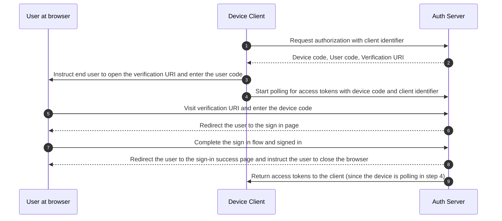

## ما هو تدفق الجهاز (Device flow)؟

[Tدفق تفويض الجهاز (OAuth Device Authorization Flow)](https://www.rfc-editor.org/rfc/rfc8628)، المعروف أيضًا بتدفق الجهاز (device flow)، هو <Ref slug="oauth-2.0-grant" /> مصمم للأجهزة ذات القدرات المحدودة على الإدخال (مثل التلفزيونات الذكية، أجهزة إنترنت الأشياء، وحدات التحكم في الألعاب) أو التطبيقات بدون واجهة (مثل أدوات CLI). يسمح للمستخدمين ببدء <Ref slug="authorization-request">طلبات التفويض</Ref> على هذه الأجهزة ثم إكمال العملية باستخدام جهاز آخر ذو قدرة أكبر على الإدخال مثل الهاتف الذكي أو الكمبيوتر المحمول.

## متى يتم استخدام تدفق الجهاز (Device flow)؟

1. **الأجهزة ذات المدخلات المحدودة**
    - تسجيل الدخول على التلفزيونات الذكية (مثل تطبيقات الوسائط)
    - تسجيل الدخول على وحدات التحكم في الألعاب (مثل نظام الألعاب أو تطبيقات الوسائط)
    - تسجيل الدخول على أجهزة الاجتماعات (مثل التطبيقات الرسمية أو تطبيقات الاجتماعات عبر الفيديو)
    - تسجيل الدخول على الأجهزة القابلة للارتداء (مثل الساعات الذكية ذات المدخلات المحدودة)
    - الوصول إلى أجهزة إنترنت الأشياء (مثل الطابعات، مشفرات الفيديو، أو مكبرات الصوت)
2. **التطبيقات بدون واجهة**
    - تسجيل الدخول عبر واجهة سطر الأوامر (مثل GitHub CLI أو Stripe CLI)
3. **تسجيل الدخول عبر رمز QR لتطبيقات سطح المكتب**
    - تسجيل الدخول بسرعة وأمان إلى تطبيقات سطح المكتب عن طريق مسح رمز QR باستخدام هاتفك الذكي (مثل Telegram، تسجيل الدخول إلى Steam على سطح المكتب). يمكن اعتبار تدفق تسجيل الدخول عبر رمز QR كنوع من تدفق الجهاز التقليدي (OAuth 2.0).

## كيف يبدو تدفق المستخدم النهائي لتدفق الجهاز (Device flow)؟

بتجاهل نوع تسجيل الدخول عبر رمز QR، دعونا نركز على تدفق الجهاز التقليدي (OAuth 2.0). هناك نوعان من الأجهزة المعنية:

### جهاز عرض رمز الجهاز

هذا هو الجهاز ذو المدخلات المحدودة أو التطبيق بدون واجهة حيث يحتاج المستخدم إلى تفويض الوصول. يعرض [رمز الجهاز وواجهة التحقق](#what-does-device-flow-workflow-look-like)، موجهًا المستخدم حول كيفية المتابعة.

واجهة المستخدم الأساسية هي:


لتحسين تجربة المستخدم، غالبًا ما تقوم الخدمات بإنشاء رمز QR لعنوان URL للتحقق:


لزيادة الكفاءة، استبدل مورد رمز QR في `verification_uri` (مثل `https://example.com/device`) بـ `verification_uri_complete` (مثل `https://example.com/device?user_code=DSHP-SNCT`)، الذي يتضمن رمز الجهاز في عنوان URL، مما يساعد المستخدمين على ملء رمز الجهاز مسبقًا في الحقول.

### جهاز التفويض

باتباع التعليمات على جهاز الهدف لتسجيل الدخول، سيقوم المستخدم بـ:

1. استخدام جهاز آخر مع إمكانية الوصول إلى المتصفح وقدرات الإدخال لفتح عنوان URL للتحقق.
2. إدخال رمز الجهاز المعروض (الذي قد يكون مملوءًا مسبقًا) والمتابعة.
3. إذا لم تكن هناك جلسات موجودة على المتصفح، سيقوم المستخدم أولاً بتسجيل الدخول إلى الخدمة.
4. ستظهر صفحة الموافقة للمستخدمين لتفويض تسجيل الدخول للجهاز.
5. أخيرًا، ستظهر صفحة نجاح بعد التفويض.


إليك بعض عناوين URL لتدفق الجهاز لمنتجات معروفة لاختبارك:

- تسجيل الدخول إلى [يوتيوب على التلفزيونات الذكية](https://www.youtube.com/watch?v=yTcuazSy5Cs): [youtube.com/activate](https://youtube.com/activate)
- تسجيل الدخول إلى Disney+ على التلفزيون الذكي: [disneyplus.com/begin](https://disneyplus.com/begin)
- تسجيل الدخول إلى [Shopify على ساعة سامسونج جالاكسي](https://www.drmare.com/spotify-music/spotify-on-galaxy-watch.html): [spotify.com/pair](https://spotify.com/pair)
- تسجيل الدخول إلى [Zoom على أجهزة الاجتماعات](https://developers.zoom.us/blog/device-authorization/): [zoom.us/oauth_device](https://zoom.us/oauth_device)
- تسجيل الدخول إلى [GitHub CLI](https://docs.github.com/en/apps/oauth-apps/building-oauth-apps/authorizing-oauth-apps#device-flow): [github.com/login/device](https://github.com/login/device)
- استخدام [Google device flow](https://www.oauth.com/oauth2-servers/device-flow/user-flow/): https://www.google.com/device

## كيف يبدو سير عمل تدفق الجهاز (Device flow)؟

أولاً، يجب أن تفهم معلمات استجابة تفويض الجهاز، والتي تُستخدم لمعالجة المعلومات المعروضة على جهاز عرض رمز الجهاز:

| المعلمة                              | الوصف                                                                                                                                                                    |
| -------------------------------------- | ------------------------------------------------------------------------------------------------------------------------------------------------------------------------------ |
| `device_code`                          | رمز التحقق من الجهاز.                                                                                                                                                  |
| `user_code`                            | رمز التحقق من المستخدم النهائي.                                                                                                                                                |
| `verification_uri`                     | واجهة التحقق من المستخدم النهائي على خادم التفويض. يجب أن يكون عنوان URI قصيرًا وسهل التذكر حيث سيُطلب من المستخدمين النهائيين كتابته يدويًا في وكيل المستخدم الخاص بهم. |
| `verification_uri_complete` (اختياري) | واجهة تحقق تتضمن "user_code" (أو معلومات أخرى بنفس وظيفة "user_code")، والتي تم تصميمها للنقل غير النصي.             |
| `expires_in`                           | مدة الحياة بالثواني لـ "device_code" و "user_code".                                                                                                                  |
| `interval`                             | الحد الأدنى من الوقت بالثواني الذي يجب أن ينتظره العميل بين طلبات الاستطلاع إلى نقطة نهاية الرمز. إذا لم يتم توفير قيمة، يجب على العملاء استخدام 5 كافتراضي. |

```json
{
    "device_code": "GmRhmhcxhwAzkoEqiMEg_DnyEysNkuNhszIySk9eS",
    "user_code": "WDJBMJHT",
    "verification_uri": "https://custom.domain.com/device",
    "verification_uri_complete":
        "https://custom.domain.com/device?user_code=WDJB-MJHT",
    "expires_in": 900,
    "interval": 5
}
```

عندما يستخدم المستخدم تدفق الجهاز (device flow) للمصادقة، فإنه يتضمن بشكل رئيسي الخطوات التالية:



1. يطلب عميل الجهاز التفويض من خادم المصادقة باستخدام معرف العميل (عادةً معرف العميل على منصة خادم المصادقة).
2. يرد خادم المصادقة على عميل الجهاز برمز الجهاز، رمز المستخدم وواجهة التحقق.
3. يعرض عميل الجهاز واجهة التحقق ورمز المستخدم للمستخدم في شكل نص (أو رمز QR، إلخ)، موجهًا المستخدم لزيارة واجهة التحقق وإدخال الرمز.
4. في نفس الوقت مع الخطوة 3، يبدأ عميل الجهاز في الاستطلاع للحصول على رموز الوصول باستخدام رمز الجهاز ومعرف العميل من خادم المصادقة ويبدأ في انتظار المستخدم لمراجعة <Ref slug="authorization-request" /> وإكمال تفويض المستخدم.
5. يزور المستخدم واجهة التحقق المستضافة بواسطة خادم المصادقة، عبر متصفح في جهاز آخر، ويدخل رمز المستخدم.
6. يعيد خادم المصادقة توجيه المستخدم إلى صفحة تسجيل الدخول ويوجه المستخدم لإكمال تسجيل الدخول.
7. أكمل المستخدم تدفق تسجيل الدخول وتم تسجيل الدخول بنجاح.
8. يعيد خادم المصادقة توجيه المستخدم إلى صفحة نجاح تسجيل الدخول ويوجه المستخدم لإغلاق المتصفح.
9. في نفس الوقت مع الخطوة 8، يعيد خادم المصادقة رموز الوصول إلى عميل الجهاز نظرًا لأن العميل كان يستطلع منذ الخطوة 4.

بعد هذه العمليات، سيتمكن عميل الجهاز من الحصول على <Ref slug="access-token" /> للخدمات اللاحقة.

لمزيد من التفاصيل، اقرأ [RFC 8628 OAuth 2.0 Device Authorization Grant](https://datatracker.ietf.org/doc/html/rfc8628#autoid-3).

## ما هي اعتبارات الأمان لتدفق الجهاز (Device flow)؟

يتضمن تدفق الجهاز تفاعلًا عبر جهازين، مما يعرضه لمخاطر أمان محتملة مثل كشف رمز الجهاز، الهجمات العنيفة، أو هجمات الرجل في المنتصف (MitM).

بينما لا يمنح الحصول على رمز الجهاز وحده التفويض فورًا (نظرًا لأن المستخدم لا يزال يجب عليه المصادقة والتفويض)، يمكن للمهاجم محاولة إعادة تشغيل طلب رمز الجهاز خلال فترة صلاحيته. قد يؤدي ذلك إلى وصول غير مصرح به متكرر. لتعزيز الأمان، ضع في اعتبارك الاحتياطات التالية:

- **تقليل مدة `expires_in`:** قلل من نافذة الفرصة للهجمات عن طريق تقليل فترة صلاحية رمز الجهاز.
- **تحديد المحاولات الفاشلة:** قيد عدد إدخالات الرمز غير الصحيحة لمنع الهجمات العنيفة.
- **فرض HTTPS:** تأكد من أن جميع الاتصالات بين الجهاز وخادم التفويض مشفرة باستخدام HTTPS لمنع هجمات الرجل في المنتصف.
- **تقييد رموز الجهاز للاستخدام الفردي:** قيد كل رمز جهاز إلى **جلسة واحدة** لمنع إعادة استخدامه من قبل أطراف غير مصرح لها.

لاحظ أن الاستخدام الفردي لرموز الجهاز ليس متطلبًا مدمجًا في تدفق الجهاز (OAuth 2.0). إنه ممارسة اختيارية جيدة. قد يقوم بعض المطورين بتصميم تفويضات أجهزة متزامنة عن قصد بنفس الرمز (مثل على مئات الأجهزة)، ولكن هذا النهج يزيد من مخاطر الأمان ويجب تقييمه بعناية.

## هل يدعم مقدمو OIDC تدفق الجهاز (Device flow)؟

بينما يرتبط تدفق الجهاز تقليديًا بـ OAuth، يمكن لمقدمي <Ref slug="openid-connect" /> دعمه أيضًا. يوفر OIDC مزايا إضافية تتجاوز التركيز الأساسي لـ OAuth على التفويض. يمتد إلى المصادقة، مما يسمح للتطبيقات بالحصول على كل من <Ref slug="access-token" /> و <Ref slug="id-token" /> في تدفق واحد.

تجعل إدارة الهوية الموحدة القوية لـ OIDC، بما في ذلك التحقق من الرموز و<Ref slug="refresh-token">التحديث</Ref>، مناسبة بشكل جيد للمصادقة الآمنة والموثوقة و<Ref slug="authorization" /> بين الأجهزة والتطبيقات، خاصة تلك ذات القدرات المحدودة على الإدخال.

<SeeAlso slugs={['oauth-2.0-grant', 'authorization-code-flow', 'implicit-flow', 'client-credentials-flow']} />

<Resources urls={['https://blog.logto.io/a-brief-introduction-to-oauth2-device-flow', 'https://datatracker.ietf.org/doc/html/rfc8628']} />