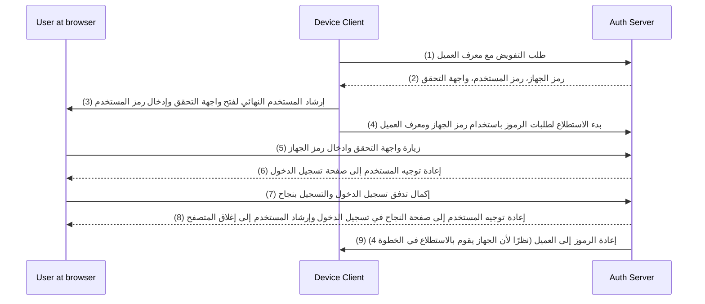

## ما هو تدفق الجهاز (Device flow)؟

[Tتدفق تفويض الجهاز في OAuth](https://www.rfc-editor.org/rfc/rfc8628)، المعروف أيضًا باسم تدفق الجهاز، هو تطبيق لـ [OAuth 2.0](https://oauth.net/2/) مصمم للأجهزة ذات قدرات الإدخال المحدودة (مثل أجهزة التلفزيون الذكية، أجهزة إنترنت الأشياء، أجهزة الألعاب) أو التطبيقات الخالية من واجهة المستخدم (مثل أدوات CLI). يتيح للمستخدمين بدء طلبات التفويض من هذه الأجهزة ثم إكمال العملية باستخدام جهاز آخر ذو قدرات إدخال أكبر مثل الهواتف الذكية أو الحواسيب المحمولة.

## متى يُستخدم تدفق الجهاز؟

1. **الأجهزة ذات المدخلات المحدودة**
    - تسجيل الدخول على أجهزة التلفزيون الذكية (مثل التطبيقات الإعلامية)
    - تسجيل الدخول على أجهزة الألعاب (مثل نظام الألعاب أو التطبيقات الإعلامية)
    - تسجيل الدخول على أجهزة الاجتماعات (مثل التطبيقات الرسمية أو تطبيقات الاجتماعات المرئية)
    - تسجيل الدخول على الأجهزة القابلة للارتداء (مثل الساعات الذكية المحدودة الإدخال)
    - الوصول إلى أجهزة إنترنت الأشياء (مثل الطابعات، مشفرات الفيديو، أو مكبرات الصوت)
2. **التطبيقات الخالية من واجهة مستخدم**
    - تسجيل الدخول من واجهة سطر الأوامر (مثل GitHub CLI أو Stripe CLI)
3. **تسجيل الدخول باستخدام رمز QR لتطبيقات سطح المكتب**
    - تسجيل الدخول بسرعة وأمان إلى تطبيقات سطح المكتب عن طريق مسح رمز QR بواسطة هاتفك الذكي (مثل تسجيلات دخول Telegram و Steam على سطح المكتب). يمكن اعتبار هذا التدفق لتسجيل الدخول عبر رمز QR كتعديل لتدفق الجهاز التقليدي في OAuth 2.0.

## كيف يبدو تدفق المستخدم النهائي في تدفق الجهاز؟

بتجاهل تبديل تسجيل الدخول عبر رمز QR، دعونا نركز على تدفق الجهاز القياسي في OAuth 2.0. هناك نوعان من الأجهزة المشاركة:

### جهاز عرض رمز الجهاز

هذا هو الجهاز ذو المدخلات المحدودة أو التطبيق الخالي من واجهة المستخدم الذي يحتاج المستخدم لتفويض الوصول منه. يعرض [رمز الجهاز وواجهة التحقق URI](#ما-هو-مخطط-تدفق-الجهاز)، موجهًا المستخدم حول كيفية المضي قدمًا.

واجهة المستخدم الأساسية هي:


لتعزيز تجربة المستخدم، غالبًا ما تولد الخدمات رمز QR لواجهة التحقق:


لزيادة الكفاءة، يمكن استبدال مورد رمز QR في `verification_uri` (مثل `https://example.com/device`) بـ `verification_uri_complete` (مثل `https://example.com/device?user_code=WDJB-MJHT`)، والذي يتضمن رمز الجهاز في عنوان URL، مما يساعد المستخدمين على ملء رمز الجهاز في الحقول مسبقًا.

### جهاز التفويض

باتباع التعليمات على الجهاز المستهدف لتسجيل الدخول، سوف يقوم المستخدم بـ:

1. استخدام جهاز آخر لديه الوصول إلى المتصفح وإمكانيات الإدخال لفتح واجهة التحقق. 
2. إدخال رمز الجهاز المعروض (الذي قد يكون قد ملئ مسبقًا) ومواصلة العملية.
3. إذا لم يكن هناك جلسات موجودة في المتصفح، سيقوم المستخدم أولاً بتسجيل الدخول إلى الخدمة.
4. ستظهر شاشة طلب الموافقة للمستخدمين لتفويض تسجيل الدخول من الجهاز.
5. أخيرًا، يتم عرض صفحة النجاح بعد التفويض.

هنا بعض روابط العناوين لمنتجات تدفق الجهاز من أجل الاختبار:

- تسجيل الدخول إلى [يوتيوب على التلفزيونات الذكية](https://www.youtube.com/watch?v=yTcuazSy5Cs): [youtube.com/activate](https://youtube.com/activate)
- تسجيل الدخول إلى Disney+ على التلفزيون الذكي: [disneyplus.com/begin](https://disneyplus.com/begin)
- تسجيل الدخول إلى [Shopify على ساعة سامسونغ جالكسي](https://www.drmare.com/spotify-music/spotify-on-galaxy-watch.html): [spotify.com/pair](https://spotify.com/pair)
- تسجيل الدخول إلى [Zoom على أجهزة الاجتماعات](https://developers.zoom.us/blog/device-authorization/): [zoom.us/oauth_device](https://zoom.us/oauth_device)
- تسجيل الدخول إلى [GitHub CLI](https://docs.github.com/en/apps/oauth-apps/building-oauth-apps/authorizing-oauth-apps#device-flow): [github.com/login/device](https://github.com/login/device)
- استخدام [تدفق جهاز Google](https://www.oauth.com/oauth2-servers/device-flow/user-flow/): https://www.google.com/device

## كيف يبدو مخطط تدفق الجهاز؟

أولاً، يجب عليك فهم بارامترات استجابة تفويض الجهاز، والتي تُستخدم لمعالجة المعلومات المعروضة على جهاز عرض رمز الجهاز:

| Parameter                              | Description                                                                                                                                                                    |
| -------------------------------------- | ------------------------------------------------------------------------------------------------------------------------------------------------------------------------------ |
| `device_code`                          | رمز التحقق من الجهاز.                                                                                                                                                          |
| `user_code`                            | رمز التحقق من المستخدم النهائي.                                                                                                                                                  |
| `verification_uri`                     | واجهة المتحقق من المستخدم النهائي على خادم التفويض. يجب أن تكون الواجهة قصيرة وسهلة التذكر حيث سيُطلب من المستخدمين إدخالها يدويًا في وكيل المستخدم.                                       |
| `verification_uri_complete` (optional) | واجهة تحقق تشير إلى أنها تحتوي على "user_code" (أو معلومات أخرى تؤدي وظيفة "user_code")، وهي مصممة لنقل غير النصية.                                              |
| `expires_in`                           | المدة الزمنية بالثواني لوجود "device_code" و "user_code".                                                                                                                      |
| `interval`                             | الحد الأدنى من الوقت بالثواني الذي يجب على العميل الانتظار بين طلبات التصويت لنقطة النهاية الخاصة بالتوكن. إذا لم يتم توفير قيمة، يجب على العملاء استخدام 5 كالافتراضي.                     |

```json
{
    "device_code": "GmRhmhcxhwAzkoEqiMEg_DnyEysNkuNhszIySk9eS",
    "user_code": "WDJBMJHT",
    "verification_uri": "https://custom.domain.com/device",
    "verification_uri_complete":
        "https://custom.domain.com/device?user_code=WDJB-MJHT",
    "expires_in": 900,
    "interval": 5
}
```

عندما يستخدم المستخدم تدفق الجهاز لـ المصادقة، فإنها تشتمل بشكل أساسي على الخطوات التالية:



1. يطلب جهاز العميل التفويض من خادم التفويض باستخدام معرف العميل (عادةً معرف العميل على منصة خادم التفويض).
2. يستجيب خادم التفويض لجهاز العميل برمز الجهاز، رمز المستخدم وواجهة التحقق.
3. يعرض جهاز العميل واجهة التحقق ورمز المستخدم للمستخدم في شكل نص (أو رمز QR، إلخ)، إرشاد المستخدم إلى زيارة الواجهة وإدخال الرمز.
4. في الوقت نفسه للخطوة 3، يبدأ جهاز العميل استطلاع طلبات الرموز باستخدام رمز الجهاز ومعرف العميل من خادم التفويض ويبدأ في انتظار المستخدم لمراجعة طلب التفويض وإكمال تفويض المستخدم.
5. يقوم المستخدم بزيارة واجهة التحقق مستضافًا من قبل خادم التفويض، عبر المتصفح في جهاز آخر، ويدخل رمز المستخدم.
6. يعيد خادم التفويض توجيه المستخدم إلى صفحة تسجيل الدخول وإرشاده لإكمال تسجيل الدخول.
7. يكمل المستخدم تدفق تسجيل الدخول ويسجل بنجاح.
8. يعيد خادم التفويض توجيه المستخدم إلى صفحة نجاح تسجيل الدخول وإرشاده لإغلاق المتصفح.
9. في الوقت نفسه للخطوة 8، يعيد خادم التفويض الرموز إلى جهاز العميل نظرًا لأن العميل كان يقوم بالاستطلاع منذ الخطوة 4.

بعد هذه العمليات، سيتمكن جهاز العميل من الحصول على رمز الوصول للخدمات اللاحقة!

لمزيد من التفاصيل، اقرأ [RFC 8628 OAuth 2.0 Device Authorization Grant](https://datatracker.ietf.org/doc/html/rfc8628#autoid-3).

<SeeAlso slugs={['authorization-code-flow', 'implicit-flow', 'client-credentials-flow']} />

<Resources urls={['https://blog.logto.io/a-brief-introduction-to-oauth2-device-flow', 'https://datatracker.ietf.org/doc/html/rfc8628']} />