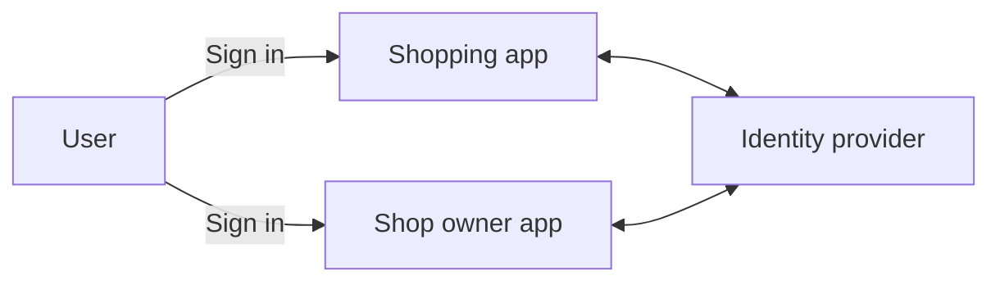
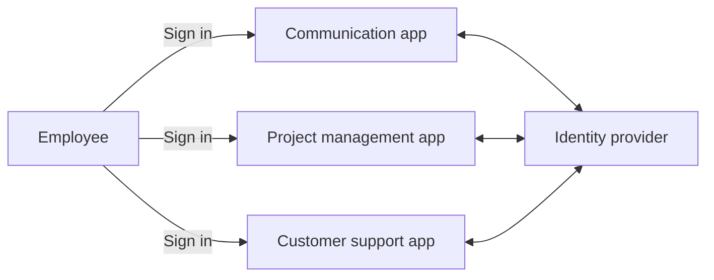
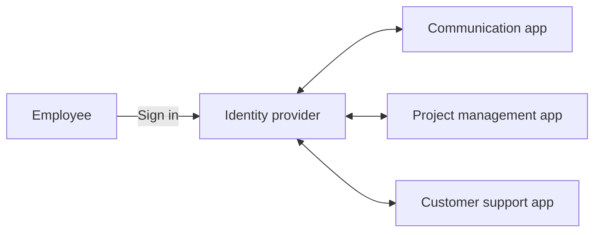
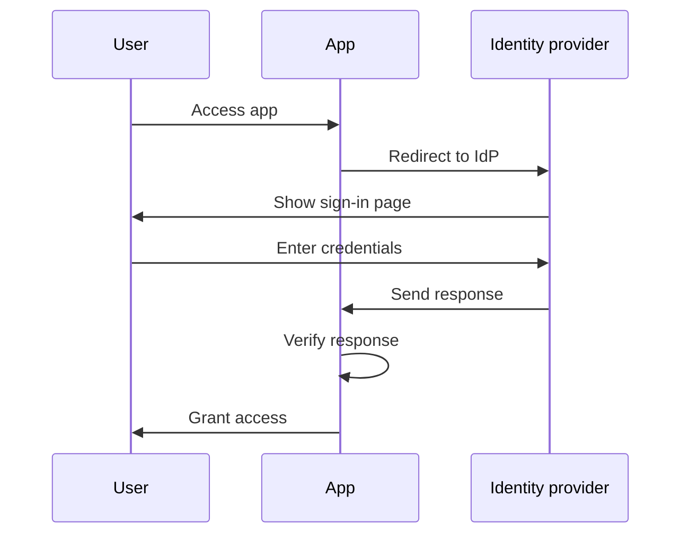
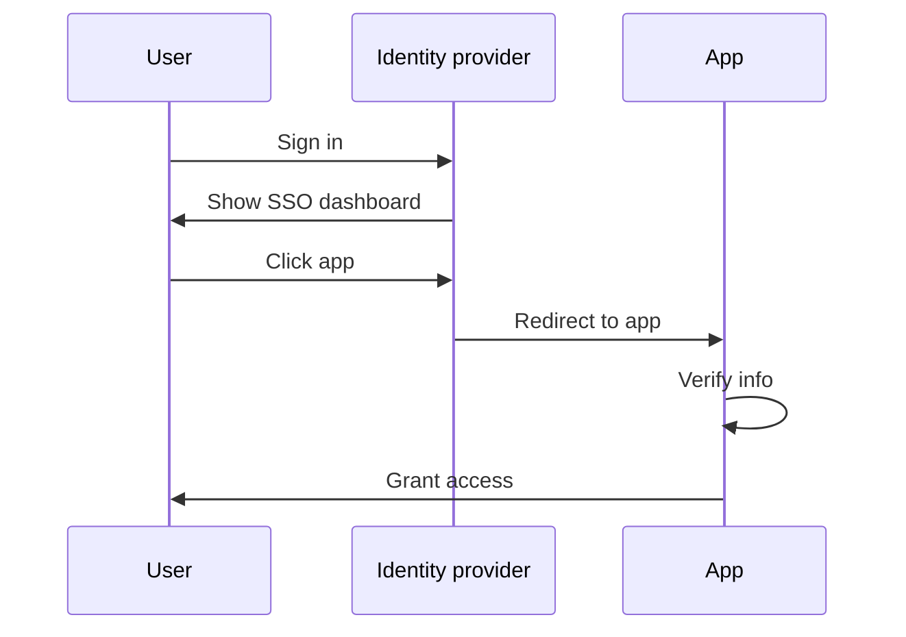
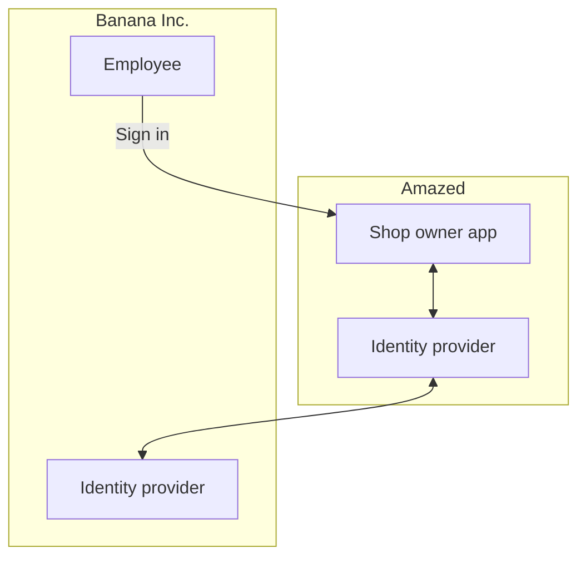

## ما هو الدخول الموحد للمؤسسات (Enterprise SSO)؟

قبل الخوض في التعريف، من المهم توضيح الفرق بين الدخول الموحد (SSO) والدخول الموحد للمؤسسات (Enterprise SSO)، حيث يمكن أن يسبب ذلك الالتباس أحيانًا.

- <Ref slug="single-sign-on" /> هو مصطلح عام يشير إلى قدرة المستخدم على تسجيل الدخول مرة واحدة والوصول إلى تطبيقات أو موارد متعددة دون الحاجة إلى تسجيل الدخول مرة أخرى.
- الدخول الموحد للمؤسسات (Enterprise SSO) هو نوع محدد من الدخول الموحد مصمم لموظفي المؤسسة.

هل لا تزال غير متأكد؟ دعونا نلقي نظرة على مثال:

موقع للتسوق عبر الإنترنت يُسمى _Amazed_ لديه تطبيقان ويب: واحد للعملاء وواحد لأصحاب المتاجر. يسجل العملاء الدخول إلى تطبيق التسوق لشراء المنتجات، بينما يسجل أصحاب المتاجر الدخول إلى تطبيق أصحاب المتاجر لإدارة متاجرهم. كلا التطبيقين يستخدمان نفس موفر الهوية (identity provider) للمصادقة (authentication). ونتيجة لذلك، يحتاج المستخدمون إلى تسجيل الدخول مرة واحدة فقط للوصول إلى كلا التطبيقين، مما يوفر تجربة دخول موحد.

داخليًا، يستخدم _Amazed_ تطبيقات متعددة للتواصل بين الفريق وإدارة المشاريع ودعم العملاء. ولتسهيل سير العمل اليومي، ينفذ _Amazed_ الدخول الموحد للمؤسسات لموظفيه. مع الدخول الموحد للمؤسسات، يمكن للموظفين الوصول إلى جميع التطبيقات الداخلية بتسجيل دخول واحد.

عادةً ما تقدم حلول الدخول الموحد للمؤسسات أيضًا لوحة تحكم مركزية للموظفين للوصول إلى جميع التطبيقات بنقرة واحدة. غالبًا ما تسمى هذه اللوحة لوحة تحكم الدخول الموحد (SSO dashboard).

باختصار، كلا السيناريوهين هما أمثلة على الدخول الموحد (SSO). الفرق هو أن المثال الأول هو دخول موحد عام، بينما الثاني هو دخول موحد للمؤسسات. هذه هي الاستخدامات النموذجية لإدارة الهوية والوصول للعملاء (Customer IAM) وإدارة الهوية والوصول للقوى العاملة (Workforce IAM) على التوالي.

## كيف يعمل الدخول الموحد للمؤسسات (Enterprise SSO)؟

يعمل الدخول الموحد للمؤسسات (Enterprise SSO) عن طريق ربط تطبيقات متعددة بموفر هوية مركزي (identity provider). يمكن أن يكون الاتصال في اتجاه واحد (من التطبيق إلى موفر الهوية) أو في اتجاهين (بين التطبيق وموفر الهوية). تُستخدم معايير وبروتوكولات مختلفة، مثل SAML، OpenID Connect، و OAuth 2.0 لهذه الاتصالات.

بغض النظر عن البروتوكول، فإن سير العمل الأساسي عادةً ما يكون مشابهًا:

1. يصل المستخدم إلى تطبيق (مثل تطبيق التواصل) يتطلب مصادقة (authentication).
2. يعيد التطبيق توجيه المستخدم إلى موفر الهوية للمصادقة (authentication).
3. يسجل المستخدم الدخول إلى موفر الهوية.
4. يرسل موفر الهوية استجابة المصادقة إلى التطبيق.
5. يتحقق التطبيق من الاستجابة ويمنح المستخدم الوصول.

عندما يصل المستخدم إلى تطبيق آخر (مثل تطبيق إدارة المشاريع) متصل بنفس موفر الهوية، يتم تسجيل دخوله تلقائيًا دون الحاجة إلى إدخال بيانات الاعتماد مرة أخرى. في هذه الحالة، يتم تخطي الخطوة 3، ولأن الخطوات 2، 4، و 5 تحدث في الخلفية، قد لا يلاحظ المستخدم حتى عملية المصادقة.

تسمى هذه العملية الدخول الموحد بمبادرة مزود الخدمة (Service Provider (SP)-Initiated SSO)، حيث يقوم التطبيق (SP) ببدء عملية المصادقة.

في سيناريو آخر، يوفر موفر الهوية لوحة تحكم مركزية للمستخدمين للوصول إلى جميع التطبيقات المتصلة. سير عمل مبسط هو:

1. يسجل المستخدم الدخول إلى موفر الهوية.
2. يعرض موفر الهوية قائمة بالتطبيقات التي يمكن للمستخدم الوصول إليها.
3. ينقر المستخدم على تطبيق (مثل تطبيق دعم العملاء) للوصول إليه.
4. يوجه موفر الهوية المستخدم إلى التطبيق مع معلومات المصادقة.
5. يتحقق التطبيق من المعلومات ويمنح المستخدم الوصول.

تسمى هذه العملية الدخول الموحد بمبادرة موفر الهوية (Identity Provider (IdP)-Initiated SSO)، حيث يبدأ موفر الهوية (IdP) عملية المصادقة.

## لماذا يعتبر الدخول الموحد للمؤسسات (Enterprise SSO) هامًا؟

### الدخول الموحد للمؤسسات (Enterprise SSO) في إدارة الهوية والوصول للقوى العاملة (Workforce IAM)

#### الإدارة المركزية

الفائدة الرئيسية من الدخول الموحد للمؤسسات (Enterprise SSO) ليست فقط الراحة للموظفين ولكن أيضًا تعزيز الأمان والامتثال للمؤسسات. بدلاً من إدارة بيانات اعتماد متعددة لتطبيقات مختلفة وتكوين المصادقة (authentication) والتفويض (authorization) بشكل منفصل لكل منها، يمكن للمؤسسات تركيز إدارة هويات المستخدم، سياسات التحكم في الوصول (access control)، وسجلات التدقيق.

على سبيل المثال، عندما يترك موظف الشركة، يمكن لقسم تقنية المعلومات تعطيل حساب الموظف في موفر الهوية، مما يلغي فورًا الوصول إلى جميع التطبيقات. هذا أمر حاسم لمنع الوصول غير المصرح به وانتهاكات البيانات، وهي عملية تعرف بإدارة دورة الحياة.

#### التحكم في الوصول (Access Control)

غالبًا ما تتضمن حلول الدخول الموحد للمؤسسات ميزات التحكم في الوصول، مثل التحكم في الوصول المستند إلى الأدوار (RBAC) والتحكم في الوصول المستند إلى السمات (ABAC). تتيح هذه الميزات للمؤسسات تحديد سياسات الوصول المفصلة بناءً على أدوار المستخدم، الخصائص، والمعلومات السياقية الأخرى، مما يضمن أن الموظفين لديهم المستوى الصحيح من الوصول إلى الموارد الصحيحة.

للحصول على مقارنة مفصلة بين RBAC وABAC، تحقق من [RBAC وABAC: نماذج التحكم في الوصول التي يجب أن تعرفها](https://blog.logto.io/rbac-and-abac).

#### تعزيز الأمان

ميزة أخرى هي القدرة على فرض طرق مصادقة قوية، مثل المصادقة متعددة العوامل (MFA)، المصادقة بدون كلمة مرور (passwordless)، والمصادقة التكيفية (adaptive authentication)، عبر جميع التطبيقات. تساعد هذه الطرق في حماية البيانات الحساسة والامتثال للوائح الصناعة.

للحصول على مزيد من المعلومات حول MFA، راجع [استكشاف MFA: النظر إلى المصادقة من منظور المنتج](https://blog.logto.io/elaborate-mfa).

### الدخول الموحد للمؤسسات (Enterprise SSO) في إدارة الهوية والوصول للعملاء (Customer IAM)

يظهر مصطلح "الدخول الموحد للمؤسسات" أيضًا في حلول إدارة الهوية والوصول للعملاء (Customer IAM). ماذا يعني ذلك في هذا السياق؟ دعونا نعيد النظر في المثال _Amazed_: بعض أصحاب المتاجر مدمجون كشركات. يقوم أحد مالكي المتاجر، _Banana Inc._، بتنفيذ الدخول الموحد للمؤسسات لموظفيه. كجزء من الاتفاقية، يتطلب _Banana Inc._ من _Amazed_ فرض الدخول الموحد للمؤسسات (Enterprise SSO) لجميع عناوين البريد الإلكتروني من _Banana Inc._ (على سبيل المثال، `*@banana.com`) عند الوصول إلى تطبيق أصحاب المتاجر.

في هذه الحالة، يحتاج _Amazed_ إلى دمج موفر الهوية الخاص به مع موفر الهوية الخاص بـ _Banana Inc._ لتمكين الدخول الموحد للمؤسسات لموظفي _Banana Inc._. يتم هذا الدمج غالبًا من خلال بروتوكولات قياسية مثل SAML، OpenID Connect، أو OAuth، ويشار إليه عادةً باتصال الدخول الموحد للمؤسسات (Enterprise SSO connection)، موصل الدخول الموحد للمؤسسات (Enterprise SSO connector)، أو اتحاد الدخول الموحد (SSO federation).

للحصول على شرح متعمق لإدارة الهوية والوصول للعملاء (Customer IAM)، تحقق من سلسلة CIAM:

- [CIAM 101: المصادقة (Authentication)، الهوية (Identity)، الدخول الموحد (SSO)](https://blog.logto.io/ciam-101-intro-authn-sso)
- [CIAM 102: التفويض (Authorization) والتحكم في الوصول المستند إلى الأدوار (Role-Based Access Control)](https://blog.logto.io/ciam-102-authz-and-rbac)

#### كن جاهزًا للمؤسسات

في سيناريوهات B2B (من الأعمال إلى الأعمال)، يعد الدخول الموحد للمؤسسات ميزة لا غنى عنها لمزودي SaaS مثل _Amazed_ لدعم عملائهم من المؤسسات. الأمر لا يتعلق فقط بالراحة؛ بل يتعلق بالأمان والامتثال للطرفين. يمكن للدخول الموحد للمؤسسات فرض جميع الهويات المدارة من قبل عميل المؤسسة للتحقق من الهوية عبر موفر الهوية الخاص بالمؤسسة، مما يضمن أن تحافظ المؤسسة على السيطرة على مستخدميها، بياناتها، سياسات الوصول، وسياسات الأمان.

يعد الدخول الموحد للمؤسسات عاملاً رئيسيًا في تحقيق الجاهزية للمؤسسات، مما يعني القدرة على تلبية احتياجات العملاء من المؤسسات. ومع ذلك، فإن إدارة الهوية والوصول، خاصة في سياق العملاء من المؤسسات، هي عملية معقدة وتتطلب استثمارًا كبيرًا في الوقت والموارد والخبرة. عادةً ما يختار مزودو SaaS الحديثون منصات إدارة الهوية والوصول لت handling هذه التعقيدات. 

<SeeAlso slugs={['single-sign-on']} />