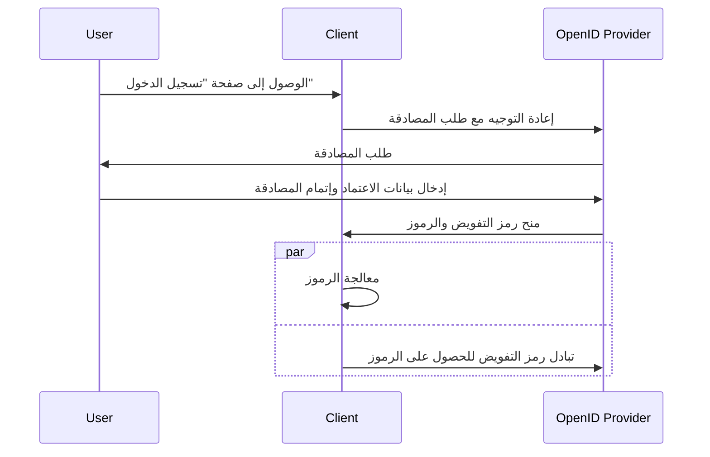

## ما هو التدفق المختلط (Hybrid flow)؟

التدفق المختلط (Hybrid flow) هو عملية مصادقة (authentication) تجمع بين ميزات <Ref slug="authorization-code-flow" /> و <Ref slug="implicit-flow" />. من الجدير بالذكر أن التدفق المختلط ليس جزءًا من مواصفات <Ref slug="oauth-2.0" /> ولكنه امتداد يوفره <Ref slug="openid-connect" />.

هذا التدفق مصمم لتوفير توازن بين الأمان وسهولة الاستخدام لمصادقة المستخدم (user authentication). ومع ذلك، لا يُنصح باستخدام التدفق المختلط في التطبيقات الجديدة نظرًا للاعتبارات الأمنية المرتبطة بتدفق الضمني (implicit flow). بديل مشهور للتدفق المختلط هو استخدام تدفق رمز التفويض (authorization code flow) مع <Ref slug="pkce" /> للحصول على أمان أفضل.

## كيف يعمل التدفق المختلط (Hybrid flow)؟

إليك الخطوات الرئيسية للتدفق المختلط (Hybrid flow):

1. مشابهًا للعديد من تدفقات OIDC الأخرى، يبدأ التدفق المختلط بواسطة <Ref slug="client" /> الذي ينشئ <Ref slug="authentication-request" /> إلى <Ref slug="openid-connect" headingId="openid-provider-op" />.

    ملاحظة: يجب أن يتضمن العميل معلمة `response_type` مع مزيج من `code` وواحدة على الأقل من `id_token` أو `token`، مما يعني أن هناك ثلاث مجموعات ممكنة:

      - `code id_token`: يتوقع العميل رمز التفويض (authorization code) ورمز التعريف (ID token).
      - `code token`: يتوقع العميل رمز التفويض (authorization code) ورمز الوصول (access token).
      - `code id_token token`: يتوقع العميل رمز التفويض (authorization code)، ورمز التعريف (ID token)، ورمز الوصول (access token).

    المتطلب واضح بذاته: يتوقع العميل رمز التفويض (authorization code) وأحد الرموز أو أكثر، والتي ترتبط بتدفق رمز التفويض (authorization code flow) وتدفق الضمني (implicit flow) على التوالي.
2. يقوم المستخدم بالمصادقة على <Ref slug="openid-connect" headingId="openid-provider-op" />.
3. <Ref slug="openid-connect" headingId="openid-provider-op" /> يعيد توجيه المستخدم إلى تطبيق العميل مع رمز التفويض والرموز المطلوبة.
4. يقوم تطبيق العميل بمعالجة الرموز ويمكنه استخدامها للوصول إلى الموارد المحمية نيابة عن المستخدم؛ كما يمكنه استخدام رمز التفويض للحصول على رموز إضافية عبر <Ref slug="token-request" />.

إليك مخطط تسلسل مبسط للتدفق المختلط:



إليك مثال غير معياري لطلب مصادقة التدفق المختلط:

```http
GET /authorize?response_type=code%20id_token
  &client_id=YOUR_CLIENT_ID
  &redirect_uri=https%3A%2F%2Fclient.example.com%2Fcallback
  &scope=openid%20profile%20email
  &nonce=123456
  &state=abc123 HTTP/1.1
Host: your-openid-provider.com
```

### المعلمات الرئيسية في طلب مصادقة التدفق المختلط (Hybrid flow)

يتضمن طلب مصادقة التدفق المختلط المعلمات الرئيسية التالية:

- **`response_type`**: يجب أن تكون القيمة مزيجًا من `code` وواحدة على الأقل من `id_token` أو `token`. على سبيل المثال، `code id_token` أو `code token`.
- **`client_id`**: معرف العميل الصادر عن <Ref slug="openid-connect" headingId="openid-provider-op" /> (خادم التفويض).
- **`redirect_uri`**: URI حيث يقوم خادم التفويض بإرسال المستخدم بعد عملية المصادقة.
- **`scope`**: النطاقات <Ref slug="scope">المطلوبة</Ref> (الأذونات) للرموز.
- **`resource`**: معلمة اختيارية تحدد <Ref slug="resource-indicator" /> للموارد المطلوبة. يحتاج خادم التفويض إلى دعم [RFC 8707](https://datatracker.ietf.org/doc/html/rfc8707) لاستخدام هذه المعلمة.

للحصول على القائمة الكاملة للمعلمات ووصفها، انظر [التوثيق باستخدام التدفق المختلط](https://openid.net/specs/openid-connect-core-1_0.html#HybridFlowAuth).

## اعتبارات الأمان

يشمل التدفق المختلط (Hybrid flow) التدفق الضمني (implicit flow)، المعروف بقيود الأمان الخاصة به. لا تزال الرموز تُنقل عبر القناة الأمامية (المتصفح)، مما قد يعرضها للهجمات المحتملة. سيتم إيقاف تدفق الضمني (implicit flow) في <Ref slug="oauth-2.1" /> بسبب هذه المخاوف.

<Ref slug="authorization-code-flow" /> مع <Ref slug="pkce" /> هو البديل الموصى به للتدفق المختلط (Hybrid flow). يوفر طريقة أكثر أمانًا لمصادقة المستخدمين دون التعرض للرموز في القناة الأمامية.

<SeeAlso slugs={["openid-connect", "oauth-2.1", "authorization-code-flow", "pkce", "implicit-flow"]} />

<Resources
  urls={[
    "https://blog.logto.io/implicit-flow-is-dead",
    "https://blog.logto.io/oauth-2-1",
    "https://openid.net/specs/openid-connect-core-1_0.html#HybridFlowAuth",
  ]}
/>