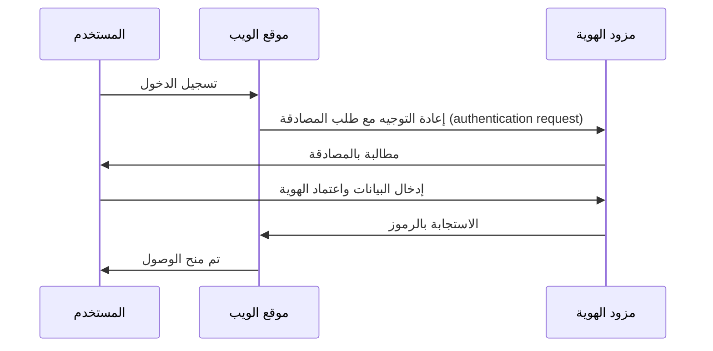

## ما هي إدارة الهوية والوصول (IAM)؟

كما توضح التعريف، فإن إدارة الهوية والوصول (IAM) هي مفهوم واسع يتضمن العديد من الجوانب المتعلقة بإدارة الهويات الرقمية وتنفيذ <Ref slug="access-control" />. دعونا أولاً نقسم المصطلحات:

- **الهوية**: تمثيل رقمي لمستخدم أو خدمة أو جهاز. يمكن أن تتضمن الهوية سمات مثل المعرفات والأدوار والصلاحيات.
- **الوصول**: القدرة على التفاعل مع الموارد، أو تنفيذ إجراءات، أو استخدام الخدمات. باختصار، الوصول يتعلق بما يمكن فعله على موارد معينة.

### إدارة الهوية

تشير إدارة الهوية إلى عملية إدارة والتحقق من الهوية وتأمينها. تتضمن الأنشطة الأساسية التالية:

- **تسجيل الهوية**: إنشاء هويات جديدة للمستخدمين أو الخدمات أو الأجهزة.
- **التحقق من الهوية**: التحقق من ملكية الهوية عبر آليات متنوعة مثل كلمات المرور أو القياسات الحيوية أو المصادقة متعددة العوامل (MFA).
- **أمان الهوية**: حماية الهويات من الوصول غير المصرح به أو سوء الاستخدام أو الكشف عنها.

كل موضوع هو واسع ويمكن تقسيمه إلى موضوعات فرعية مثل إدارة كلمات المرور، ووحدات توحيد الهوية، وإدارة دورة حياة الهوية.

### إدارة الوصول

إدارة الوصول (أو <Ref slug="access-control" />) هي عملية التحكم في من يمكنه تنفيذ أي إجراءات على موارد معينة. تتضمن الأنشطة الأساسية التالية:

- **سياسات التحكم في الوصول**: وضع القواعد والسياسات التي تحدد من يمكنه الوصول إلى الموارد وما يمكنه فعله.
- **تنفيذ الوصول**: تنفيذ سياسات التحكم في الوصول عبر آليات مثل المصادقة (authentication)، والتفويض (authorization)، والمراجعة.
- **حوكمة الوصول**: مراقبة وإدارة حقوق الوصول لضمان الامتثال للوائح وأفضل الممارسات الأمنية.

كل نشاط يلعب دورًا هامًا في التطبيقات والأنظمة الحديثة لضمان أن الوصول إلى الموارد مقتصر فقط على الهويات المصرح بها (المستخدمين أو الخدمات أو الأجهزة) وفق السياسات المحددة.

## ما هي مكونات IAM؟

يتم تنفيذ IAM باستخدام مجموعة من البرامج والخدمات وأفضل الممارسات. اثنان من المكونات المهمة في IAM هما:

- **<Ref slug="identity-provider" />**: خدمة تدير هويات المستخدمين والمصادقة.
- **<Ref slug="service-provider" />**: الخدمة التي تعتمد على مزود الهوية للتحقق من الهوية والتفويض. في معظم الحالات، تكون التطبيق أو الخدمة التي تطورها.

الفصل الواضح بين مزود الهوية ومزود الخدمة سيساعد في فك تشابك IAM عن منطق التطبيق، مما يجعل إدارته وتكبيره أسهل.

## إدارة الهوية والوصول في الواقع

لنرى مثالاً على كيفية عمل IAM: عندما تقوم بتسجيل الدخول إلى موقع ويب، يمكن اعتبار عملية التحقق من هويتك ومنحك الوصول إلى الموقع كعملية إدارة الهوية والوصول.

عادةً، تتضمن عملية IAM مرحلتين رئيسيتين: المصادقة (authentication) والتفويض (authorization):

- <Ref slug="authentication" /> يجيب على السؤال "أي هوية تملك؟"
- <Ref slug="authorization" /> يجيب على السؤال "ما الذي يمكنك فعله؟"

> في بعض الأحيان، يتم تفسير المصادقة على أنها "من أنت؟" ومع ذلك، عند مناقشة الهويات الرقمية، يكون من الدقة أن يُظهَر المصادقة عن طريق "إثبات ملكية الهوية".

علاوة على ذلك، مفهوم إدارة الهوية والوصول كبير بما فيه الكفاية لتوليد مفاهيم جديدة، مثل WIAM (إدارة الهوية لفرق العمل) وCIAM (إدارة هوية العملاء).

في حين أن WIAM وCIAM يشتركان في نفس الأساس، فإن لهما استخدامات مختلفة: تستخدم WIAM عادةً للمستخدمين الداخليين، بينما تُستخدم CIAM للعملاء الخارجيين. بعض الأمثلة:

- **WIAM**: لدى شركتك نظام هوية موحد للموظفين، حيث يمكن لكل شخص استخدام نفس الحساب للوصول إلى موارد الشركة، مثل الاشتراكات في البرامج وخدمات الحوسبة السحابية، إلخ.
- **CIAM**: يتطلب مكتبتك الإلكترونية نظام هوية للمستخدمين والمزودين. تجربة تسجيل الدخول جزء جوهري من عملية الإعداد، لأنها تقع في قمة مسار التحويل.

للمزيد من المعلومات عن مفهوم CIAM والمواضيع ذات الصلة، يمكنك الرجوع إلى [CIAM 101: Authentication, Identity, SSO](https://blog.logto.io/ciam-101-intro-authn-sso).

### المصادقة

هذه بعض طرق المصادقة الشائعة التي تُستخدم في IAM:

- **المصادقة المستندة إلى كلمة المرور**: الطريقة الأكثر شيوعًا، حيث يقدم المستخدمون اسم المستخدم وكلمة المرور لإثبات هويتهم.
- **المصادقة <Ref slug="passwordless" />**: طريقة تتيح للمستخدمين تسجيل الدخول دون كلمة مرور، مثل استخدام رمز يتم إرساله لبريد الإلكتروني أو الهاتف. لاحظ أن المصادقة بدون كلمة مرور قد تشير أيضًا إلى طرق أخرى، مثل المصادقة بالقياسات الحيوية.
- **تسجيل الدخول الاجتماعي**: طريقة تتيح للمستخدمين تسجيل الدخول باستخدام حساباتهم الاجتماعية، مثل Google أو Facebook أو Twitter.
- **<Ref slug="passkey" /> (WebAuthn)**: طريقة تتيح للمستخدمين تسجيل الدخول باستخدام مفتاح أمان، مثل مفتاح USB أو هاتف ذكي يدعم WebAuthn.
- **المصادقة البيومترية**: طريقة تستخدم الخصائص الفيزيائية مثل بصمات الأصابع أو التعرف على الوجه أو التعرف على الصوت للتحقق من هوية المستخدم.
- **المصادقة <Ref slug="machine-to-machine" />**: طريقة تتيح للخدمات أو الأجهزة التحقق من هويتها دون تدخل بشري، مثل استخدام مفاتيح API أو الشهادات.

لإضافة طبقة إضافية من الأمان، يمكن استخدام <Ref slug="mfa" /> بالتزامن مع هذه الطرق. يتطلب MFA من المستخدمين تقديم عاملين أو أكثر لإثبات هويتهم، مثل شيء يعرفونه (كلمة المرور)، أو شيء لديهم (مفتاح الأمان أو <Ref slug="totp" />)، أو شيء هم عليه (البيانات البيومترية).

### التفويض

مع وجود المصادقة، يحدد التفويض ماذا يمكن للهوية أن تفعل. يمكن أن يكون التفويض استنادًا إلى عوامل متنوعة، مثل دور الهوية، أو عضوية المجموعة، أو الصلاحيات، أو السمات، أو السياسات، إلخ. هناك عدة نماذج تفويض شائعة:

- **<Ref slug="rbac" />**: نموذج يخصص الصلاحيات للأدوار، ثم يخصص الأدوار للهويات. على سبيل المثال، قد يكون لدور الموظف الوصول إلى موارد معينة، بينما قد يكون لدور المسؤول الوصول إلى جميع الموارد.
- **<Ref slug="abac" />**: نموذج يستخدم السمات (الخصائص) للهوية والموارد والبيئة لاتخاذ قرارات التحكم في الوصول. على سبيل المثال، قد يكون للهوية التي تمتلك السمة "القسم=الهندسة" الوصول إلى موارد الهندسة.
- **التحكم في الوصول المستند إلى السياسات (PBAC)**: نموذج يستخدم السياسات لتعريف قواعد التحكم في الوصول. يمكن أن تستند السياسات إلى عوامل متنوعة، مثل وقت اليوم، الموقع، نوع الجهاز، إلخ.
- **التحكم في الوصول الدقيق**: نموذج يوفر تحكمًا أكثر دقة في الوصول، مما يسمح بتعيين الصلاحيات على مستوى الموارد الفردية أو العمليات.

## ما هي المعايير المفتوحة المستخدمة بشكل واسع في IAM؟

هناك العديد من المعايير والبروتوكولات المفتوحة التي تُستخدم بشكل واسع في IAM:

- **<Ref slug="oauth-2.0" />**: بروتوكول يتيح للتطبيقات الوصول إلى الموارد نيابة عن المستخدم دون مشاركة بيانات اعتماد المستخدم. يُستخدم OAuth 2.0 بشكل شائع للتفويض، مثل السماح لتطبيق طرف ثالث بالوصول إلى ملفات Google Drive الخاصة بالمستخدم.
- **<Ref slug="openid-connect" />**: طبقة هوية مبنية على OAuth 2.0 تتيح للتطبيقات التحقق من هوية المستخدم والحصول على معلومات ملف تعريف أساسية عنه. يعد الدخول الأحادي (SSO) استخدامًا شائعًا لـ OpenID Connect. يعتبر دمج OAuth 2.0 وOpenID Connect ممارسة شائعة في IAM الحديثة.
- **<Ref slug="saml" />**: معيار قائم على XML لتبادل بيانات المصادقة والتفويض بين موفري الهوية ومقدمي الخدمات. يُستخدم SAML بشكل شائع لـ SSO في البيئات المؤسسية.
- **SCIM (نظام إدارة الهوية عبر المجالات)**: معيار لتحديث تبادل معلومات هوية المستخدم تلقائيًا بين موفري الهوية ومقدمي الخدمات. يُستخدم SCIM بشكل شائع لإدارة المستخدمين وتفويضهم في التطبيقات السحابية.

## ما هي الاعتبارات الرئيسية لتصميم IAM؟

عند تصميم نظام IAM، هناك عدة اعتبارات رئيسية للنظر فيها:

- **الأمان**: الأمان هو الأهم في IAM. تأكد من أن طرق المصادقة تتبع أفضل الممارسات، مثل استخدام تشفير كلمات المرور القوي، وتنفيذ MFA، والحماية من الهجمات الشائعة مثل التصيد والاختراق القسري.
- **الخصوصية**: احترم خصوصية المستخدم بجمع المعلومات الضرورية فقط والحصول على موافقة المستخدم عندما يكون ذلك ضروريًا.
- **القابلية للتوسيع**: اجعل نظام IAM قابلاً للتوسيع للتعامل مع عدد كبير من المستخدمين والتطبيقات. فكر في استخدام موفري الهوية المستندة إلى السحابة للتوسعة.
- **التشغيل البيني**: فائدة استخدام المعايير المفتوحة هو أنها تسمح بالتشغيل البيني بين الأنظمة المختلفة. على سبيل المثال، معظم موفري الهوية الشهيرين مثل Google وFacebook وMicrosoft يدعمون OAuth 2.0 وOpenID Connect.
- **تجربة المستخدم**: لتجربة المستخدم مع المصادقة والتفويض تأثير كبير على تحويل المستخدم واحتفاظه. موازنة الأمان مع سهولة الاستخدام هي فن في IAM.

<SeeAlso slugs={['openid-connect', 'oauth-2.0', 'single-sign-on', 'enterprise-sso']} />

<Resources
  urls={[
    "https://blog.logto.io/ciam-101-intro-authn-sso",
    "https://blog.logto.io/ciam-102-authz-and-rbac"
  ]}
/>
