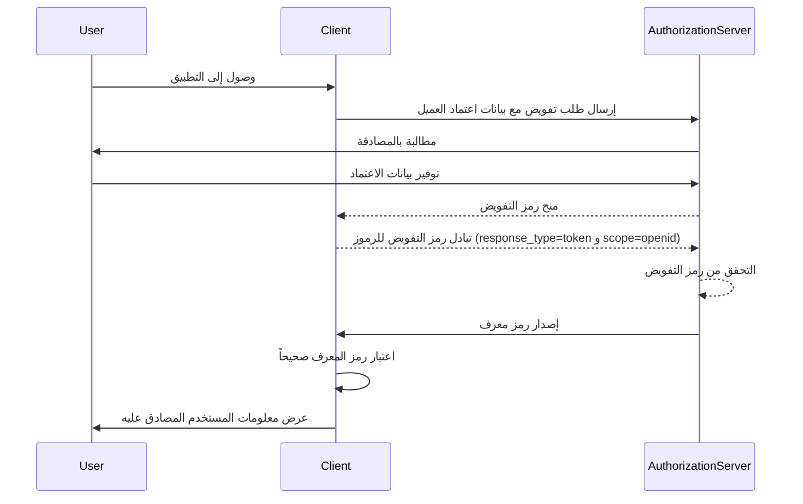

## ما هو رمز المعرف (ID token)؟

رمز المعرف (ID token) هو نوع محدد من رموز الأمان التي تحتوي على معلومات حول المستخدم المصادق عليه، يتم تسليمه إلى تطبيق العميل بعد عملية مصادقة ناجحة. رمز المعرف هو الميزة الرئيسية التي تميز OpenID Connect (OIDC) عن OAuth 2.0. بينما يركز OAuth 2.0 فقط على التفويض، يبني OIDC فوقه لإضافة مصادقة المستخدم عن طريق تقديم رمز المعرف.

في عملية مصادقة OIDC، يبدأ تطبيق العميل (الطرف المعتمد) في عملية المصادقة عن طريق إعادة توجيه المستخدم إلى خادم التفويض. بعد مصادقة ناجحة، يستجيب الخادم برمز معرف، بالإضافة إلى رموز أخرى مثل رمز الوصول (access token). يتم ترميز رمز المعرف عادةً كـ JWT (JSON Web Token) ويشمل مطالبات رئيسية مثل معرف المستخدم (sub)، المُصدر (iss)، الجمهور (aud) ومعلومات أخرى خاصة بالمستخدم.

الوظيفة الأساسية لرز المعرف هي التحقق من هوية المستخدم ونقل هذه المعلومات إلى تطبيق العميل. هذا يمكّن التطبيق من مصادقة المستخدم دون معالجة بيانات الاعتماد مباشرةً. ولأن العميل يتلقى رمز المعرف فقط بعد أن تم مصادقة المستخدم بواسطة خادم التفويض، يمكن استخدام رمز المعرف كوسيلة آمنة للتحقق من هوية المستخدم.

## كيف يعمل رمز المعرف (ID token)؟

يبدأ تطبيق العميل عملية المصادقة عن طريق إعادة توجيه المستخدم إلى خادم التفويض. يصادق المستخدم مع الخادم، الذي يصدر بعد ذلك رمز معرف مع رموز أخرى مثل رمز الوصول. يتم إرجاع رمز المعرف إلى تطبيق العميل، الذي يمكنه بعد ذلك استخدامه للتحقق من هوية المستخدم.

نظرًا لأن OIDC هو بروتوكول شائع ومعياري، فإن العديد من المكتبات والأطر توفر دعمًا مدمجًا للتعامل مع رموز المعرف. هذا يجعل رموز المعرف سهلة التكامل في تطبيقات العميل، وتستخدم على نطاق واسع في سيناريوهات الدخول الموحد (SSO) والهوية الفيدرالية.

## المطالبات في رمز المعرف (ID token)

رمز المعرف (ID token) هو JWT (JSON Web Token) يحتوي على مجموعة من المطالبات حول المستخدم المصادق عليه. تشمل هذه المطالبات المطالبات القياسية لـ JWT التي تم تعريفها في [مواصفات JWT](https://datatracker.ietf.org/doc/html/rfc7519#section-4)، وكذلك المطالبات الخاصة بـ OIDC التي تُستخدم لنقل معلومات هوية المستخدم.

مطالبات رمز JWT القياسية:

- **iss (المُصدر)**: مطلوب. مطاليب المُصدر تحدد من أصدر رمز المعرف. هذا عادةً هو عنوان URL لخادم التفويض الذي أصدر الرمز.
- **sub (الموضوع)**: مطلوب. المطالبة بالموضوع تحدد المستخدم الذي يدور حوله رمز المعرف. هذا عادةً معرف فريد للمستخدم.
- **aud (الجمهور)**: مطلوب. المطالبة بالجمهور تحدد الجمهور لرمز المعرف. هذا عادةً تطبيق العميل الذي طلب الرمز.
- **exp (وقت انتهاء الصلاحية)**: مطلوب. المطالبة بوقت انتهاء الصلاحية تحدد الوقت الذي ينتهي فيه الرمز. بعد هذا الوقت، يجب عدم قبول الرمز للمعالجة.
- **iat (الصادر في)**: مطلوب. المطالبة بوقت الإصدار تحدد الوقت الذي تم فيه إصدار الرمز.
- **auth_time (وقت المصادقة)**: اختياري. المطالبة بوقت المصادقة تحدد الوقت الذي تم فيه مصادقة المستخدم. هذه المطالبة تكون موجودة فقط إذا تم مصادقة المستخدم خلال الجلسة الحالية.
- **nonce**: اختياري. المطالبة nonce تُستخدم لربط جلسة العميل برمز المعرف. تُستخدم عادةً لمنع هجمات التكرار.

مطالبات معلومات المستخدم القياسية في OIDC:

- **name**: الاسم الكامل للمستخدم.
- **given_name**: الاسم الأول للمستخدم.
- **family_name**: اسم العائلة للمستخدم.
- **middle_name**: الاسم الأوسط للمستخدم.
- **nickname**: لقب المستخدم أو اسم قصير آخر.
- **preferred_username**: اسم المستخدم المفضل للمستخدم.
- **profile**: عنوان URL يشير إلى صفحة الملف الشخصي للمستخدم.
- **picture**: عنوان URL يشير إلى صورة الملف الشخصي للمستخدم.
- **website**: عنوان URL يشير إلى موقع المستخدم الإلكتروني.
- **email**: عنوان البريد الإلكتروني للمستخدم.
- **email_verified**: قيمة بوليانية تشير إلى ما إذا تم التحقق من عنوان البريد الإلكتروني للمستخدم
- **gender**: جنس المستخدم.
- **birthdate**: تاريخ ميلاد المستخدم. يمثل كسلسلة في الشكل YYYY-MM-DD.
- **zoneinfo**: المنطقة الزمنية للمستخدم. سلسلة من [قاعدة بيانات IANA للمناطق الزمنية](https://www.iana.org/time-zones).
- **locale**: اللغة المستخدمة للمستخدم. تمثل اللغة المفضلة للمستخدم والمنطقة لعرض التواريخ والأوقات والأرقام.
- **phone_number**: رقم هاتف المستخدم.
- **phone_number_verified**: قيمة بوليانية تشير إلى ما إذا تم التحقق من رقم هاتف المستخدم.
- **address**: عنوان البريد الخاص بالمستخدم. القيمة هي كائن JSON يحتوي على معلومات عنوان المستخدم.
- **updated_at**: الوقت الذي تم فيه تحديث معلومات المستخدم آخر مرة.

تقدم هذه المطالبات طريقة قياسية لنقل معلومات الهوية للمستخدم في رمز المعرف. بينما يحدد المعيار مجموعة من المطالبات القياسية، يمكن تضمين مطالبات مخصصة أيضًا في رمز المعرف لنقل معلومات إضافية خاصة بالمستخدم حسب الحاجة.

## التحقق من صحة رمز المعرف (ID token)

عندما يتلقى تطبيق العميل رمز معرف، يجب عليه التحقق من صحة الرمز لضمان أصالته وتكامله. عادةً ما تشمل عملية التحقق الخطوات التالية:

1. **تحقق من التوقيع**: يجب على العميل التحقق من توقيع رمز المعرف باستخدام المفتاح العام لخادم التفويض. هذا يضمن أن الرمز لم يتم العبث به وقد أصدر بواسطة الطرف المتوقع.
2. **التحقق من المُصدر**: يجب على العميل التحقق من أن المطالبة `iss` في رمز المعرف تتطابق مع عنوان URL لخادم التفويض الذي أصدر الرمز. هذا يساعد في منع هجمات استبدال الرمز.
3. **التحقق من الجمهور**: يجب على العميل التحقق من أن المطالبة `aud` في رمز المعرف تتطابق مع `client_id` لتطبيق العميل. هذا يضمن أن الرمز قد أصدر لتطبيق العميل.
4. **التحقق من وقت الانتهاء**: يجب على العميل التحقق من أن المطالبة `exp` في رمز المعرف لم تتجاوز. إذا انتهت صلاحية الرمز، يجب عدم قبوله. قد توفر البيئات تقديرات للحساب للتفاوت الزمني بين الساعات.
5. **التحقق من nonce**: إذا قام العميل بتضمين معلمة `nonce` في طلب المصادقة، فيجب عليه التحقق من أن المطالبة `nonce` في رمز المعرف تتطابق مع قيمة معلمة `nonce`. هذا يساعد في منع هجمات التكرار.

## رمز المعرف مقابل رمز الوصول (access token)

بينما تستخدم رموز المعرف ورموز الوصول على نطاق واسع في OIDC، فإنها تخدم أغراض مختلفة ولديها خصائص مميزة:

|              | رمز المعرف (ID token)                                                                 | رمز الوصول (Access token)                                                                                                   |
| ------------ | ------------------------------------------------------------------------------------ | -------------------------------------------------------------------------------------------------------------------------- |
| **الغرض**    | يتحقق من هوية المستخدم وينقل معلومات المستخدم إلى تطبيق العميل.                        | يوفر الوصول إلى الموارد المحمية نيابة عن المستخدم.                                                                            |
| **التنسيق**  | عادةً ما يكون JWT يحتوي على مطالبات هوية المستخدم.                                     | يمكن أن يكون إما JWT أو راندوم سترينج غير شفاف.                                                                               |
| **الجمهور**  | مخصص لتطبيق العميل الذي طلب الرمز.                                                     | مخصص لخادم الموارد الذي يستضيف الموارد المحمية.                                                                               |
| **مدة الحياة**| رمز قصير العمر يكون عادةً صالحًا لبضع دقائق. للاستخدام لمرة واحدة فقط.                 | رمز طويل الأمد يكون صالحًا لفترة أطول (مثل ساعات). يمكن إعادة استخدامه عدة مرات خلال فترة صلاحيته.                             |
| **المحتويات**| يحتوي على معلومات هوية المستخدم مثل الاسم، البريد الإلكتروني، وبيانات أخرى خاصة بالمستخدم. | يحتوي على معلومات حول أذونات المستخدم (النطاقات) للوصول إلى موارد معينة.                                                     |

## أفضل الممارسات لاستخدام رموز المعرف (ID tokens)

عند العمل مع رموز المعرف في OIDC، من المهم اتباع أفضل الممارسات لضمان أمان وسلامة عملية المصادقة. بعض أفضل الممارسات الرئيسية تشمل:

1. **التحقق من صحة الرموز**: دائماً تحقق من صحة رمز المعرف الذي تم استلامه من خادم التفويض لضمان أصالته وتكامله. هذا يساعد في منع هجمات استبدال الرموز والوصول غير المصرح به.
2. **استخدام قنوات آمنة**: تأكد من نقل الرموز عبر قنوات آمنة (مثل HTTPS) لمنع الاعتراض والعبث.
3. **حماية المعلومات الحساسة**: بما أن رموز JWT عادةً ما تكون مشفرة ولكن غير مشفرة، فإن المحتويات يمكن أن تكون شفافة. تجنب إدراج المعلومات الحساسة في حمولة رمز المعرف لمنع تعرض البيانات الحساسة في حالة تسرب الرمز.
4. **ليست للتفويض**: رموز المعرف مخصصة لمصادقة المستخدم ولا يجب استخدامها لأغراض التفويض. استخدم رموز الوصول للتفويض للوصول إلى الموارد المحمية.
5. **استخدام لمرة واحدة**: رموز المعرف عادةً ما تكون للاستخدام لمرة واحدة. بمجرد أن يقوم تطبيق العميل بالتحقق من صحة رمز المعرف، لا ينبغي إعادة استخدامه لطلبات لاحقة أو للحفاظ على حالة الجلسة. للحفاظ على حالة جلسة المستخدم، يجب أن تستخدم تطبيقات العميل آليات مثل رموز التحديث وطلبات تبادل الرموز. (رموز التحديث هي رموز غير شفافة طويلة العمر يمكن استخدامها للحصول على رموز وصول جديدة ورموز معرف عند انتهاء صلاحيتها.)

<SeeAlso slugs={["openid-connect", "jwt", "signing-key", "access-token"]} />