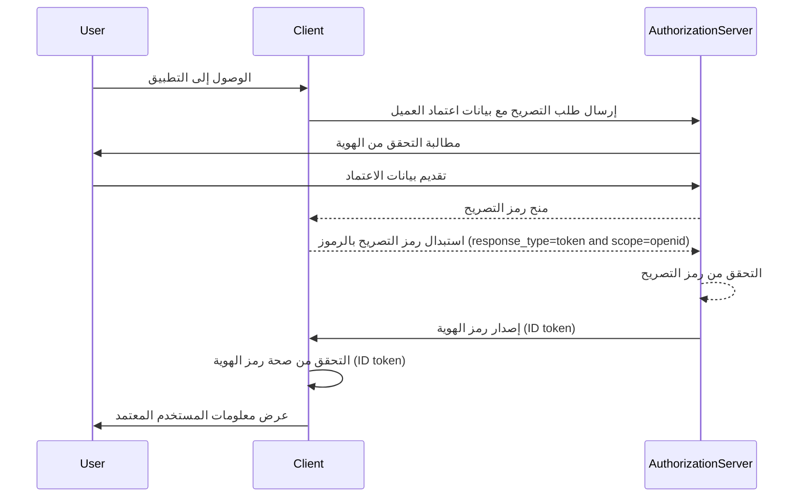

## ما هو رمز الهوية (ID token)؟

رمز الهوية (ID token) هو نوع محدد من الرموز الأمنية التي تحتوي على معلومات حول المستخدم الذي تم التحقق من هويته، يتم تسليمها لتطبيق العميل بعد نجاح <Ref slug="authentication" />. يتميز رمز الهوية (ID token) كميزة رئيسية تميز <Ref slug="openid-connect" /> عن <Ref slug="oauth-2.0" />. بينما يركز OAuth 2.0 فقط على التصريح، يبني OIDC على ذلك لإضافة التحقق من هوية المستخدم عن طريق إدخال رمز الهوية (ID token).

في عملية التحقق من الهوية باستخدام OIDC، يبدأ تطبيق العميل (اعتماد الأطراف) التحقق من الهوية عن طريق إعادة توجيه المستخدم إلى خادم التصريح. بعد نجاح التحقق من الهوية، يستجيب الخادم برمز هوية (ID token)، بالإضافة إلى رموز أخرى مثل <Ref slug="access-token" />. يتم ترميز رمز الهوية (ID token) عادةً كـ <Ref slug="jwt" /> ويشمل مطالبات رئيسية مثل معرف المستخدم (sub)، المصدر (iss)، الجمهور (aud) وغيرها من المعلومات الخاصة بالمستخدم.

تتمثل الوظيفة الأساسية لرمز الهوية (ID token) في التحقق من هوية المستخدم ونقل هذه المعلومات إلى تطبيق العميل. يمكِّن هذا التطبيق من التحقق من هوية المستخدم دون التعامل المباشر مع أوراق الاعتماد. طالما أن التطبيق العميل لم يتلقَ سوى رمز الهوية (ID token) بعد أن تم التحقق من المستخدم بواسطة خادم التصريح، يمكن استخدام رمز الهوية كطريقة آمنة للتحقق من هوية المستخدم.

## كيف يعمل رمز الهوية (ID token)؟

يبدأ تطبيق العميل عملية التحقق من الهوية عن طريق إعادة توجيه المستخدم إلى خادم التصريح. يتحقق المستخدم مع الخادم، الذي يصدر بعد ذلك رمز هوية (ID token) بالإضافة إلى رموز أخرى مثل رمز الوصول (access token). يعود رمز الهوية (ID token) إلى تطبيق العميل، الذي يمكنه بعد ذلك استخدامه للتحقق من هوية المستخدم.

نظرًا لأن OIDC هو بروتوكول شائع ومعياري، فإن العديد من المكتبات والأطر توفر دعمًا مدمجًا لمعالجة رموز الهوية (ID tokens). يجعل هذا رموز الهوية سهلة الدمج في تطبيقات العميل، وتستخدم على نطاق واسع في سيناريوهات <Ref slug="single-sign-on" /> وهويات الفيدرالية.

## مطالبات في رمز الهوية (ID token)

رمز الهوية (ID token) هو JWT يحتوي على مجموعة من <Ref slug="claim" /> حول المستخدم الذي تم التحقق من هويته. تتضمن هذه المطالبات كلاً من مطالبات JWT القياسية التي تم تعريفها في [مواصفة JWT](https://datatracker.ietf.org/doc/html/rfc7519#section-4)، بالإضافة إلى مطالبات محددة لـ OIDC تُستخدم لنقل معلومات هوية المستخدم.

مطالبات رمز JWT القياسية:

- **iss (المصدر)**: مطلوب. تحدد مطالبة المصدر مصدر رمز الهوية. عادة ما يكون هذا هو عنوان URL لخادم التصريح الذي أصدر الرمز.
- **sub (الموضوع)**: مطلوب. تحدد مطالبة الموضوع المستخدم الذي يتعلق به رمز الهوية. عادة ما يكون هذا معرفًا فريدًا للمستخدم.
- **aud (الجمهور)**: مطلوب. تحدد مطالبة الجمهور ال<Ref slug="audience" /> لرمز الهوية. عادة ما يكون هذا هو تطبيق العميل الذي طلب الرمز.
- **exp (وقت انتهاء الصلاحية)**: مطلوب. تحدد مطالبة وقت انتهاء الصلاحية الوقت الذي ينتهي فيه صلاحية الرمز. بعد هذا الوقت، يجب ألا يتم قبول الرمز للمعالجة.
- **iat (مُصدر في)**: مطلوب. تحدد مطالبة المُصدر الوقت الذي تم فيه إصدار الرمز.
- **auth_time (وقت التحقق من الهوية)**: اختياري. تحدد مطالبة وقت التحقق من الهوية الوقت الذي تم فيه التحقق من هوية المستخدم. تكون هذه المطالبة موجودة فقط إذا تم التحقق من هوية المستخدم خلال الجلسة الحالية.
- **nonce**: اختياري. تستخدم مطالبة nonce لربط جلسة العميل برمز الهوية. يتم استخدامها عادة لمنع هجمات الإعادة.

مطالبات معلومات المستخدم القياسية لـ OIDC:

- **name**: الاسم الكامل للمستخدم.
- **given_name**: الاسم الأول للمستخدم.
- **family_name**: اسم العائلة للمستخدم.
- **middle_name**: الاسم الأوسط للمستخدم.
- **nickname**: لقب المستخدم أو اسم آخر قصير.
- **preferred_username**: اسم المستخدم المفضل للمستخدم.
- **profile**: عنوان URL يشير إلى صفحة ملف تعريف المستخدم.
- **picture**: عنوان URL يشير إلى صورة ملف تعريف المستخدم.
- **website**: عنوان URL يشير إلى موقع المستخدم.
- **email**: عنوان البريد الإلكتروني للمستخدم.
- **email_verified**: قيمة منطقية تشير إلى ما إذا تم التحقق من عنوان البريد الإلكتروني للمستخدم.
- **gender**: جنس المستخدم.
- **birthdate**: تاريخ ميلاد المستخدم. يتم تمثيله كعلامة نصية بالتنسيق YYYY-MM-DD.
- **zoneinfo**: المنطقة الزمنية للمستخدم. سلسلة من [قاعدة بيانات المنطقة الزمنية من IANA](https://www.iana.org/time-zones).
- **locale**: لغة المستخدم. تمثل اللغة والمنطقة المفضلة لدى المستخدم لتنسيق التواريخ والأوقات والأرقام.
- **phone_number**: رقم هاتف المستخدم.
- **phone_number_verified**: قيمة منطقية تشير إلى ما إذا تم التحقق من رقم هاتف المستخدم.
- **address**: العنوان البريدي للمستخدم. تكون القيمة كائن JSON يحتوي على معلومات عنوان المستخدم.
- **updated_at**: الوقت الذي تم فيه تحديث معلومات المستخدم آخر مرة.

تقدم هذه المطالبات طريقة معي

ارية لنقل معلومات هوية المستخدم في رمز الهوية. بينما تعرف المواصفة مجموعة من المطالبات القياسية، يمكن أيضًا تضمين المطالبات المخصصة في رمز الهوية لنقل معلومات إضافية خاصة بالمستخدم حسب الحاجة.

## التحقق من صحة رمز الهوية (ID token)

عندما يتلقى تطبيق العميل رمز هوية (ID token)، يجب عليه التحقق من صحة الرمز للتأكد من صحته وسلامته. تتضمن عملية التحقق عادةً الخطوات التالية:

1. **التحقق من التوقيع**: يجب على العميل التحقق من توقيع رمز الهوية باستخدام المفتاح العام لخادم التصريح. يضمن هذا أن الرمز لم يتم التلاعب به وتم إصداره من قبل الجهة المتوقعة.
2. **التحقق من المصدر**: يجب على العميل التحقق من أن مطالبة `iss` في رمز الهوية تطابق عنوان URL لخادم التصريح الذي أصدر الرمز. يساعد ذلك في منع هجمات استبدال الرموز.
3. **التحقق من الجمهور**: يجب على العميل التحقق من أن مطالبة `aud` في رمز الهوية تطابق `client_id` لتطبيق العميل. يضمن ذلك أن الرمز قد تم إصداره لتطبيق العميل.
4. **التحقق من وقت انتهاء الصلاحية**: يجب على العميل التحقق من أن مطالبة `exp` في رمز الهوية لم يمر. إذا انتهت صلاحية الرمز، فلا يجب قبوله. قد توفر التنفيذات فترة تسامح للتعويض عن انزياح الساعة.
5. **التحقق من nonce**: إذا قام العميل بتضمين معلمة `nonce` في طلب التحقق من الهوية، يجب عليه التحقق من أن مطالبة `nonce` في رمز الهوية تطابق قيمة معلمة `nonce`. يساعد ذلك في منع هجمات الإعادة.

## رمز الهوية مقابل رمز الوصول

على الرغم من أن كلا من رموز الهوية ورموز الوصول تُستخدم على نطاق واسع في OIDC، إلا أنها تخدم أغراضًا مختلفة ولها خصائص مميزة:

|              | رمز الهوية (ID token)                                                                               | رمز الوصول (Access token)                                                                                                                 |
| ------------ | -------------------------------------------------------------------------------------- | ---------------------------------------------------------------------------------------------------------------------------- |
| **الغرض**  | يتحقق من هوية المستخدم وينقل معلومات المستخدم إلى تطبيق العميل. | يتيح الوصول إلى الموارد المحمية نيابة عن المستخدم.                                                                |
| **التنسيق**   | عادة ما يكون JWT يحتوي على مطالبات هوية المستخدم.                                    | يمكن أن يكون إما JWT أو <Ref slug="opaque-token" />.                                                                       |
| **الجمهور** | مخصص لتطبيق العميل الذي طلب الرمز.                          | مخصص لخادم الموارد الذي يستضيف الموارد المحمية.                                                         |
| **مدة الحياة** | رمز قصير الأمد يكون عادة صالحًا لبضع دقائق. يستخدم لمرة واحدة فقط.        | رمز طويل الأمد يكون صالحًا لفترة زمنية أطول (مثل الساعات). يمكن إعادة استخدامه عدة مرات خلال فترة صلاحيته. |
| **المحتويات** | يحتوي على معلومات هوية المستخدم مثل الاسم والبريد الإلكتروني والبيانات الخاصة الأخرى بالمستخدم.  | يحتوي على معلومات حول أذونات المستخدم (نطاقات) للموارد المحددة.                                            |

## أفضل الممارسات لاستخدام رموز الهوية

عند العمل مع رموز الهوية في OIDC، من المهم اتباع أفضل الممارسات لضمان أمان وسلامة عملية التحقق من الهوية. تتضمن بعض أفضل الممارسات الرئيسية:

1. **التحقق من صحة رموز الهوية**: تحقق دائمًا من صحة رمز الهوية المستلم من خادم التصريح لضمان صحته وسلامته. يساعد ذلك في منع هجمات استبدال الرموز والوصول غير المصرح به.
2. **استخدام القنوات الآمنة**: تأكد من أن رموز الهوية تُنقل عبر قنوات آمنة (مثل HTTPS) لمنع الاعتراض والتلاعب.
3. **حماية المعلومات الحساسة**: نظرًا لأن JWTs عادة ما تكون مشفرة ولكن ليست مشفرة، مما يجعل المحتوى شفافًا. تجنب تضمين المعلومات الحساسة في حمولة رمز الهوية لمنع انكشاف البيانات الحساسة في حالة تسرب الرمز.
4. **ليس للتصريح**: تُستخدم رموز الهوية للتحقق من هوية المستخدم ويجب عدم استخدامها لأغراض التصريح. استخدم رموز الوصول للتصريح للوصول إلى الموارد المحمية.
5. **الاستخدام الفردي**: يُقصد برموز الهوية عادة للاستخدام لمرة واحدة. بمجرد أن يتحقق تطبيق العميل من صحة رمز الهوية، يجب عدم إعادة استخدامه للطلبات الفرعية أو الاحتفاظ بحالة الجلسة. للحفاظ على حالة جلسة المستخدم، يجب أن تستخدم تطبيقات العميل آليات مثل <Ref slug="refresh-token" /> وطلبات تبادل الرموز. (الرموز المنعشة هي رموز غامضة طويلة الأمد يمكن استخدامها للحصول على رموز وصول جديدة ورموز هوية عند انتهاء صلاحيتها.)

<SeeAlso slugs={["openid-connect", "jwt", "signing-key", "access-token"]} />