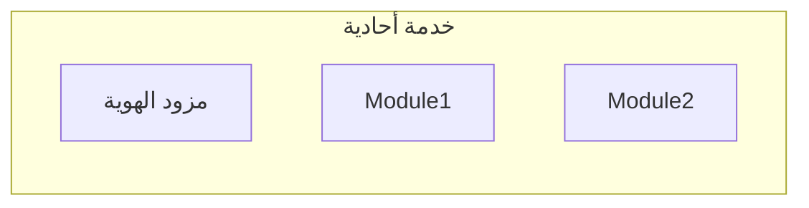
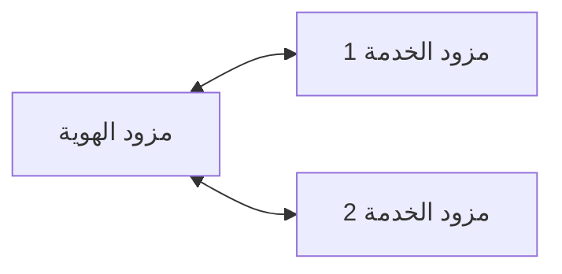

## ما هو مزود الهوية (IdP)؟

في مجال <Ref slug="iam" />، يعد مزود الهوية (IdP) الخدمة المركزية لإدارة الهويات. وهو مسؤول عن مصادقة المستخدمين، إصدار رموز الهوية، وتوفير معلومات المستخدم لـ <Ref slug="service-provider">مزودي الخدمة</Ref> (مثل التطبيقات، الخدمات، واجهات برمجة التطبيقات).

بالإضافة إلى <Ref slug="authentication" />، تكون مزودي الهوية الحديثة أيضًا مسؤولة عن <Ref slug="authorization" /> (تطبيق سياسات <Ref slug="access-control" />) ودعم الميزات المتقدمة مثل <Ref slug="single-sign-on" /> و<Ref slug="multi-tenancy" />.

## معايير مزودي الهوية

نظرًا لطبيعة إدارة الهوية والحاجة إلى التشغيل البيني، سيكون من غير العملي وغير الفعال بناء مزودي الهوية بدون معايير. هذه بعض السيناريوهات النموذجية:

- يحتاج مزودان للهوية للتواصل مع بعضهما لتبادل معلومات المستخدم (مثل تسجيل الدخول الاجتماعي).
- يحتاج تطبيق إلى التحقق من هوية المستخدمين باستخدام مزودي هوية متعددين (مثل هوية متحدّة).
- يحتاج مزود الهوية إلى دعم أنواع متعددة من العملاء (مثل الويب، الجوال، إنترنت الأشياء).

لمعالجة هذه السيناريوهات، طورت الصناعة عدة معايير شائعة لمزودي الهوية:

- <Ref slug="oauth-2.0" />: إطار تفويض مستخدم على نطاق واسع يمكن التطبيقات من الحصول على حق الوصول نيابة عن المستخدمين أو الخدمات.
- <Ref slug="openid-connect" />: طبقة هوية مبنية على قمة OAuth 2.0 توفر المصادقة ومعلومات المستخدم.
- <Ref slug="saml" />: معيار لتبادل بيانات المصادقة والتفويض بين نطاقات الأمان.

بالنسبة للتطبيقات الجديدة، يعد OpenID Connect (OIDC) المعيار الموصى باستخدامه إما لبناء مزود هوية أو للتكامل مع مزودي الهوية الحاليين.

## هيكلية مزود الهوية

مصطلح "مزود الهوية" لا يحدد بنية معينة أو تنفيذًا معينًا. بمعنى آخر، يمكن أن يكون مزود الهوية أيضًا تطبيقًا أحاديًا أو خدمة صغيرة أو خدمة سحابية.

نظرًا لتعقيد وأهمية إدارة الهوية، تميل التطبيقات الحديثة إلى استخدام مزودي هوية متخصصين يكونون خدمات مستقلة أو حلولًا من البائعين.

## ميزات مزود الهوية

تقدم مزودات الهوية الحديثة مجموعة واسعة من الميزات لدعم حالات استخدام ومتطلبات مختلفة. هذه بعض الميزات الشائعة:

- <Ref slug="authentication" />: التحقق من هوية المستخدمين باستخدام طرق مختلفة (مثل اسم المستخدم وكلمة المرور، تسجيل الدخول الاجتماعي، <Ref slug="mfa" />).
- <Ref slug="authorization" />: تطبيق سياسات الوصول وإدارة أذونات المستخدم (مثل <Ref slug="rbac" />، <Ref slug="abac" />).
- **إدارة المستخدم**: إنشاء وتحديث وحذف حسابات وملفات تعريف المستخدمين؛ توفير بيانات المستخدم لـ <Ref slug="service-provider">مزودي الخدمة</Ref>.
- **إدارة الرموز**: إصدار وإدارة رموز الهوية (مثل رمز الهوية، رمز الوصول، رمز التحديث).
- <Ref slug="single-sign-on" />: تمكين المستخدمين من المصادقة مرة واحدة والوصول إلى تطبيقات متعددة.
- <Ref slug="multi-tenancy" />: دعم منظمات أو مستأجرين متعددين ببيانات مستخدم وتكوينات معزولة.

<SeeAlso slugs={["service-provider", "iam", "openid-connect", "oauth-2.0"]} />

<Resources
  urls={[
    "https://blog.logto.io/secure-cloud-apps-with-oauth-and-openid-connect",
    "https://blog.logto.io/incorporate-identity-solution",
    "https://blog.logto.io/centralized-identity-system"
  ]}
/>
