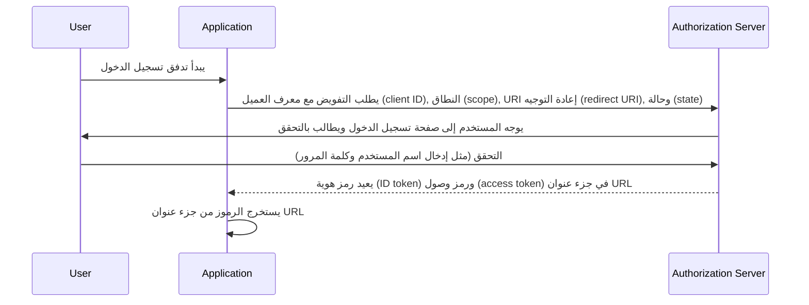

## ما هو التدفق الضمني (implicit flow)

التدفق الضمني (Implicit flow) في OIDC (OpenID Connect) هو عملية تحقق من الهوية تُستخدم بشكل أساسي من قبل تطبيقات العملاء المنفذة في المتصفح باستخدام لغة برمجة نصية، مثل تطبيقات الصفحة الواحدة (SPAs). يسمح لتطبيقات العملاء بالحصول مباشرة على رموز الهوية (ID tokens) والرموز الوصول (access tokens) من خادم التفويض (authorization server) دون إجراء تحقق العميل (client authentication).

## كيف يعمل التدفق الضمني (implicit flow)؟

الخطوات الرئيسية للتدفق الضمني (implicit flow) هي كالآتي:

1. **إرسال طلب تحقق الهوية (authentication request)**: يبدأ المستخدم التدفق عادةً بالنقر على رابط أو زر في التطبيق لتسجيل الدخول. يرسل التطبيق طلب تحقق الهوية إلى نقطة نهاية التفويض لخادم التفويض (authorization server). يقوم خادم التفويض بتحقق من المعلمات ويعيد توجيه المستخدم للتحقق على صفحة تسجيل الدخول الخاصة بخادم التفويض.
2. **تحقق المستخدم**: يُجري المستخدم التحقق على خادم التفويض (على سبيل المثال، بإدخال اسم المستخدم وكلمة المرور).
3. **خادم التفويض يستجيب**: يعيد خادم التفويض رمز هوية (ID token) وإذا طُلب، رمز وصول (access token) لتطبيق العميل كجزء من عنوان URL.
4. **معالجة العميل للرموز (tokens)**: يستخرج تطبيق العميل الرموز من عنوان URL.



### طلب التحقق من الهوية (Authentication request)

معلمات الطلب كما يلي:
- **client_id**: مطلوب. معرف عميل OAuth 2.0 صالح، المتاح في Logto كمعرف التطبيق.
- **scope**: مطلوب. يُحدد هذا القيمة مجموعة من الموارد التي يطلبها المستخدم من خادم التفويض. مثل: `openid profile email`
- **response_type**: مطلوب. القيمة تكون إما `id_token` أو `id_token token`. لا يتم إعادة رمز وصول عندما تكون القيمة `id_token`.
- **redirect_uri**: مطلوب. URI الذي سيتم إرسال استجابة التحقق إليه، ويجب أن يتطابق تمامًا مع URI إعادة التوجيه الذي سبق تسجيله بواسطة العميل في <Ref slug="openid-connect" headingId="openid-provider-op" />. مثل: `Sign-in redirect URI` في Logto Admin Console.
- **nonce**: مطلوب. سلسلة عشوائية تُستخدم للتخفيف من هجمات إعادة التشغيل، تُمرر بدون تعديل من طلب التحقق إلى ادعاء رمز الهوية (ID token claim).

### Beispiel auf eine Authentifizierungsanfrage

```bash
curl -X GET "https://authorization-server.com/auth" \
  -d "response_type=id_token token" \
  -d "client_id=YOUR_APPLICATION_ID" \
  -d "redirect_uri=https://yourapp.com/callback" \
  -d "scope=openid profile email" \
  -d "nonce=RANDOM_STRING"
```

## القيود

تم تطوير التدفق الضمني (implicit flow) في وقت لم تكن فيه مشاركة الموارد عبر الأصل (CORS) معتمدة على نطاق واسع من قبل المتصفحات. لذلك، يتم حظر إرسال طلبات POST إلى خادم التفويض المستضاف على نطاق مختلف.

بسبب هذا القيد، يعيد خادم التفويض الرموز مباشرة في جزء عنوان URL، مما قد يعرضها للمستخدم النهائي والتطبيقات التي تتمتع بإمكانية الوصول إلى وحدة وكيل المستخدم للمستخدم النهائي.

علاوة على ذلك، لا يتم إجراء تحقق العميل في التدفق الضمني، مما يعني أن أي تطبيق يمكن أن يتظاهر بأنه ذلك العميل الذي يطلب التحقق، حيث يتم دائمًا كشف معرف العميل في تطبيقات المستعرض.

بسبب القيود المذكورة أعلاه، يُعتبر أن التدفق الضمني (implicit flow) أقل أمانًا من تدفق رمز التفويض (Authorization Code Flow).

## بدائل التدفق الضمني (implicit flow)

نظرًا للقيود الأمنية للتدفق الضمني، يُوصى غالبًا باستخدام تدفقات أخرى:
- **تدفق رمز التفويض (Authorization Code Flow)**: يتضمن هذا التدفق خطوة إضافية يقوم فيها العميل بتبادل رمز التفويض للحصول على الرموز، مما يوفر طبقة إضافية من الأمان.
- **PKCE (Proof Key for Code Exchange)**: هو امتداد لتدفق رمز التفويض يضيف طبقة أمان إضافية باستخدام مُتحقق الكود (code verifier) والتحدي الكود (code challenge).

<SeeAlso slugs={['device-flow', 'authorization-code-flow', 'client-credentials-flow']} />

<Resources
  urls={[
    "https://blog.logto.io/implicit-flow-is-dead",
    {
      url: "https://tools.ietf.org/html/rfc6749#section-4.2",
      result: {
        ogTitle: "The OAuth 2.0 Authorization Framework: Implicit Grant",
        ogDescription: "نوع تفويض الضمني يُستخدم للحصول على رموز الوصول (ولا يدعم إصدار رموز التحديث) وهو محسّن للعملاء العامين المعروفين بتشغيل URI لإعادة التوجيه معينة. يتم تنفيذ هذه التطبيقات عادةً في متصفح باستخدام لغة برمجة نصية مثل JavaScript."
      }
    },
    "https://openid.net/specs/openid-connect-core-1_0.html",
  ]}
/>