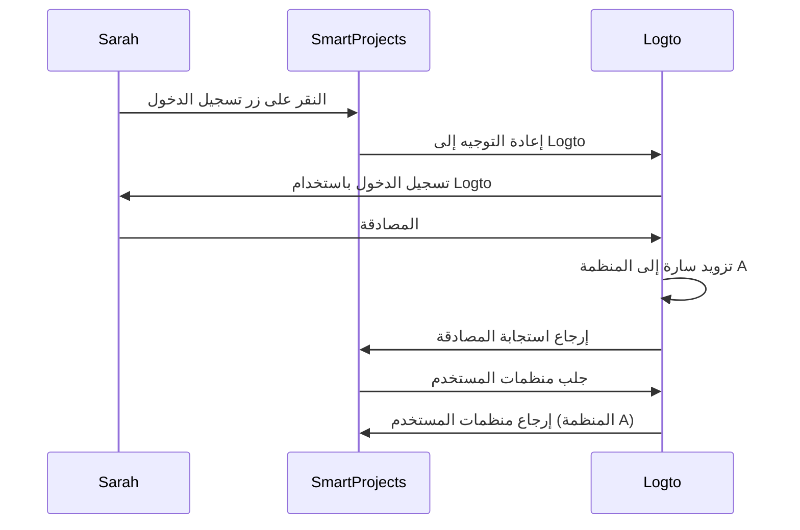
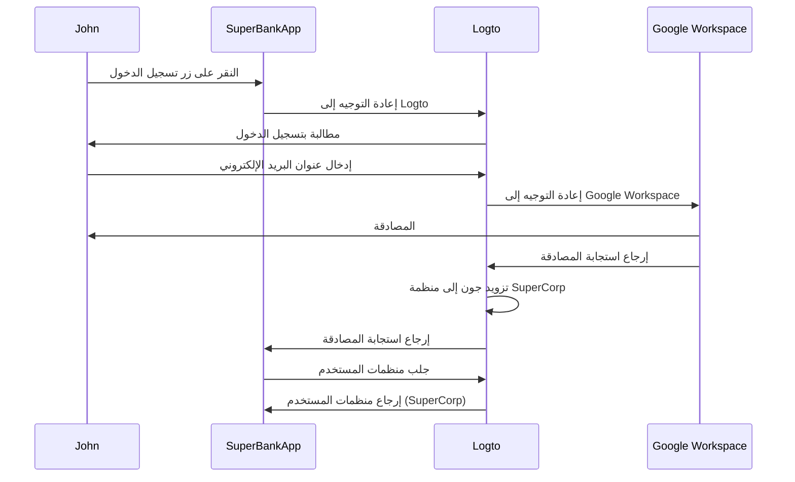

## ما هو التزويد الفوري؟

التزويد الفوري (JIT) هو عملية تُستخدم في <Ref slug="iam" /> حيث يتم تزويد حسابات المستخدمين وفقًا لهوية المستخدم وتكوين النظام بشكل فوري عند محاولة المستخدم تسجيل الدخول لأول مرة.

## ما هي حالات الاستخدام للتزويد الفوري؟

تكون هذه الحالات شائعة عند بناء تطبيق B2B يتضمن بنية متعددة المستأجرين، أو Enterprise SSO، أو يتطلب ميزات إعداد الفريق. إليك بعض السيناريوهات النموذجية التي قد تواجهها أنت أو عميلك.

### إعداد الموظفين

تخيل أن أحد عملائك *SuperFantasy* يواجه توظيفًا متكررًا أو نموًا سريعًا يمكنه استخدام التزويد الفوري لإعداد حسابات المستخدمين بسرعة للموظفين الجدد. تستخدم *SuperFantasy* Logto لإدارة الهوية والتحكم في الوصول وSmartProjects لإدارة المشاريع. عندما تقوم موظفة جديدة، سارة، بتسجيل الدخول إلى SmartProjects لأول مرة، يتم إنشاء حسابها وتكوينه تلقائيًا بناءً على بيانات اعتمادها في Logto.

وفقًا للمخطط أعلاه، عندما تقوم سارة بتسجيل الدخول إلى SmartProjects لأول مرة، يتم تزويد حسابها تلقائيًا إلى المنظمة A في Logto. يضمن هذا العملية أن سارة لديها الوصول اللازم إلى SmartProjects دون الحاجة إلى تدخل يدوي من فريق تكنولوجيا المعلومات.

### إعداد العملاء من المؤسسات

تخيل عميلًا آخر *SuperBank* هو مؤسسة مالية تقدم خدمات مصرفية عبر الإنترنت لعملائها. تستخدم *SuperBank* Logto لإدارة الهوية والتحكم في الوصول وSuperBankApp للخدمات المصرفية عبر الإنترنت. وقد وقعت *SuperBank* مؤخرًا عقدًا مع عميل مؤسسة جديد، *SuperCorp*، لتقديم خدمات مصرفية عبر الإنترنت لموظفيها.

تستخدم *SuperCorp* Google Workspace لحسابات موظفيها. يحتاج SuperBankApp إلى ضمان أنه عندما يقوم موظف من *SuperCorp* بتسجيل الدخول لأول مرة، يتم إضافة حسابه تلقائيًا إلى منظمة *SuperCorp* في Logto.

في المخطط أعلاه، عندما يقوم جون بتسجيل الدخول إلى SuperBankApp لأول مرة، يتم تزويد حسابه تلقائيًا إلى منظمة SuperCorp في Logto وفقًا لهويته في Google Workspace.

## هل هو خاص بـ SAML وEnterprise SSO؟

غالبًا ما يرتبط التزويد الفوري (JIT) بـ <Ref slug="enterprise-sso" /> في مصادقة SAML، لكنه ليس حصريًا لـ <Ref slug="saml" />. يمكن أيضًا استخدام التزويد الفوري مع بروتوكولات مصادقة أخرى مثل <Ref slug="oauth-2.0" /> و<Ref slug="openid-connect" />، ولا يتطلب دائمًا إعداد <Ref slug="enterprise-sso" />.

على سبيل المثال، يمكن استخدام التزويد الفوري المستند إلى البريد الإلكتروني عندما يدعم <Ref slug="identity-provider" /> هذه الميزة. في هذه الحالة، يكون عنوان البريد الإلكتروني للمستخدم هو السمة الوحيدة المطلوبة للتزويد، بغض النظر عن بروتوكول المصادقة أو تكوين SSO.

## هل ينطبق على المستخدمين الجدد أو الحاليين للتطبيق؟

يشير التزويد الفوري (JIT) عمومًا إلى المحاولة الأولى للوصول إلى تطبيق. ومع ذلك، تدرك المنتجات المختلفة هذه الوظيفة بشكل مختلف. يستخدم البعض التزويد الفوري فقط لإنشاء الهوية والحساب، بينما يتضمن البعض الآخر تحديثات الحساب الفورية، مثل إعادة التزويد ومزامنة السمات.

على سبيل المثال، يسمح SAML JIT Provisioning بمنح وإلغاء عضوية المجموعات كجزء من التزويد. يمكنه أيضًا تحديث المستخدمين المزودين للحفاظ على سماتهم في مخزن <Ref slug="service-provider" /> متزامنة مع سمات مخزن مستخدم <Ref slug="identity-provider" />.

إذا كنت ترغب في النظر في سيناريو تسجيل الدخول للمستخدمين الحاليين، فتأكد من أن لديك نظام تزويد قوي مع نظام JIT الخاص بك. على سبيل المثال:

- **حل النزاعات**: يجب أن يكون لنظامك استراتيجية للتعامل مع النزاعات إذا كان الحساب موجودًا بالفعل بمعلومات مختلفة عن تلك المقدمة من IdP أثناء عملية JIT. قد يتطلب ذلك تحكمًا دقيقًا في سياسات مؤسستك وتكوين IdP.
- **سجلات التدقيق**: من المهم الاحتفاظ بسجلات لكل من إنشاء الحسابات الجديدة وتحديث الحسابات الحالية من خلال عمليات JIT لأسباب أمنية وامتثالية.
- **الأداء**: بينما يحدث التزويد الفوري بسرعة، فكر في التأثير المحتمل على أوقات تسجيل الدخول، خاصة للمستخدمين الحاليين إذا كنت تقوم بتحديث معلوماتهم في كل تسجيل دخول.
- **اتساق البيانات**: تأكد من أن عملية التزويد الفوري الخاصة بك تحافظ على اتساق البيانات، خاصة عند تحديث حسابات المستخدمين الحالية.

## ما هو الفرق بين JIT وSystem for Cross-domain Identity Management (SCIM)؟

SCIM هو بروتوكول معيار مفتوح مصمم لتبسيط وأتمتة إدارة هوية المستخدم عبر الأنظمة والمجالات المختلفة. يُستخدم عادة في سيناريوهات مزامنة الدليل.

الفرق الرئيسي بين JIT وSCIM هو أن JIT يشير غالبًا إلى المحاولة الأولى للوصول إلى تطبيق (أو إعداد مستخدم جديد)، وهو مصطلح واسع يصف عملية تزويد حسابات المستخدمين ديناميكيًا؛ بينما SCIM هو بروتوكول محدد لإدارة دورة حياة المستخدم عبر الأنظمة وليس محدودًا بالتسجيل الأول.

علاوة على ذلك، يفتقر JIT إلى تنفيذ موحد عبر الأنظمة، بينما SCIM هو بروتوكول موحد معرف [RFC 7644](https://datatracker.ietf.org/doc/html/rfc7644) لإدارة الهوية.

تستخدم بعض المنظمات الكبيرة SCIM لتزويد الحسابات، وتدمجه مع أنظمتها الخاصة. يمكن أن يكون هذا معقدًا جدًا ويختلف من حالة لأخرى. بالنسبة لمعظم حالات الاستخدام، يعد التزويد الفوري JIT نهجًا أبسط وأكثر مباشرة.

<Resources urls={['https://blog.logto.io/jit-provisioning', 'https://datatracker.ietf.org/doc/html/rfc7644']} />