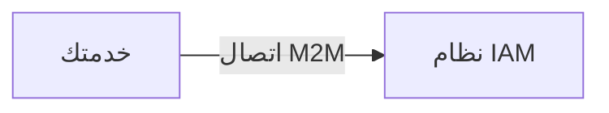
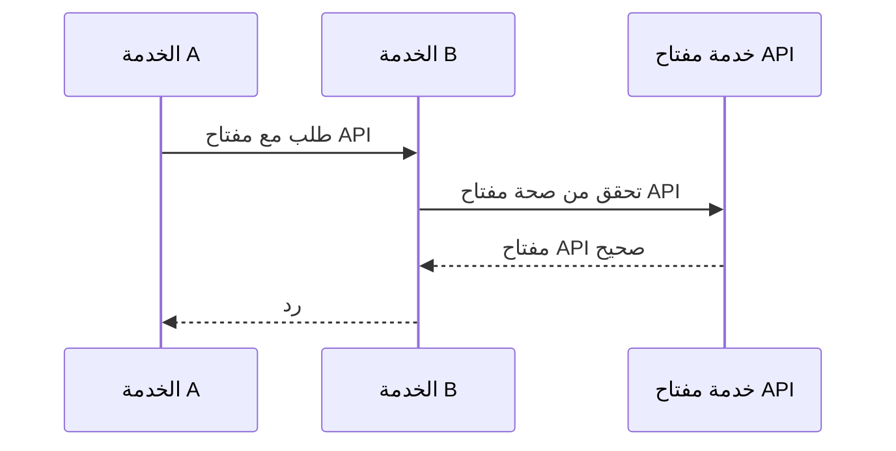
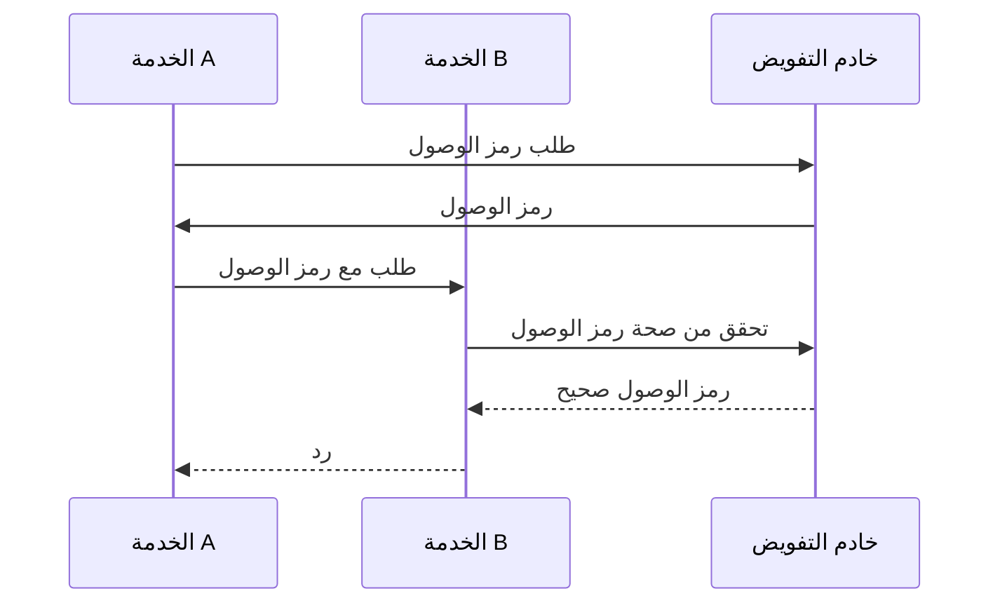
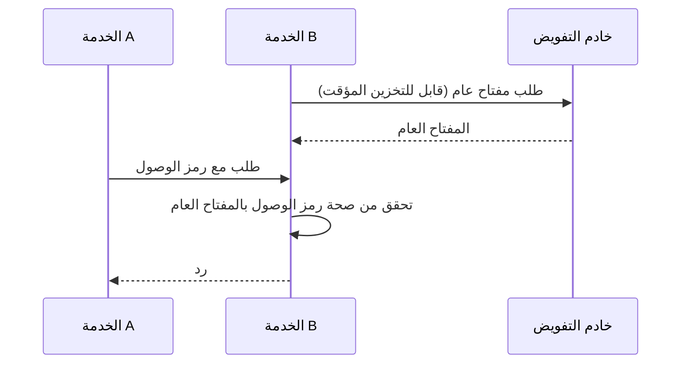

## ما هو اتصال الآلة بالآلة؟

يشير الاتصال بين الآلات (M2M) إلى التبادل التلقائي للبيانات بين الأجهزة بدون تدخل بشري. في سياق المصادقة (authentication) والتفويض (authorization)، غالبًا ما يتضمن اتصال M2M تطبيق عميل يحتاج للوصول إلى الموارد، حيث يكون التطبيق العميل آلة (خدمة) أو آلة تعمل نيابة عن المستخدم.

## لماذا نحتاج إلى التعامل مع اتصال الآلة بالآلة؟

عندما يكون لديك خدمة واحدة فقط بدون أي تبعيات، فمن المحتمل ألا تحتاج إلى التواصل مع الخدمات الأخرى. ومع نمو نظامك أو إذا كنت ترغب في التكامل مع نظام إدارة الهوية والوصول (IAM)، تحتاج إلى التعامل مع اتصال الآلة بالآلة.

ومع ذلك، لا تزال تبدو بسيطة - كل ما تحتاجه هو تعريف الخدمة والتحقق من هويتها. ولكن في الواقع، هناك العديد من التحديات التي تحتاج إلى معالجتها:

### 1. المصادقة (Authentication)

كيف تقوم بمصادقة الخدمة؟ لا يمكنك استخدام اسم مستخدم وكلمة مرور، نظرًا لعدم وجود بشر لإدخالها. تحتاج إلى استخدام آلية مختلفة، مثل مفاتيح API، أو شهادات العميل، أو أوراق اعتماد العميل على OAuth.

### 2. التفويض (Authorization)

بمجرد مصادقة الخدمة، كيف تحدد ما يمكن أن تفعله الخدمة؟ تحتاج إلى تحديد الأذونات والأدوار للخدمة، بطريقة مشابهة لكيفية تحديدها للمستخدمين. آخر شيء تريده هو أن تكتب الأذونات بشكل ثابت في كودك.

### 3. الأمان

كيف تضمن أن يكون الاتصال بين الخدمات آمنًا؟ هل سيتم تحديث بيانات الاعتماد بشكل منتظم؟ كيف تقوم بمراقبة وتدقيق الاتصال؟

### 4. القابلية للتوسع

مع زيادة عدد الخدمات، كيف يمكنك إدارة المصادقة والتفويض لكل خدمة؟

## الأساليب الشائعة لاتصال الآلة بالآلة

مع وضع التحديات في الاعتبار، هناك العديد من الأساليب الشائعة في الصناعة:

### 1. مفاتيح API

<Ref slug="api-key">مفاتيح API</Ref> هي طريقة بسيطة لمصادقة الخدمات. يمكن أن يكون لكل خدمة مفتاح API واحد أو أكثر، والتي تستخدم للمصادقة (وأحيانًا التفويض). قد ترى بعض الخدمات تطلب منك تقديم مفتاح API في ترويسة الطلب، مثل `X-API-Key: your-api-key`.

مثال غير قياسي عن كيفية عمل مفاتيح API:

المزايا:

- بسيط التنفيذ والاستخدام.
- مع التوليد الآمن والعشوائي والطول الكافي، من الصعب تخمين مفاتيح API.
- التحقق ديناميكي، مما يعني أنه يمكنك إلغاء مفتاح API في أي وقت.

العيوب:

- يتطلب اتصالاً بالشبكة للتحقق من صحة مفتاح API.
- غير مكتفي بذاته، مما يعني أن الخدمة مطلوبة للاستقصاء.
- تتقاسم الخدمة الأخرى نفس مستوى الوصول كالخدمة التي تملك مفتاح API (يمكن التخفيف جزئيًا باستخدام بوابة API).
- من الصعب إدارة عدد كبير من مفاتيح API عبر الخدمات.

### 2. أوراق اعتماد العميل على OAuth

OAuth (أو OIDC، نظرًا لأن OpenID Connect يستند إلى OAuth 2.0) <Ref slug="client-credentials-flow" /> هو طريقة أكثر تقدمًا لمصادقة الخدمات. يستند إلى إطار عمل OAuth 2.0، الذي يُستخدم على نطاق واسع لمصادقة المستخدمين وتفويضهم. باستخدام أوراق اعتماد العميل على OAuth، يمكن للخدمة الحصول على رمز وصول من خلال تقديم معرف العميل وسر العميل إلى خادم التفويض.

مثال غير قياسي عن كيفية عمل أوراق اعتماد العميل على OAuth:

عادةً ما يكون رمز الوصول هو JSON Web Token (JWT)، والذي يحتوي على معلومات حول الخدمة وأذوناتها. ثم يمكن للخدمة الأخرى التحقق من صحة رمز الوصول دون التواصل مع خادم التفويض (طالما أنها تمتلك المفتاح العام للتحقق من توقيع JWT). يصبح سير العمل:

للمزيد من المعلومات حول JSON Web Tokens، انظر <Ref slug="jwt" />.

المزايا (مع JWT):

- مكتفي بذاته، مما يعني أن الخدمة الأخرى يمكنها أن تعرف المعلومات الضرورية مثل الأذونات فورًا دون الاتصال بالشبكة.
- يمكن أن يكون رمز الوصول قصير الأجل، مما يقلل من خطر الاستخدام السيء.
- لا تحتاج الخدمة الأخرى إلى معرفة سر العميل، بل فقط المفتاح العام للتحقق من توقيع JWT.
- يمكن استخدام رمز الوصول لتدقيق إجراءات الخدمة (مثل أي خدمة قامت بالوصول إلى أي مورد).
- من الأسهل إدارة عدد كبير من الخدمات، حيث يحدد بوضوح الحدود بين الخدمات والأذونات.

العيوب:

- أكثر تعقيدًا في التنفيذ والاستخدام من مفاتيح API.
- إذا كانت الخدمة الأخرى تقوم فقط بالتحقق دون اتصال، فقد لا تعرف إذا كان رمز الوصول قد تم إلغاؤه.

### 3. TLS المتبادل (mTLS)

TLS المتبادل (mTLS) هو طريقة لمصادقة الخدمات باستخدام شهادات العميل. مع mTLS، تحتفظ كل خدمة بشهادة عميل بمفتاح خاص، وتتحقق الخدمة الأخرى من الشهادة باستخدام المفتاح العام. ومع ذلك، يركز mTLS على طبقة TLS، مما يعني أنه وحده عادة لا يناسب المصادقة (authentication) والتفويض (authorization) على مستوى التطبيق.

للحالات المتقدمة، يمكن دمج mTLS مع رموز الوصول المرتبطة بالشهادات لتأمين الاتصال بشكل أكبر. انظر [RFC 8705: OAuth 2.0 Mutual-TLS Client Authentication and Certificate-Bound Access Tokens](https://datatracker.ietf.org/doc/html/rfc8705) للمزيد من المعلومات.

المزايا:

- مصادقة قوية، حيث تستند إلى التشفير بالمفتاح العام.
- الاتصال مشفر وآمن بشكل افتراضي.
- يمكن استخدام شهادة العميل للتعرف على الخدمة، بطريقة مشابهة لكيفية عمل JWT.

العيوب:

- أكثر تعقيدًا في التنفيذ والإدارة من مفاتيح API وأوراق اعتماد العميل على OAuth.
- تحتاج شهادة العميل إلى التحديث بشكل منتظم.
- تتطلب مزيدًا من المعرفة التقنية لإدارة شهادات العملاء بشكل صحيح.
- قد لا تدعم الخدمة الأخرى mTLS، مما يعني أنك بحاجة إلى آلية احتياطية.

<SeeAlso slugs={["api-key", "client-credentials-flow", "jwt"]} />
