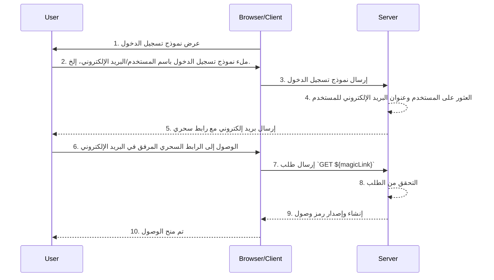

## ما هي الروابط السحرية (Magic Links)؟

الرابط السحري (Magic link) هو رابط يستخدم لمرة واحدة يتم إرساله إلى المستخدم أثناء عملية المصادقة (authentication).

عن طريق الوصول إلى هذا الرابط، يكمل المستخدم سير عملية التفويض (authorization flow) المطلوبة للوصول إلى المورد المرغوب ويُمنح الوصول المناسب للموارد. بعد ذلك، يصبح الرابط السحري غير صالح.

## ما الفرق بين الرابط السحري (Magic link) وكلمة المرور لمرة واحدة (OTP)؟

لنفترض أن المستخدم يستخدم البريد الإلكتروني لتلقي رابط سحري أو كلمة مرور لمرة واحدة (OTP).

في كثير من الحالات، يستخدم المستخدمون البريد الإلكتروني لتلقي كلمة مرور لمرة واحدة (OTP) للتحقق من تسجيل الدخول أو كعامل تحقق إضافي للمصادقة متعددة العوامل (MFA). ما الفرق بين استخدام رابط سحري عبر البريد الإلكتروني وكلمة مرور لمرة واحدة عبر البريد الإلكتروني؟

مع كلمة المرور لمرة واحدة (OTP)، يحتاج المستخدم إلى التحقق من بريده الإلكتروني، وتذكر كلمة المرور لمرة واحدة (OTP)، ثم إدخالها في عملية تسجيل الدخول/التحقق. يتطلب ذلك من المستخدم التنقل اليدوي المتكرر بين التطبيقات أو الصفحات المختلفة.

باستخدام رابط سحري عبر البريد الإلكتروني، يحتاج المستخدم فقط إلى فتح البريد الإلكتروني الذي يحتوي على الرابط السحري في تطبيق البريد الإلكتروني والنقر على الرابط. هذا يوفر تجربة مستخدم أبسط.

علاوة على ذلك، يتيح استخدام رابط سحري تضمين معلومات تتجاوز الرمز لمرة واحدة في الرابط، مثل المعلومات المتعلقة بالجلسة لتسجيل الدخول. يمكن أن يحسن هذا الأمان وتجربة المستخدم على حد سواء.

## كيف يعمل الرابط السحري (Magic Link)؟

في هذا المخطط التسلسلي، نوضح كيفية تسجيل المستخدم والحصول على الوصول إلى الموارد المناسبة باستخدام الرابط السحري (Magic link).

في هذا المخطط التسلسلي، نفترض أن الرابط السحري مرسل عبر البريد الإلكتروني. ومع ذلك، هناك طرق أخرى ممكنة لإرسال الرابط السحري، مثل إرساله عبر رسالة نصية إلى الهاتف المحمول. لن يتم تناول هذه البدائل هنا لأن العمليات متشابهة تقريبًا.

1. **عرض نموذج تسجيل الدخول**
المتصفح/العميل يبدأ عملية المصادقة (authentication) بعرض نموذج تسجيل الدخول للمستخدم.
2. **المستخدم يملأ نموذج تسجيل الدخول**
يدخل المستخدم معرفه، مثل اسم المستخدم أو عنوان البريد الإلكتروني أو رقم الهاتف، في نموذج تسجيل الدخول.
المعلومات المقدمة تحتاج إلى أن تكون كافية لمساعدة النظام على التعرف على مستخدم فريد. على سبيل المثال، في معظم الأنظمة، تكون أسماء المستخدمين المستخدمة لتسجيل الدخول فريدة. في مثل هذه الأنظمة، يحتاج المستخدمون فقط إلى تقديم اسم المستخدم الخاص بهم لمساعدة النظام في تحديد الحساب الذي يريدون تسجيل الدخول إليه بشكل فريد.
3. **إرسال نموذج تسجيل الدخول**
المتصفح/العميل يرسل النموذج إلى الخادم، مرفقًا بمعلومات المستخدم الموضحة في الخطوة 2.
4. **العثور على المستخدم والبريد الإلكتروني**
الخادم يعالج الطلب عن طريق تحديد المستخدم الفريد في قاعدة البيانات واسترجاع عنوان البريد الإلكتروني المرتبط بالمستخدم.
5. **إرسال بريد إلكتروني مع رابط سحري**
الخادم يرسل بريدًا إلكترونيًا إلى عنوان البريد الإلكتروني للمستخدم. يشمل البريد الإلكتروني رابطًا سحريًا للمصادقة (authentication).
6. **المستخدم يصل إلى الرابط السحري**
يتلقى المستخدم البريد الإلكتروني ويضغط على الرابط السحري المقدم بداخله.
7. **إرسال طلب GET مع الرابط السحري**
المتصفح/العميل يرسل طلب `GET` إلى الخادم باستخدام عنوان الرابط السحري.
8. **التحقق من الطلب**
الخادم يتحقق من الطلب للتأكد من أن الرابط السحري صالح ولم يستخدم أو انتهت صلاحيته.
9. **إنشاء وإصدار رمز وصول**
بمجرد التحقق من الطلب، ينشئ الخادم رمز وصول ويصدره إلى المتصفح/العميل.
10. **منح الوصول**
المتصفح/العميل يستلم رمز الوصول ويسمح للمستخدم بالوصول إلى المورد المطلوب.

## ما فائدة الروابط السحرية (Magic Links)؟

تعزز الروابط السحرية من بنية أمان أنظمة المصادقة عن طريق استخدام نموذج تفاعل قائم على الرموز. كل رابط مشفر بشكل فريد ويشمل عادةً توقيت انتهاء الصلاحية. نظرًا لطبيعته المؤقتة، حتى إذا تم اعتراض رابط سحري أو تسربه، فإن مدة صلاحيته القصيرة تقلل من فرصة الاستغلال الضار.

علاوة على ذلك، لأن استخدام الروابط السحرية يتطلب طريقة استقبال يسيطر عليها المستخدم، مثل عنوان بريد إلكتروني موثوق به أو رقم هاتف، فإنه يوفر طريقة تحقق إضافية تتجاوز اسم المستخدم وكلمة المرور، مما يوفر أمانًا إضافيًا للحساب. ونظرًا لأن الروابط السحرية تلغي الحاجة إلى إدخال بيانات الاعتماد، يتم حماية أمان حسابات المستخدمين بشكل أفضل، وتصبح العملية أكثر ملاءمة.