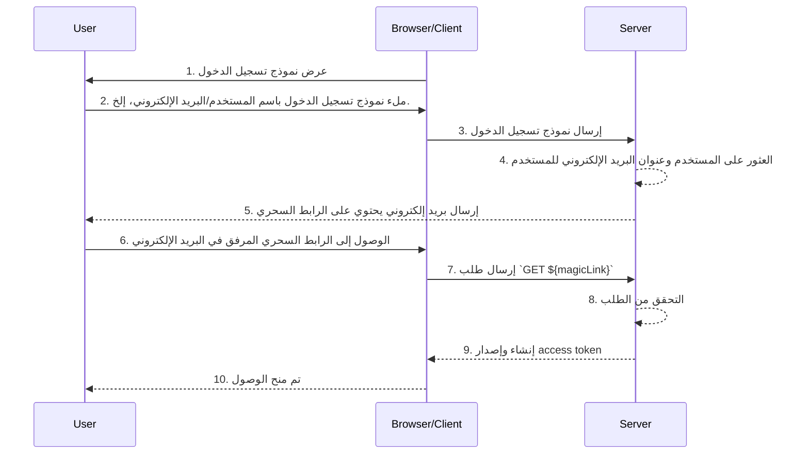

## ما هي الروابط السحرية (Magic links)؟

الرابط السحري (Magic link) هو رابط يستخدم لمرة واحدة يتم إرساله إلى المستخدم خلال عملية المصادقة (authentication).

عند الوصول إلى هذا الرابط، يكمل المستخدم تدفق التفويض (authorization code flow) المطلوب للوصول إلى المورد المطلوب ويتم منحه الوصول المناسب إلى الموارد. بعد ذلك، يصبح الرابط السحري غير صالح.

## ما الفرق بين الرابط السحري (Magic link) وكلمة المرور لمرة واحدة (OTP)؟

لنفترض أن المستخدم يستخدم البريد الإلكتروني لتلقي رابط سحري (Magic link) أو <Ref slug='otp' />.

في كثير من الحالات، يستخدم المستخدمون البريد الإلكتروني لتلقي OTP للتحقق من تسجيل الدخول أو كعامل تحقق إضافي لـ <Ref slug='mfa' />. ما الفرق بين استخدام رابط سحري عبر البريد الإلكتروني و OTP عبر البريد الإلكتروني؟

مع OTP، يحتاج المستخدم إلى التحقق من بريده الإلكتروني، وتذكر OTP، ثم إدخاله في عملية تسجيل الدخول/التحقق. يتطلب هذا من المستخدم التبديل يدويًا بشكل متكرر بين التطبيقات أو الصفحات المختلفة.

باستخدام رابط سحري عبر البريد الإلكتروني، يحتاج المستخدم فقط إلى فتح البريد الإلكتروني الذي يحتوي على الرابط السحري في تطبيق البريد الإلكتروني الخاص به والنقر على الرابط. يوفر هذا تجربة مستخدم أبسط.

علاوة على ذلك، يتيح استخدام الرابط السحري تضمين معلومات تتجاوز الرمز لمرة واحدة في الرابط، مثل المعلومات المتعلقة بالجلسة لتسجيل الدخول. يمكن أن يحسن هذا من الأمان وتجربة المستخدم على حد سواء.

## كيف يعمل الرابط السحري (Magic link)؟

في مخطط التسلسل هذا، نوضح كيف يقوم المستخدم بتسجيل الدخول والحصول على الوصول إلى الموارد المناسبة باستخدام رابط سحري (Magic link).

في مخطط التسلسل هذا، نفترض أن الرابط السحري يتم إرساله عبر البريد الإلكتروني. ومع ذلك، هناك طرق أخرى ممكنة لإرسال رابط سحري، مثل إرساله عبر رسالة نصية إلى هاتف محمول. لن يتم تغطية هذه البدائل هنا نظرًا لأن التدفقات متشابهة تقريبًا.

1. **عرض نموذج تسجيل الدخول**
المتصفح/العميل يبدأ عملية المصادقة (authentication) بعرض نموذج تسجيل الدخول للمستخدم.
2. **المستخدم يملأ نموذج تسجيل الدخول**
يدخل المستخدم معرفه، مثل اسم المستخدم أو عنوان البريد الإلكتروني أو رقم الهاتف، في نموذج تسجيل الدخول.
المعلومات المقدمة يجب أن تكون كافية لمساعدة النظام في تحديد مستخدم فريد. على سبيل المثال، في معظم الأنظمة، تكون أسماء المستخدمين المستخدمة لتسجيل الدخول فريدة. في مثل هذه الأنظمة، يحتاج المستخدمون فقط إلى تقديم اسم المستخدم الخاص بهم لمساعدة النظام في تحديد الحساب الذي يريدون تسجيل الدخول إليه بشكل فريد.
3. **إرسال نموذج تسجيل الدخول**
المتصفح/العميل يرسل النموذج إلى الخادم، متضمنًا معلومات المستخدم الموضحة في الخطوة 2.
4. **العثور على المستخدم والبريد الإلكتروني**
الخادم يعالج الطلب عن طريق تحديد المستخدم الفريد في قاعدة البيانات واسترجاع عنوان البريد الإلكتروني المرتبط بالمستخدم.
5. **إرسال بريد إلكتروني يحتوي على الرابط السحري**
الخادم يرسل بريدًا إلكترونيًا إلى عنوان البريد الإلكتروني للمستخدم. يحتوي هذا البريد الإلكتروني على رابط سحري للمصادقة.
6. **المستخدم يصل إلى الرابط السحري**
يتلقى المستخدم البريد الإلكتروني وينقر على الرابط السحري المقدم داخله.
7. **إرسال طلب GET مع الرابط السحري**
المتصفح/العميل يرسل طلب `GET` إلى الخادم، باستخدام عنوان URL للرابط السحري.
8. **التحقق من الطلب**
الخادم يتحقق من الطلب للتأكد من أن الرابط السحري صالح، غير مستخدم وغير منتهي الصلاحية.
9. **إنشاء وإصدار access token**
بمجرد التحقق من الطلب، يقوم الخادم بإنشاء access token وإصداره للمتصفح/العميل.
10. **منح الوصول**
المتصفح/العميل يتلقى access token ويسمح للمستخدم بالوصول إلى المورد المطلوب.

## ما فائدة الروابط السحرية (Magic links)؟

تعزز الروابط السحرية (Magic links) بنية الأمان لأنظمة المصادقة (authentication) من خلال استخدام نموذج تفاعل قائم على الرموز. كل رابط مشفر بشكل فريد وعادة ما يتضمن طابع زمني لانتهاء الصلاحية. نظرًا لطبيعتها المؤقتة، حتى إذا تم اعتراض الرابط السحري أو تسريبه، فإن نافذة صلاحيته القصيرة تحد من الفرصة للاستغلال الضار.

علاوة على ذلك، لأن استخدام الروابط السحرية يتطلب طريقة استقبال يتحكم فيها المستخدم، مثل عنوان بريد إلكتروني موثوق أو رقم هاتف، فإنه يوفر طريقة تحقق إضافية تتجاوز اسم المستخدم وكلمة المرور، مما يوفر أمانًا إضافيًا للحساب. ولأن الروابط السحرية تلغي الحاجة إلى إدخال بيانات الاعتماد، فإن أمان حسابات المستخدمين يكون محميًا بشكل أفضل، وتكون العملية أكثر سهولة.