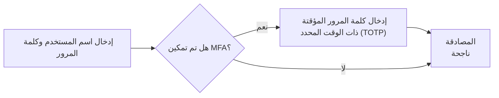
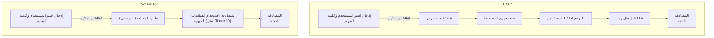

## ما هي المصادقة متعددة العوامل (MFA)؟

تعزز المصادقة متعددة العوامل (MFA) الأمان من خلال مطالبة المستخدمين بتقديم أشكال متعددة من التعريف للتحقق من هويتهم. إنها تضيف طبقة إضافية من الأمان إلى عملية <Ref slug="authentication" />، مما يجعل من الصعب على المهاجمين الحصول على وصول غير مصرح به.

إليك مثال على MFA:

### تعريف "العامل"

في المثال أعلاه، هناك عاملان:

1. اسم المستخدم وكلمة المرور
2. <Ref slug="totp" /> من تطبيق الهاتف المحمول

يمثل كل عامل فئة مختلفة من بيانات الاعتماد التي يمكن استخدامها لمصادقة المستخدم (لإثبات أنك من تدعي أنك هو). في الممارسة العملية، يمكن تصنيف العوامل إلى ثلاثة أنواع رئيسية:

|            | ماذا يعني        | عوامل التحقق                                                                       |
| ---------- | ---------------- | ----------------------------------------------------------------------------------- |
| المعرفة    | شيئ تعرفه       | كلمة المرور، رمز التحقق عبر البريد الإلكتروني، رمز النسخ الاحتياطي                    |
| الحيازة    | شيئ تملكه       | رمز التحقق عبر SMS، OTP من تطبيق المصادقة، OTP من الهاردوير (مفتاح الأمان)، بطاقة ذكية |
| الوراثة    | شيئ تكونه      | القياسات الحيوية مثل بصمات الأصابع، معرف الوجه                                    |

تتضمن إعدادات MFA الشائعة دمج عاملين من فئات مختلفة، مثل كلمة المرور (المعرفة) و<Ref slug="totp" /> من تطبيق المصادقة (الحيازة).

### لماذا تعد MFA مهمة؟

> لا يوجد شيء اسمه أمان تام، هناك فقط مستويات متفاوتة من عدم الأمان. — سلمان رشدي

تتضح أهمية MFA من الأرقام: تقلل MFA خطر الاختراق بنسبة 99.22٪ عبر السكان بأكملهم وبنسبة 98.56٪ في حالات بيانات الاعتماد المخترقة[^1]. بمساعدة MFA، يمكن اتخاذ إجراءات أكثر أهمية بثقة، مثل الوصول إلى البيانات الحساسة وإجراء المعاملات المالية. إنها طريقة بسيطة وفعالة للغاية لتقديم مستوى أعلى بكثير من الأمان من مجرد كلمة مرور أو عامل واحد فقط للمصادقة.

## MFA في التطبيقات الحديثة

كما يوحي الاسم، يمكن أن تتضمن MFA أكثر من عاملين. مع زيادة عدد العوامل، يرتفع مستوى الأمان وكذلك تعقيد عملية المصادقة التي قد تكون أقل سهولة في الاستخدام. بينما كان <Ref slug="totp" /> خيارًا شائعًا في السنوات الأخيرة، تظهر تقنيات جديدة مثل <Ref slug="passkey" /> لتوفير تجربة MFA أكثر أمانًا وصديقة للمستخدم.

على سبيل المثال، قد تستخدم التطبيقات الحديثة <Ref slug="webauthn" /> API لتطبيق MFA باستخدام مفاتيح المرور، التي هي أوراق اعتماد مقاومة للتصيد الاحتيالي يتم تأمينها بواسطة تشفير المفتاح العام. قامت شركات مثل Apple بدمج مفاتيح المرور مع المصادقة البيومترية (Touch ID, Face ID) لإضافة عامل الوراثة إلى عملية MFA محليًا، مما يزيد من الأمان وراحة المستخدم.

لنجري مقارنة سريعة لفهم أفضل. نفترض أن لدينا مستخدم لديه:

1. تطبيق مصادقة مثبت على هاتفه لإنشاء رموز TOTP.
2. مفتاح مرور مدمج مع المصادقة البيومترية لجهازه.

عندما يقومون بتسجيل الدخول إلى موقع ويب مع تمكين MFA على جهاز الكمبيوتر المحمول الخاص بهم، سيبدو كلا العمليتين على النحو التالي:

من الواضح أن عملية WebAuthn تأخذ خطوات أقل ووقتًا أقل بكثير للمستخدمين. وحتى أكثر من ذلك، تدعم شركات مثل Apple مزامنة مفاتيح المرور عبر الأجهزة (مثل، iPhone, iPad, Mac) لجعل عملية MFA أكثر سلاسة مع الحفاظ على مستوى عالٍ من الأمان.

## اعتبارات الأمان

عند تنفيذ MFA، ينبغي مراعاة بعض اعتبارات الأمان:

- استخدم مجموعة من العوامل من فئات مختلفة لضمان مستوى أعلى من الأمان. على سبيل المثال، جمع كلمة مرور (معرفة) مع رمز TOTP (حيازة).
- تجنب استخدام SMS كعامل MFA نظرًا لكونه عرضة لهجمات تبديل SIM.
- يجب ألا تتجاوز خيارات الاسترداد MFA. على سبيل المثال، إذا فقد المستخدم تطبيق المصادقة الخاص به، فيجب عليهم استخدام رمز النسخ الاحتياطي أو عامل MFA آخر لاستعادة الوصول.
- فرض فترات تهدئة بين محاولات MFA الفاشلة لمنع هجمات القوة الغاشمة.

[^1]: [ما مدى فعالية المصادقة متعددة العوامل في ردع الهجمات الإلكترونية؟](https://query.prod.cms.rt.microsoft.com/cms/api/am/binary/RW166lD)

<SeeAlso slugs={["totp", "webauthn", "passkey"]} />

<Resources
  urls={[
    "https://blog.logto.io/elaborate-mfa",
    "https://blog.logto.io/web-authn-and-passkey-101",
    "https://blog.logto.io/webauthn-base-knowledge",
  ]}
/>
