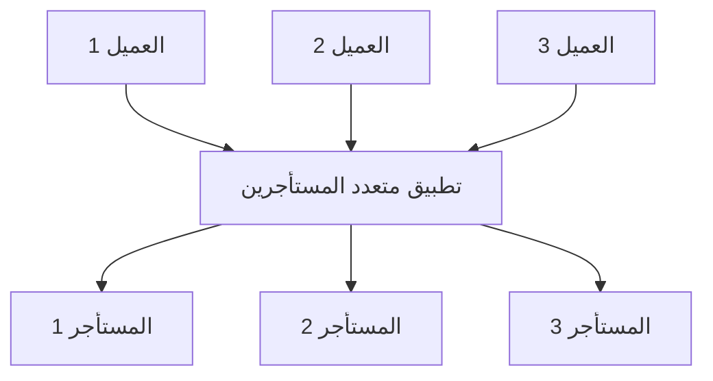
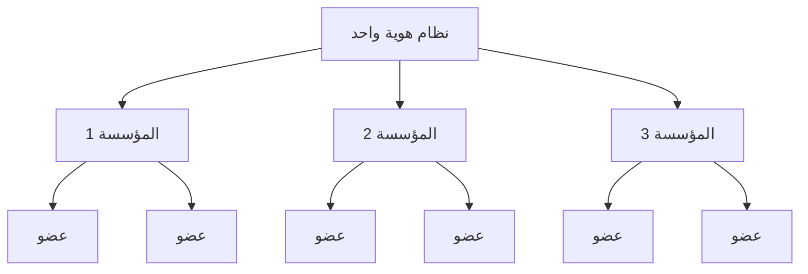

## ما هو تعدد المستأجرين (Multi-tenancy)؟

تعدد المستأجرين (Multi-tenancy) في البرمجيات هو نظام برمجي حيث تعمل نسخة واحدة من البرنامج على خادم وتخدم عدة مستأجرين. الأنظمة المصممة بهذه الطريقة تكون "مشتركة" (بدلاً من "مخصصة" أو "معزولة").

المستأجر هو مجموعة من المستخدمين الذين يشاركون الوصول المشترك مع امتيازات محددة إلى نسخة البرنامج.

على سبيل المثال، غالبًا ما تستخدم أنظمة إدارة علاقات العملاء (CRM) بنية متعددة المستأجرين لتقديم نفس الخدمة لجميع العملاء.

المبدأ الأساسي لتعدد المستأجرين هو "المشاركة". هذا لا يعني أن **كل** جزء من الحل مشترك؛ بل يعني أن **بعض** المكونات على الأقل يعاد استخدامها عبر عدة مستأجرين. فهم هذا المفهوم الأوسع يمكن أن يساعدك في تلبية احتياجات عملائك بشكل أفضل.

## ما هي حالات الاستخدام للمنتجات متعددة المستأجرين؟

تُستخدم التطبيقات متعددة المستأجرين بشكل شائع في منتجات البرمجيات كخدمة (SaaS) مثل أدوات الإنتاجية وبرامج التعاون وغيرها. في هذا الإعداد، يمثل كل "مستأجر" عادةً عميلًا تجاريًا، مع عدة مستخدمين (عادةً موظفين). في منتجات مختلفة، قد يُشار إليها كمستأجر، مساحة عمل، أو مشروع، اعتمادًا على السياق. قد يكون لدى شركة واحدة أيضًا عدة مستأجرين لتمثيل أقسام أو منظمات مختلفة.

في حالات أكثر تعقيدًا، مثل التطبيقات بين الشركات (B2B) خارج نطاق SaaS، توفر التطبيقات متعددة المستأجرين منصة مشتركة لفرق مختلفة، عملاء تجاريين، وشركات شريكة للوصول إلى خدماتك.

## لماذا يجب عليك استخدام تعدد المستأجرين في منتج SaaS

### التوسع مع تعدد المستأجرين

بالنسبة للشركات الكبرى، يعد تعدد المستأجرين هو المفتاح لتلبية متطلباتهم بفعالية من حيث التوافر، إدارة الموارد، إدارة التكاليف، وأمان البيانات. على المستوى التقني، فإن اعتماد نهج متعدد المستأجرين يبسط عمليات التطوير لديك، ويقلل من التحديات التقنية، ويعزز التوسع السلس.

### إنشاء تجربة موحدة

عند فحص جذور منتجات SaaS، يشبه الأمر مبنى يضم شققًا مختلفة. يشارك جميع المستأجرين في المرافق المشتركة مثل المياه والكهرباء والغاز، ومع ذلك يحتفظون بالتحكم المستقل في إدارة مساحتهم ومواردهم الخاصة. هذا النهج يبسط إدارة الممتلكات.

### ضمان الأمان من خلال عزل المستأجرين

في بنية تعدد المستأجرين، يتم تقديم مصطلح "المستأجر" لإنشاء حدود تفصل وتؤمن الموارد والبيانات للمستأجرين المختلفين داخل نسخة مشتركة. هذا يضمن أن بيانات وعمليات كل مستأجر تبقى متميزة وآمنة، حتى لو كانوا يستخدمون نفس الموارد الأساسية.

## كيف تحقق عزل المستأجرين في بنية تعدد المستأجرين؟

عند مناقشة التطبيقات متعددة المستأجرين، من الضروري دائمًا تحقيق **عزل المستأجرين**. هذا يعني الحفاظ على البيانات والموارد للمستأجرين المختلفين منفصلة وآمنة داخل نظام مشترك (على سبيل المثال، بنية تحتية سحابية أو تطبيق متعدد المستأجرين). هذا يمنع أي محاولات غير مصرح بها للوصول إلى موارد مستأجر آخر.

### يتماشى عزل المستأجرين مع مفهوم "المشاركة" في تعدد المستأجرين

ذلك لأن عزل المستأجرين ليس بالضرورة بناءً على مستوى موارد البنية التحتية. في مجال تعدد المستأجرين والعزل، يرى البعض العزل كتقسيم صارم بين موارد البنية التحتية الفعلية. عادةً ما يؤدي هذا إلى نموذج حيث يكون لكل مستأجر قواعد بيانات منفصلة، وحالات حوسبة، وحسابات، أو سحابات خاصة. في سيناريوهات الموارد المشتركة، مثل التطبيقات متعددة المستأجرين، يمكن أن يكون تحقيق العزل بناءً منطقيًا.

### المصادقة (Authentication) والتفويض (Authorization) لا يساويان "العزل"

استخدام المصادقة (Authentication) والتفويض (Authorization) للتحكم في الوصول إلى بيئة SaaS الخاصة بك مهم، لكنه لا يضمن "العزل". العزل يعني الحفاظ على المستخدمين المختلفين أو مجموعات البيانات منفصلة بحيث لا يمكن لبيانات أو أفعال مستخدم واحد أن تتداخل مع أو يتم الوصول إليها من قبل آخر.

على سبيل المثال، حتى إذا قمت بإعداد المصادقة (Authentication) والتفويض (Authorization)، حيث يقوم المستخدمون بتسجيل الدخول واستلام رمز يحدد أذوناتهم، فإن هذا يحسن الأمان لكنه لا يضمن أن المستخدمين معزولون تمامًا عن بعضهم البعض. يجب تقديم سياق آخر لتحقيق "العزل".

### استخدام "المؤسسة" كالسياق لتمثيل مستأجر منتج SaaS، لتحقيق عزل المستأجرين

المصادقة (Authentication) والتفويض (Authorization) وحدهما لن يمنعا مستخدمًا لديه الدور الصحيح من الوصول إلى موارد مستأجر آخر. لتقييد الوصول، نحتاج إلى إضافة سياق "المستأجر"، مثل معرف المستأجر، معرف المؤسسة، أو معرف مساحة العمل. تعمل هذه المعرفات مثل الجدران، الأبواب، والأقفال، للحفاظ على المستأجرين منفصلين.

يُستخدم مصطلح "المؤسسة" بشكل شائع لعزل المستأجرين. العديد من <Ref slug="identity-provider" /> تتضمن ميزة "المؤسسة" للمساعدة في عزل المستأجرين مع الحفاظ على نظام هوية موحد. يُطلق على المستخدم داخل المؤسسة "عضو".

## كيف تُدار الهويات في التطبيقات متعددة المستأجرين؟

السؤال الرئيسي الأول هو التفكير فيما إذا كانت أجزاء من عملك أو منتجك تتطلب أنظمة هوية منفصلة. سيوجه هذا تصميم نظامك. إليك مثالان:

1. نظام هوية واحد: يمكن لشخص واحد أن يكون له هويتان داخل نفس نظام الهوية. على سبيل المثال، قد يكون لدى سارة بريد إلكتروني شخصي مسجل وتستخدم أيضًا بريدًا إلكترونيًا للشركة متصلًا عبر <Ref slug="enterprise-sso" />.
2. أنظمة هوية متعددة: يمكن للمستخدمين أيضًا أن يكون لديهم هويتان متميزتان عبر أنظمة هوية منفصلة لمنتجات غير ذات صلة تمامًا.

في معظم التطبيقات متعددة المستأجرين، تُدار الهويات عادةً في مجموعة واحدة، بينما تُحفظ موارد كل مستأجر منفصلة.

## اعتبارات لتخطيط وبناء التطبيقات متعددة المستأجرين

1. التركيز على نموذجك: B2B أو B2C.
2. من سيتولى مهام إدارة الهوية: المطورون، مدير العميل الخاص بك، أو العملاء النهائيون؟
3. بالنسبة لـ B2B، هل يحتاج عملاؤك إلى إدارة هويات مؤسستهم؟
4. تحديد الأذونات (<Ref slug="scope" />) و<Ref slug="role" /> التي تحتاج إلى تعريف للمؤسسة والتي لا تحتاج.
5. هل يحتاج عميلك إلى <Ref slug="enterprise-sso" />؟
6. النظر في إضافة ميزات التعاون، مثل الدعوات.

<Resources
  urls={[
    "https://blog.logto.io/implement-multi-tenancy",
    "https://blog.logto.io/multi-tenant-ultimate-guide",
    "https://blog.logto.io/case-study-multi-tenancy",
    "https://blog.logto.io/multi-tenancy-explained",
    "https://blog.logto.io/are-multi-tenant-apps-equal-saas",
    "https://blog.logto.io/tenancy-models",
    "https://blog.logto.io/do-you-need-multiple-tenants-identity-model",
  ]}
/>