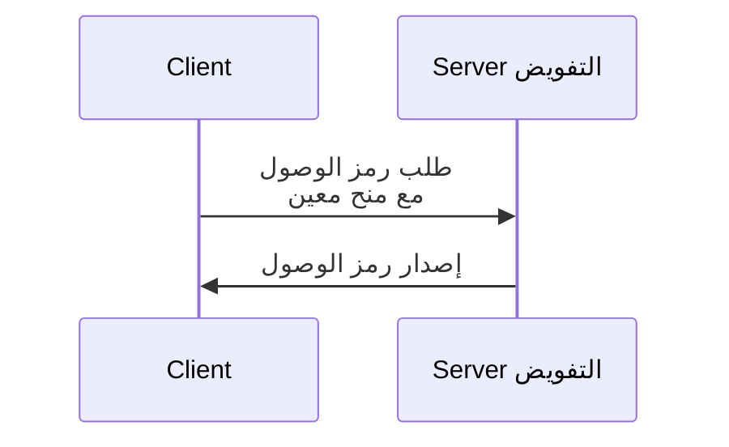

## ما هو منح OAuth 2.0؟

منح OAuth 2.0 هو عملية تفويض تُمكّن <Ref slug="client" /> من طلب <Ref slug="access-token" /> من <Ref slug="authorization-server" />. قد تسمع أيضًا مصطلحات أخرى حول هذا المفهوم، لذا دعنا نوضحها قبل التعمق:

- **منح OAuth 2.0**: يُعرف أيضًا باسم "نوع منح OAuth 2.0"، "تدفق OAuth 2.0"، أو "منح تفويض OAuth 2.0". في أغلب السياقات، تشير هذه المصطلحات إلى نفس المفهوم.
- <Ref slug="authorization-server" />: الخادم الذي يصدر رموز الوصول إلى العميل. في OpenID Connect (OIDC)، يكون خادم التفويض هو نفسه <Ref slug="openid-connect" headingId="openid-provider-op" />.
- <Ref slug="authorization-request" />: الطلب الذي يقدمه العميل إلى خادم التفويض للحصول على رمز وصول. في OpenID Connect (OIDC)، يُشار إليه أيضًا كـ <Ref slug="authentication-request" />.

من أجل الوضوح، سنستخدم المصطلحات الأولية الموضحة أعلاه بشكل متسق طوال هذه المقالة.

عملية منح OAuth 2.0 على مستوى عالٍ بسيطة للغاية:

بعد أن يتلقى العميل رمز الوصول، يمكنه استخدامه للوصول إلى الموارد المحمية (مثل، واجهات برمجة التطبيقات) نيابةً عن المستخدم أو بنفسه.

لاحظ أنه وفقاً للمنح المحدد، قد يقوم العميل وخادم التفويض بتبادل معلومات إضافية ويشملون خطوات أكثر في العملية. على سبيل المثال، يشمل <Ref slug="authorization-code-flow">منح رمز التفويض</Ref> مصادقة (Authentication) وتفويض المستخدم، وتوليد الرمز، وتبادل الرموز.

## المنح المختلفة في OAuth 2.0

تعرف مواصفة OAuth 2.0 الأساسية أربع منح يُمكن للعملاء استخدامها للحصول على رموز الوصول:

1. <Ref slug="authorization-code-flow">منح رمز التفويض</Ref>: المنح الأكثر أمانًا والمُوصى به لغالبية التطبيقات. يُفرض استخدام <Ref slug="pkce" /> لجميع العملاء في <Ref slug="oauth-2.1" />.
2. <Ref slug="implicit-flow">المنح الضمني</Ref>: منح مبسط تم إيقافه في OAuth 2.1 بسبب مخاوف أمنية.
3. [منح معلومات اعتماد كلمة مرور مالك المورد (ROPC)](https://datatracker.ietf.org/doc/html/rfc6749#section-4.3): منح يتم فيه تبادل بيانات اعتماد المستخدم مباشرة للحصول على رمز وصول. لا يُوصى به لمعظم التطبيقات بسبب المخاطر الأمنية.
4. <Ref slug="client-credentials-flow">منح معلومات اعتماد العميل</Ref>: منح يُستخدم من قبل <Ref slug="client" headingId="confidential-clients" /> للحصول على رمز وصول دون مشاركة المستخدم.

مع تطور الصناعة، يتم [التخلي عن المنح الضمني وROPC](https://blog.logto.io/oauth-2-1) لصالح تدفقات أكثر أمانًا وموحدة. للتطبيقات الجديدة، الخيارات واضحة:

- لمصادقة (Authentication) وتفويض المستخدم، استخدم منح رمز التفويض مع PKCE.
- للاتصال بين الآلات (<Ref slug="machine-to-machine" />)، استخدم منح معلومات اعتماد العميل.

### منح أخرى في OAuth 2.0

بالإضافة إلى المنح الأربعة الأساسية، هناك امتدادات أخرى تحدد منحًا جديدة لحالات استخدام معينة. على سبيل المثال:

- <Ref slug="device-flow">منح تفويض الأجهزة</Ref> هو منح مصمم للأجهزة ذات القدرات الإدخال المحدودة، مثل أجهزة التلفزيون الذكية وأجهزة إنترنت الأشياء.
- <Ref slug="hybrid-flow">التدفق الهجين</Ref> هو منح من OpenID Connect يجمع بين منح رمز التفويض والمنح الضمني.

## المنح في OpenID Connect (OIDC)

في <Ref slug="openid-connect" />، يمتد مفهوم المنح ليشمل <Ref slug="id-token">رموز المعرف</Ref> التي تمثل معلومات هوية المستخدم بالإضافة إلى رموز الوصول. يضيف OIDC امتدادين لمنح OAuth 2.0 (رمز التفويض والضمني) ليشمل رموز المعرف، ويقدم منحًا جديدًا يسمى <Ref slug="hybrid-flow">التدفق الهجين</Ref> الذي يجمع بين كليهما.

> مثل OAuth 2.0، يُوصى فقط باستخدام منح رمز التفويض مع PKCE في OIDC للمصادقة (Authentication) وتفويض المستخدم.

وفي نفس الوقت، نظرًا لأن OIDC مبني على أساس OAuth 2.0، يمكن استخدام منح أخرى مثل منح معلومات اعتماد العميل على نفس خادم التفويض، طالما أن الخادم يدعمها.

<SeeAlso slugs={["pkce", "oauth-2.1", "authorization-code-flow", "implicit-flow", "client-credentials-flow", "device-flow"]} />

<Resources
  urls={[
    "https://blog.logto.io/implicit-flow-is-dead",
    "https://datatracker.ietf.org/doc/html/rfc6749",
    "https://openid.net/specs/openid-connect-core-1_0.html"
  ]}
/>
