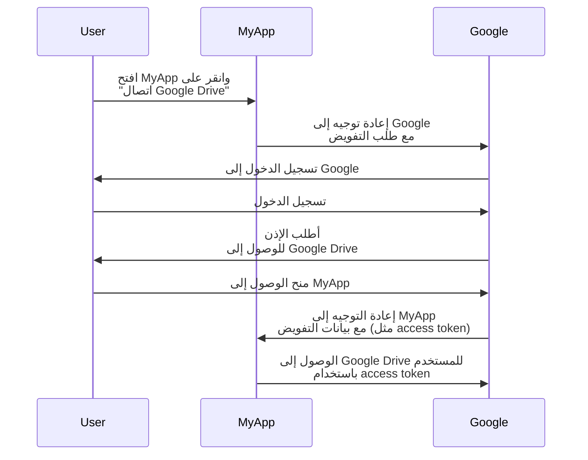
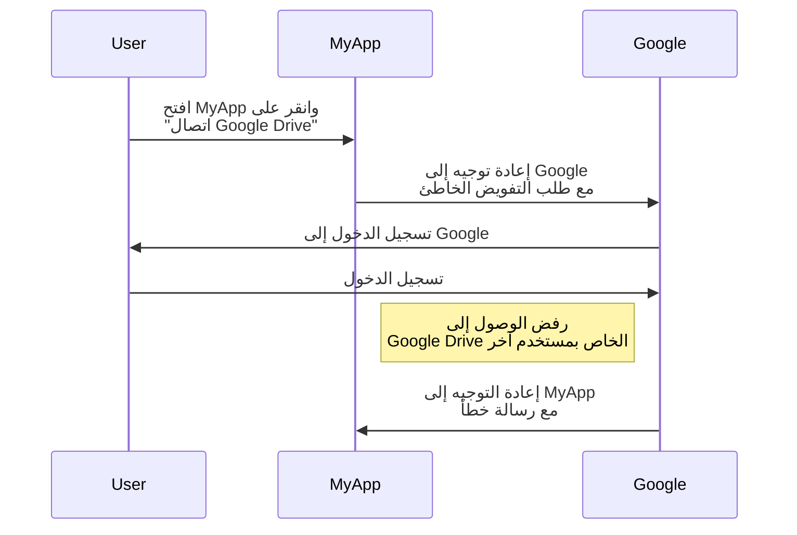
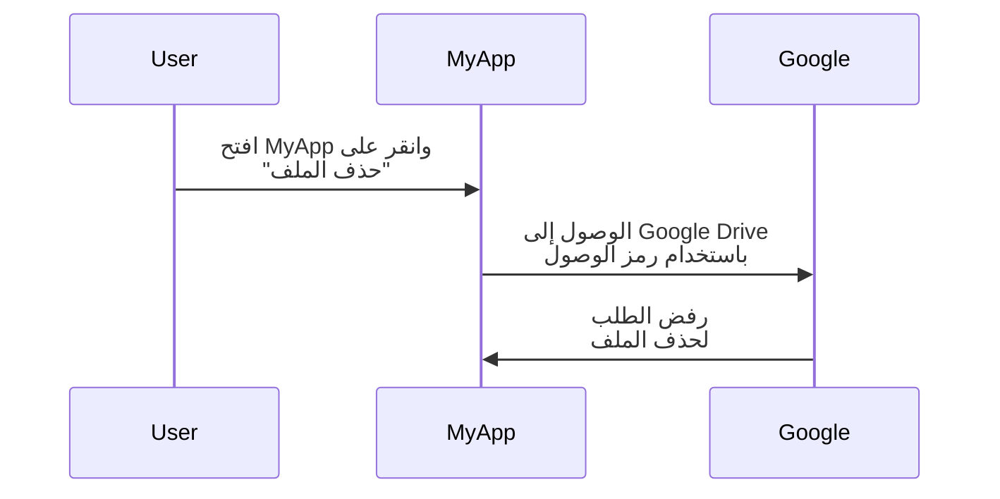

## ما هو OAuth 2.0؟

يعد OAuth 2.0 المعيار الفعلي للتفويض ويستخدم على نطاق واسع عبر الويب. إنه يسمح للتطبيق بالحصول بشكل آمن على وصول محدود إلى الموارد المحمية على تطبيق آخر، مثل ملف تعريف المستخدم أو البيانات، دون الكشف عن بيانات الاعتماد مثل كلمات المرور.

لنرَ مثالًا واقعيًا لفهم أفضل. لديك تطبيق ويب يسمى MyApp يريد الوصول إلى Google Drive الخاص بالمستخدم. بدلًا من مطالبة المستخدم بمشاركة بيانات اعتماد Google Drive الخاصة بهم، يمكن لـ MyApp استخدام OAuth 2.0 لطلب الوصول إلى Google Drive نيابة عن المستخدم. إليك تدفق مبسط:

في هذا التدفق، لا يرى MyApp أبدًا بيانات اعتماد Google Drive للمستخدم. بدلاً من ذلك، يتلقى <Ref slug="access-token" /> من Google الذي يسمح له بالوصول إلى Google Drive نيابة عن المستخدم.

### المكونات الرئيسية لـ OAuth 2.0

بالنسبة للمثال أعلاه، فإن MyApp هو <Ref slug="client" />، وGoogle هي كل من <Ref slug="authorization-server" /> و<Ref slug="resource-server" />، والمستخدم هو <Ref slug="resource-owner" />. يتضمن التدفق جميع المكونات الأساسية لـ OAuth 2.0:

- **Client**: التطبيق الذي يريد الوصول إلى الموارد المحمية. غالبًا ما يتم استخدام "Client" و"application" بالتبادل.
- **Resource owner**: المستخدم الذي يمتلك الموارد المحمية. يمكن لمالك المورد منح (تفويض) أو رفض الوصول إلى العميل.
- **Authorization server**: الخادم الذي يقوم بالتفويض (عادةً مع المصادقة) ويصدر رموز الوصول للعميل.
- **Resource server**: الخادم الذي يستضيف الموارد المحمية. يتحقق من رمز الوصول ويقدم الموارد المحمية للعميل.

## OAuth 2.0 grants (التدفقات)

<Ref slug="oauth-2.0-grant">Grant</Ref> يبني الأساس لـ OAuth 2.0 ويحدد كيف يمكن للعميل الحصول على رمز للوصول من الخادم التفويض. يحدد مواصفات OAuth 2.0 الأساسية أربعة أنواع من المنح:

- <Ref slug="authorization-code-flow">Authorization code grant</Ref>
- <Ref slug="implicit-flow">Implicit grant</Ref>
- [اعتماد كلمات المرور لمالك المورد (ROPC) grant](https://datatracker.ietf.org/doc/html/rfc6749#section-4.3)
- <Ref slug="client-credentials-flow">Client credentials grant</Ref>

دون التعمق في تفاصيل كل منحة، يمكن توقع هذه المنح في فئتين:

- **Authorization grants**: تُستخدم عندما يحتاج العميل إلى الوصول إلى موارد نيابة عن المستخدم، بمعنى آخر يتطلب تفويض المستخدم.
- **Client credentials grant**: تُستخدم عندما يحتاج العميل إلى الوصول إلى الموارد نيابة عنه. هذه المنحة مناسبة للاتصال <Ref slug="machine-to-machine" />.

### Authorization grants

بغض النظر عن نوع المنحة، تتضمن منح التفويض الخطوات الشائعة التالية:

1. يبدأ العميل <Ref slug="authorization-request" /> إلى خادم التفويض.
2. يقوم خادم التفويض بالتحقق من المستخدم (مالك المورد) ويطلب إذنًا للوصول إلى الموارد.
3. يمنح المستخدم إذن الوصول للعميل.
4. يصدر خادم التفويض رمز وصول للعميل.
5. يستخدم العميل رمز الوصول للوصول إلى الموارد المحمية على <Ref slug="resource-server" />.

يرجى ملاحظة أن الخطوات والمعلمات الدقيقة قد تختلف اعتمادًا على نوع المنحة. على سبيل المثال، يتضمن <Ref slug="authorization-code-flow">authorization code grant</Ref> خطوات أكثر مثل توليد الرمز والتبادل.

### Client credentials grant

تُعد <Ref slug="client-credentials-flow">client credentials grant</Ref> أسهل بكثير ولا تتضمن تفويض المستخدم. إليك تدفق مبسط:

1. يرسل العميل <Ref slug="token-request" /> إلى خادم التفويض.
2. يتحقق خادم التفويض من العميل ويصدر رمز الوصول.
3. يستخدم العميل رمز الوصول للوصول إلى الموارد المحمية على <Ref slug="resource-server" />.

---

للنقاشات المتعمقة حول منح OAuth 2.0، راجع <Ref slug="oauth-2.0-grant" /> ومقالات المنح الخاصة.

## التحكم في الوصول باستخدام OAuth 2.0

يُعرّف OAuth 2.0 معلمة <Ref slug="scope" /> لتحديد الأذونات التي يطلبها العميل. قد يتجاهل خادم التفويض النطاقات المطلوبة جزئيًا أو كليًا ويمنح الوصول بناءً على سياساته الخاصة بالتحكم في الوصول.

ومع ذلك، يترك OAuth 2.0 لخادم التفويض حرية اتخاذ القرار حول كيفية تنفيذ <Ref slug="access-control" />. يعني ذلك أن خادم التفويض يمكنه تحديد الموارد التي يمكن للموضوع (المستخدم أو العميل) الوصول إليها وما هي الإجراءات التي يمكنهم القيام بها على تلك الموارد.

لنبقَ مع مثال Google Drive. قد يبدأ MyApp طلب تفويض للوصول إلى Google Drive الخاص بمستخدم آخر عن طريق الخطأ. في هذه الحالة، يجب على خادم التفويض الخاص بـ Google رفض الطلب لأن المستخدم ليس لديه الأذونات اللازمة للوصول إلى Google Drive خاص بمستخدم آخر.

حالة أخرى هي عندما يتلقى MyApp رمز وصول من Google يسمح له بقراءة الملفات من Google Drive للمستخدم. ومع ذلك، يحاول MyApp حذف ملف بدلاً من قراءته. يجب على خادم الموارد (Google) رفض الطلب.

توضح كلتا الحالتين سبب ضرورة <Ref slug="access-control" /> عند تنفيذ OAuth 2.0. يجب على <Ref slug="authorization-server" /> و<Ref slug="resource-server" /> العمل معًا لفرض سياسات التحكم في الوصول وحماية الموارد.

### نماذج التحكم في الوصول

للتعامل بشكل جيد مع التحكم في الوصول، يُوصى باستخدام نماذج التحكم في الوصول القياسية مثل <Ref slug="rbac" /> و<Ref slug="abac" />. لقد أثبتت هذه النماذج فعاليتها في الصناعة وتوفر القابلية للتوسع لمتطلبات المستقبل.

## OAuth 2.1

<Ref slug="oauth-2.1" /> هو تحديث مقترح لمواصفات OAuth 2.0 يهدف إلى تحسين الأمان وسهولة الاستخدام وفقًا لتجربة الصناعة على مر السنين. بينما لم يتم الانتهاء من OAuth 2.1 بعد، يمكننا أن نتعلم عن التغييرات المقترحة ونفهم كيف يمكن أن تؤثر على تطبيقات OAuth 2.0 الحالية. يمكن اعتبار OAuth 2.1 كتوحيد لأفضل الممارسات والتوصيات الأمنية التي تم اعتمادها على نطاق واسع في الصناعة.

## OAuth 2.0 وOpenID Connect (OIDC)

يعرّف OAuth 2.0 فقط عملية التفويض ولا يغطي توثيق المستخدم أو الهوية. لهذا السبب، تم تقديم <Ref slug="openid-connect" /> كطبقة هوية على قمة OAuth 2.0. يقوم OIDC بتوسيع OAuth 2.0 لتوفير توثيق المستخدم ومعلومات الهوية في شكل <Ref slug="id-token" />.

يقوم OpenID Connect بتوسيع اثنين من منح OAuth 2.0 (رمز التفويض والمباشر) لتشمل رموز الهوية، ويقدم منحى جديد يسمى <Ref slug="hybrid-flow">hybrid flow</Ref> الذي يجمع بين كلاهما.

هذا يعني أن كل معارفك وممارساتك في OAuth 2.0 يمكن تطبيقها مباشرة على OIDC؛ وكل توسعات OAuth 2.0 مثل <Ref slug="pkce" /> و<Ref slug="resource-indicator" /> يمكن استخدامها أيضًا في OIDC.

<SeeAlso slugs={["oauth-2.0-grant", "oauth-2.1", "openid-connect"]} />

<Resources
  urls={[
    "https://blog.logto.io/secure-cloud-apps-with-oauth-and-openid-connect",
    "https://blog.logto.io/oauth-2-1",
    "https://datatracker.ietf.org/doc/html/rfc6749",
    "https://datatracker.ietf.org/doc/draft-ietf-oauth-v2-1/",
  ]}
/>
