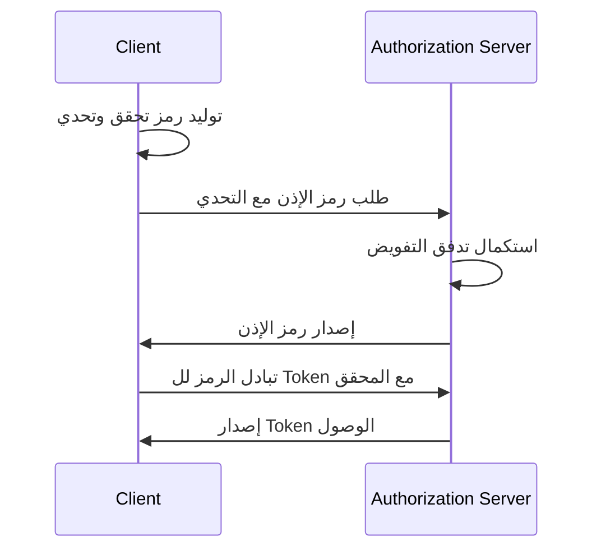

## ما هو OAuth 2.1؟

OAuth 2.1 هو تحديث مقترح لإطار تفويض <Ref slug="oauth-2.0" />. يتضمن سلسلة من التغييرات والتوصيات على مواصفات OAuth 2.0 الحالية التي توحد أفضل الممارسات وتحسينات الأمان التي تم اعتمادها على نطاق واسع في الصناعة على مر السنوات.

التحديثات الرئيسية لـOAuth 2.1 هي:

1. إهمال <Ref slug="implicit-flow">التفويض الضمني</Ref> و[إذونات كلمة مرور مالك المورد (ROPC)](https://datatracker.ietf.org/doc/html/rfc6749#section-4.3) بسبب المخاوف الأمنية.
2. فرض استخدام <Ref slug="pkce" /> لجميع العملاء، بما في ذلك <Ref slug="client" headingId="confidential-clients">العملاء السرية (الخاصة)</Ref>.
3. المطابقة الدقيقة لـ<Ref slug="redirect-uri">عناوين URI الخاصة بإعادة التوجيه</Ref>.
4. تعريف واضح لأنواع <Ref slug="client">العملاء</Ref> (عملاء عامين وسريين).
5. متطلبات الأمان ل<Ref slug="refresh-token">رموز التحديث</Ref>.

## إهمال التفويض الضمني

تم تصميم التفويض الضمني للتطبيقات ذات الصفحة الواحدة (SPAs) والتطبيقات المعتمدة على المتصفح التي لا يمكنها تخزين أسرار العملاء بأمان. ومع ذلك، فإن مخاطر الأمان الخاصة به أدت إلى إهماله: يعود التفويض بtoken الوصول في القناة الأمامية (جزء URL) الذي يمكن كشفه للمهاجمين عبر تاريخ المتصفح وراسلس للتوجيه.

يوصي OAuth 2.1 باستخدام <Ref slug="authorization-code-flow">تفويض رمز الإذن</Ref> مع <Ref slug="pkce" /> للتطبيقات المعتمدة على المتصفح.

## إهمال إذونات ROPC

تسمح إذونات ROPC للعميل بتبادل بيانات اعتماد المستخدم مباشرة للحصول على رمز وصول. تم تصميمها للتطبيقات القديمة التي لا يمكنها دعم تدفق رمز التفويض. ومع ذلك، فإن التفويض يعرض لمخاطر الأمان عبر:

- كشف بيانات اعتماد المستخدم للعميل.
- تجاوز شاشة الموافقة لخادم التفويض.
- تحديد قدرة خادم التفويض على تنفيذ إجراءات أمان أخرى، مثل <Ref slug="mfa" />.

يوصي OAuth 2.1 باستخدام <Ref slug="authorization-code-flow">تفويض رمز الإذن</Ref> مع <Ref slug="pkce" /> للمصادقة وتفويض المستخدم.

## فرض PKCE لجميع العملاء

<Ref slug="pkce" /> هو امتداد أمني لتدفق رمز الإذن الذي يحد من خطر اعتراض رمز الإذن. يتضمن قيام العميل بتوليد رمز تحقق وتحدي، والتأكد من التحدي بواسطة خادم التفويض أثناء تبادل الرمز.

إليك رسم بياني مبسط لتتابع تدفق رمز الإذن مع PKCE:

تم التوصية في البداية للعملاء العامين بـPKCE، ولكن OAuth 2.1 يمتد هذه التوصية إلى مطلب إلزامي لجميع العملاء، بما في ذلك <Ref slug="client" headingId="confidential-clients">العملاء السرية (الخاصة)</Ref>.

## المطابقة الدقيقة لعنوان URI لإعادة التوجيه

يتم استخدام <Ref slug="redirect-uri">عناوين URI لإعادة التوجيه</Ref> بواسطة العميل لاستقبال ردود التفويض من خادم التفويض. يقدم OAuth 2.1 مطلبًا جديدًا بأن عنوان URI لإعادة التوجيه المستخدم في طلب التفويض يجب أن يطابق تمامًا عنوان URI لإعادة التوجيه المسجل من قبل العميل مع <Ref slug="authorization-server" />، بما في ذلك المخطط، والمضيف، والمسار.

في بعض تنفيذات OAuth 2.0، كانت مطابقة عنوان URI لإعادة التوجيه متساهلة، مما يسمح بالمطابقات الجزئية أو استخدام الأحرف البديلة. ومع ذلك، فإن هذه المرونة يمكن أن تقدم مخاطر أمان، مثل ثغرات التوجيه المفتوحة.

## تعريف واضح لأنواع العملاء

لا يحدد OAuth 2.0 أنواع العملاء بوضوح. قد ترى تصنيفات مختلفة في الصناعة، مثل مستوى الوصول (عام مقابل سري) أو نوع التطبيق (تطبيق ويب مقابل تطبيق محمول). لا يهم إطار عمل OAuth كيفية تنفيذ العميل (حيث تكون أكثر حول سمات العمل للعميل)، لكن مستوى الوصول يحدث فرقًا في متطلبات الأمان.

لذلك، يقدم OAuth 2.1 تعريفًا واضحًا لأنواع العملاء:

- <Ref slug="client" headingId="public-clients" />: العملاء الذين لا يمكنهم الحفاظ على سرية اعتماداته (مثل SPAs، التطبيقات المحمولة).
- <Ref slug="client" headingId="confidential-clients" />: العملاء الذين يمكنهم الحفاظ على سرية اعتماداته (مثل تطبيقات الويب الجانبية للخادم، تطبيقات سطح المكتب المشاركة).

## متطلبات الأمان لرموز التحديث

<Ref slug="refresh-token">رموز التحديث</Ref> هي رموز طويلة الأمد يستخدمها العميل للحصول على رموز وصول جديدة بدون تفاعل المستخدم. في نفس الوقت، هي أيضًا أهداف قيمة عالية للمهاجمين. حيث لا يمكن للعملاء العامين تخزين بيانات الاعتماد بأمان، يحدد OAuth 2.1 أن <Ref slug="authorization-server" /> يجب أن يستخدم إحدى الوسائل التالية لتأمين رموز التحديث:

- إصدار <Ref slug="refresh-token" headingId="sender-constrained-refresh-tokens">رموز تحديث مقيدة بالمرسل</Ref>.
- استخدام <Ref slug="refresh-token" headingId="refresh-token-rotation">تدوير رموز التحديث</Ref> لتقليل قابلية الاستخدام وعمر رموز التحديث.

## OAuth 2.1 وOpenID Connect (OIDC)

حيث تم بناء <Ref slug="openid-connect" /> على قمة OAuth 2.0، فإن التغييرات المقدمة في OAuth 2.1 تنطبق أيضًا على OIDC. على سبيل المثال، ينبغي على جميع عملاء OIDC استخدام تدفق رمز الإذن مع PKCE للمصادقة وتفويض المستخدم.

<SeeAlso slugs={["oauth-2.0", "authorization-code-flow", "pkce", "implicit-flow", "openid-connect"]} />

<Resources
  urls={[
    "https://datatracker.ietf.org/doc/draft-ietf-oauth-v2-1/",
    "https://blog.logto.io/oauth-2-1",
  ]}
/>
