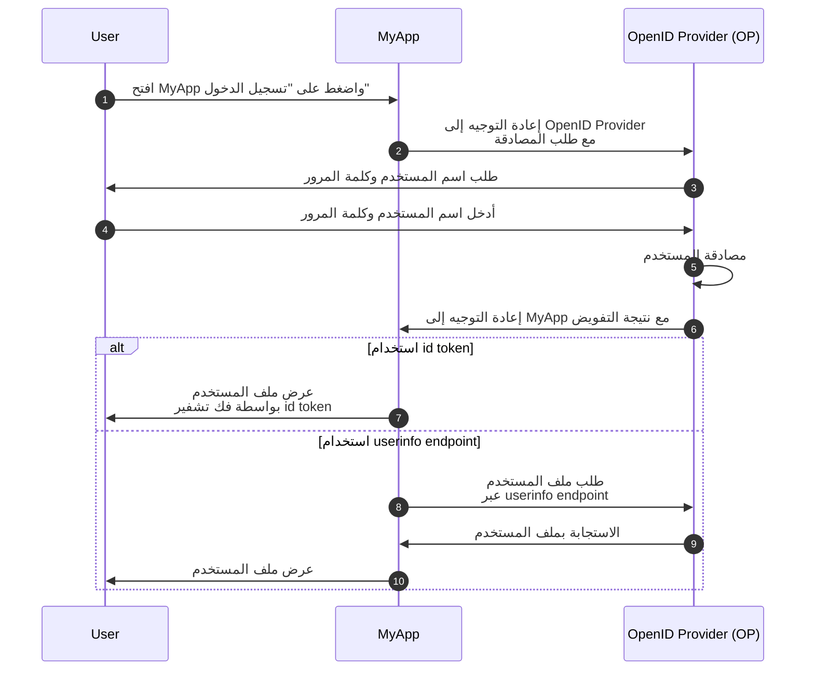
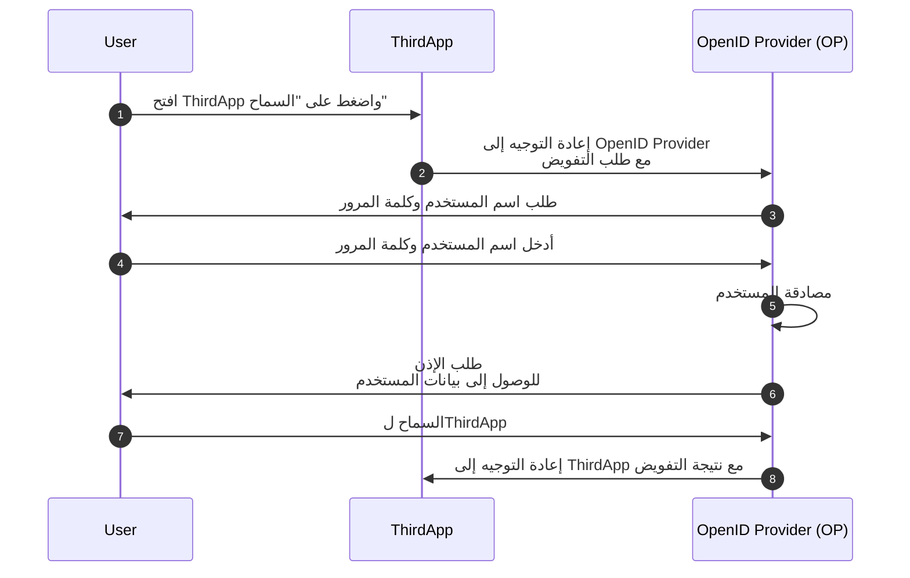

## ما هو OpenID Connect (OIDC)؟

OpenID Connect (OIDC) يضيف إمكانات المصادقة إلى <Ref slug="oauth-2.0" />، إطار العمل للتفويض، من خلال إدخال طبقة هوية عليه. يسمح OIDC للعملاء بمصادقة المستخدمين والحصول على معلومات الهوية في شكل <Ref slug="id-token">id token</Ref> واستجابات <Ref slug="userinfo-endpoint" />.

دعونا نلقي نظرة على مثال. لنفترض أن لديك تطبيق ويب يسمى MyApp ويمكن للمستخدمين تسجيل الدخول باستخدام اسم المستخدم وكلمة المرور؛ بعد تسجيل الدخول، يمكنهم الوصول إلى معلومات ملفهم الشخصي. هنا تدفق مبسط:



قد تكون بعض المصطلحات جديدة بالنسبة لك، لذا دعونا نوضحها:

### OpenID Provider (OP)

OpenID Provider (OP) هو <Ref slug="identity-provider" /> ينفذ تكوينات OIDC و OAuth 2.0. وهذا يعني أن OP هو أيضًا <Ref slug="authorization-server" /> في OAuth 2.0.

OPs مسؤولون عن مصادقة المستخدمين وإصدار id token و access token للعملاء.

### الرموز

- <Ref slug="id-token">ID tokens</Ref> هي <Ref slug="jwt">JSON Web Tokens</Ref> تُستخدم لتمثيل معلومات هوية المستخدم، مثل الاسم والبريد الإلكتروني وصورة الملف الشخصي.
- <Ref slug="access-token">Access tokens</Ref> تُستخدم للوصول إلى الموارد المحمية نيابة عن المستخدم (نفس ما في OAuth 2.0)، على سبيل المثال، userinfo endpoint.

### طلب المصادقة والنتيجة

- <Ref slug="authentication-request" /> هو طلب يُقدمه العميل إلى OP لمصادقة المستخدم. يتضمن معايير لتحديد متطلبات معينة وسيؤثر على عملية المصادقة.
- بناءً على طلب المصادقة، يمكن أن تختلف نتيجة المصادقة. على الأقل يجب أن تعرف أن النتيجة تحمل المعلومات الضرورية للعميل لتحديد هوية المستخدم.

### Userinfo endpoint

<Ref slug="userinfo-endpoint" /> هو نقطة انتهاء خاصة بـ OIDC تتيح للعملاء استرجاع معلومات ملف المستخدم الشخصي. إنه بديل لاستخدام id tokens حيث إن userinfo endpoint تقدم عادةً معلومات مستخدم أكثر تفصيلًا من id token.

يترك OIDC لـ OpenID Provider (OP) قرار ما المعلومات التي تشملها في الاستجابة لـ id token و userinfo. لذا قبل تحليل id token أو الاتصال بـ userinfo endpoint، يجب التحقق من وثائق OP لفهم المعلومات المتاحة.

## الفروق بين المصطلحات في OAuth 2.0 و OIDC

نظرًا لأن OIDC مبني على OAuth 2.0، فإن العديد من المصطلحات مشتركة بين الاثنين. ومع ذلك، بينما يركز OAuth 2.0 على التفويض، يقدم OIDC المصادقة والهوية، مما يجعل بعض المصطلحات غير مناسبة في سياق OIDC. إليك بعض الفروق البارزة:

| OAuth 2.0             | OpenID Connect (OIDC)  |
|-----------------------|------------------------|
| Authorization server  | OpenID Provider (OP)   |
| Authorization request | Authentication request |
| Grant                 | Flow                   |

في الواقع، قد تشير المصطلحات الواردة أعلاه إلى نفس الموضوع، ولكن لها معانٍ مختلفة في سياق OAuth 2.0 و OIDC:

- **OpenID Provider (OP)** هو OAuth 2.0 <Ref slug="authorization-server" /> الذي لديه القدرة على مصادقة المستخدمين وإصدار id tokens.
- **<Ref slug="authentication-request" />** هوOAuth 2.0 <Ref slug="authorization-request" /> الذي يستخدم معايير محددة في OIDC لطلب مصادقة المستخدم النهائية والحصول على id token.
- **Flow** هو مصطلح عام يُستخدم في OIDC لوصف عملية مصادقة وتفويض المستخدم، والتي قد تتضمن خطوات متعددة وتفاعلات بدلاً من دورة طلب استجابة واحدة. إنه في الأساس نفس <Ref slug="oauth-2.0-grant" />.

## تدفقات OIDC

كما يظهر في المثال أعلاه، يتم بدء تدفقات OIDC بواسطة العميل (مثل MyApp) مع طلب المصادقة إلى OP. يحدد طلب المصادقة التدفق الذي سيتم استخدامه، والذي يمكن أن يكون واحدًا من التالي:

- **<Ref slug="authorization-code-flow" />**: التدفق الأكثر أمانًا والمستحسن لمصادقة المستخدم وتفويضه. يُلزم <Ref slug="pkce" /> جميع العملاء في <Ref slug="oauth-2.1" />.
- **<Ref slug="implicit-flow" />**: تدفق مبسط يتم إنهاؤه في OAuth 2.1 بسبب مخاوف أمنية.
- **<Ref slug="hybrid-flow" />**: تدفق OIDC يجمع بين تدفق الكود المتاح للتفويض مع التدفق الضمني. أيضًا غير موصى به للتطبيقات الجديدة بسبب المخاوف الأمنية.

تدفق الكود المتاح للتفويض وتدفق الدلالة ممتدان من OAuth 2.0 ليشمل id tokens، بينما تدفق الجماع هو تدفق OIDC المحدد الذي يجمع بين الاثنين. انقر على الروابط أعلاه لمعرفة المزيد عن كل تدفق.

## نطاقات OIDC والادعاءات

مثل OAuth 2.0، يستخدم OIDC قيم <Ref slug="scope" /> لتحديد الأذونات التي يطلبها العميل. نظرًا لأن <Ref slug="id-token">id tokens</Ref> هي <Ref slug="jwt">JSON Web Tokens</Ref>، يمكن أن تحتوي على <Ref slug="claim">claims</Ref> (أزواج اسم وقيمة) تمثل معلومات هوية المستخدم وفقًا للنطاقات المطلوبة في <Ref slug="authentication-request" />. يتم أيضًا إرجاع مثل هذه الادعاءات في استجابة <Ref slug="userinfo-endpoint" />.

يحدد OIDC عدة نطاقات قياسية وإدعاءات ذات صلة يمكن للعملاء طلبها في طلب المصادقة:

- **openid**: يشير إلى أن العميل هو عميل OIDC ويطلب id token.
- **profile**: يطلب الوصول إلى ادعاءات ملف المستخدم الافتراضية، وهي: `name`، `family_name`، `given_name`، `middle_name`، `nickname`، `preferred_username`، `profile`، `picture`، `website`، `gender`، `birthdate`، `zoneinfo`، `locale`، و `updated_at`.
- **email**: يطلب الوصول إلى ادعاءات المستخدم `email` و `email_verified`.
- **address**: يطلب الوصول إلى ادعاء المستخدم `address`.
- **phone**: يطلب الوصول إلى ادعاءات المستخدم `phone_number` و `phone_number_verified`.
- **offline_access**: يطلب <Ref slug="refresh-token" /> للسماح للعميل بالحصول على <Ref slug="access-token" /> جديدة دون تفاعل المستخدم.

راجع [ادعاءات قياسية](https://openid.net/specs/openid-connect-core-1_0.html#StandardClaims) و [طلب ادعاءات باستخدام قيم النطاق](https://openid.net/specs/openid-connect-core-1_0.html#ScopeClaims) في مواصفات OIDC لمزيد من المعلومات حول النطاقات والادعاءات. أيضًا، تحقق من <Ref slug="offline-access" /> لشروحات مفصلة عن النطاق `offline_access`.

> [!Note]
> قد يدعم مقدمو OpenID (OPs) نطاقات وادعاءات إضافية تتجاوز النطاقات القياسية. تحقق من وثائق OP للحصول على تفاصيل أكثر.

## التفويض في OIDC

إذا كنت مألوفًا بـ OAuth 2.0، قد تلاحظ أن المثال أعلاه لا يتضمن أي عملية <Ref slug="authorization" />. تم إغفال جزء موافقة المستخدم لأننا افترضنا أن MyApp هو تطبيق من الدرجة الأولى الذي لا يشمل الوصول للبيانات بواسطة طرف ثالث. لا يزال التفويض منفذًا بواسطة OP، لكنه غير موضح بشكل صريح في التدفق.

جزء موافقة المستخدم مطلوب عندما يطلب عميل ثالث (مثل تطبيق لا يملكه OP) الوصول إلى بيانات المستخدم. في مثل هذه الحالات، سيطلب OP من المستخدم منح الإذن للعميل قبل إصدار id token أو access token. لنفترض وجود تطبيق ثالث يسمى ThirdApp يريد الوصول إلى بيانات المستخدم:



بمجرد اكتمال عملية التفويض واستلام ThirdApp لنتيجة التفويض (عادةً <Ref slug="access-token" />)، يمكنها الوصول إلى بيانات المستخدم من <Ref slug="resource-server" />.

راجع <Ref slug="oauth-2.0" /> لمزيد من المعلومات حول OAuth 2.0 وتفويض التدفقات.

### النطاقات

على غرار OAuth 2.0، يستخدم OIDC قيم <Ref slug="scope" /> لتحديد الأذونات التي يطلبها العميل. لقد قمنا بتغطية النطاقات والادعاءات القياسية في [نطاقات OIDC والادعاءات](#oidc-scopes-and-claims). من الجدير بالذكر أن هذه النطاقات والادعاءات يجب التعامل معها كقيم محجوزة في OIDC، مما يعني أنك لا ينبغي أن تستخدمها لأغراض محددة للأعمال.

في الممارسة، قد يدعم مقدم OpenID (OP) نطاقات وادعاءات مخصصة لأغراض عملك. استشر وثائق OP لمزيد من المعلومات حول النطاقات والادعاءات المخصصة. إذا لم تقم بتعريف نطاقات وادعاءات مخصصة، قد يتجاهلها OP مباشرةً أو يعيد استجابة خطأ.

### مؤشرات الموارد

نظرًا لأن الإطار مثل OIDC و OP قد يحجز بعض النطاقات والادعاءات لأغراض محددة، فإن OP يوصي عادةً باستخدام بادئة أو مساحة namespace لتجنب التعارض مع القيم المحجوزة عند تعريف نطاقات وادعاءات مخصصة. على سبيل المثال، يمكنك إضافة بادئة لنطاقاتك المخصصة بـ `myapp:` للإشارة إلى أنها خاصة بتطبيقك.

```json
{
  "scope": "myapp:custom_scope"
}
```

ومع ذلك، لا يمكن لهذا ضمان أن نطاقاتك وادعاءاتك المخصصة لن تتعارض مع القيم المحجوزة المستقبلية، وقد يؤدي إلى تضخم حجم الرموز المميزة. يوفر ملحق OAuth 2.0 يسمى <Ref slug="resource-indicator">مؤشرات الموارد</Ref> طريقة أكثر مرونة وقابلية للتوسع لتحقيق نفس الهدف. مؤشرات الموارد هي URIs تمثل الموارد المطلوبة، ويمكن أن تكون نقاط النهاية الفعلية للواجهات البرمجية لتعكس الموارد في العالم الواقعي. على سبيل المثال، يمكنك استخدام `https://api.myapp.com` كمؤشر مورد لتمثيل موارد API التي يريد عميلك الوصول إليها.

مرة أخرى، نظرًا لأن OIDC مبني على OAuth 2.0، يمكنك استخدام مؤشرات الموارد في طلبات مصادقة OIDC عند تكوينها بشكل صحيح. إليك مثال غير قياسي على طلب مصادقة مع مؤشر مورد:

```http
GET /authorize?response_type=code
  &client_id=YOUR_CLIENT_ID
  &redirect_uri=https%3A%2F%2Fclient.example.com%2Fcallback
  &scope=openid%20profile
  &resource=https%3A%2F%2Fapi.example.com HTTP/1.1
Host: your-openid-provider.com
```

لاستخدام مؤشرات الموارد، تحتاج أولاً إلى تأكيد أن OP الخاص بك يدعم هذا الامتداد (RFC 8707). إذا كان مدعومًا، ينبغي عليك تسجيل URI مؤشر مورد مع OP واستخدامه في معلمة `resource` في طلب المصادقة.

راجع <Ref slug="resource-indicator" /> للحصول على معلومات مفصلة عن مؤشرات الموارد.

## اعتبارات الأمان في OIDC

### الاتصال الآمن

يجب تأمين جميع الاتصالات بين العميل و OP و<Ref slug="resource-server" /> باستخدام HTTPS لمنع أي تنصت أو تلاعب بالبيانات.

### اختر التدفقات الآمنة

عند تنفيذ OIDC، يُوصى باستخدام:

- <Ref slug="authorization-code-flow" /> مع <Ref slug="pkce" /> لمصادقة المستخدم وتفويضه (مفروض في <Ref slug="oauth-2.1" />).
- <Ref slug="client-credentials-flow" /> للتواصل من آلة إلى آلة.

تم إيقاف تدفق الدلالة و hybrid flow بسبب المخاوف الأمنية، لذلك تجنب استخدامها للتطبيقات الجديدة وفكر في ترحيل التطبيقات الحالية إلى تدفقات أكثر أمانًا.

### التحقق من صحة id token

عند استلام id token من OP، يجب أن يتحقق العميل من صحة الرمز للتأكد من نزاهته وأصالته. يجب أن تتضمن عملية التحقق على الأقل الفحوصات التالية:

- **Issuer (المُصدِر)**: ينبغي أن تتطابق ادعاء `iss` مع عنوان URL لمصدر OP.
- **Audience (الجمهور)**: ينبغي أن تتطابق ادعاء `aud` مع رقم تعريف العميل للعميل.
- **Expiration (انتهاء الصلاحية)**: ينبغي أن تكون ادعاء `exp` في المستقبل.
- **Signature (التوقيع)**: ينبغي أن يتم توقيع الرمز بواسطة <Ref slug="signing-key" /> الخاص بـ OP.

### استخدام access token

تُستخدم access tokens للوصول إلى الموارد المحمية نيابة عن المستخدم. ينبغي أن يعامل العميل access tokens كمعلومات حساسة ويتبع هذه الممارسات الفضلى:

- **تخزين الرموز المميزة**: يجب تخزين access tokens بشكل آمن وعدم كشفها لأطراف غير مصرح لها.
- **انتهاء صلاحية الرموز المميزة**: ينبغي أن تكون access tokens مزودة بفترة صلاحية قصيرة (مثل 1 ساعة) لتقليل خطر الوصول غير المصرح به إذا تم تسريب الرمز.
- **إبطال الرموز المميزة**: تنفيذ آليات إبطال الرموز للإبطال access tokens عند الضرورة.

### موافقة المستخدم

عندما يطلب عميل من جهة ثالثة الوصول إلى بيانات المستخدم، ينبغي أن يضمن OP أن المستخدم على علم بالأذونات المطلوبة ويقوم بمنح الموافقة. ينبغي أن تكون عملية موافقة المستخدم شفافة وتقدم معلومات واضحة حول البيانات التي يتم الوصول إليها وكيف سيتم استخدامها.

<SeeAlso slugs={["oauth-2.0", "authorization-code-flow", "implicit-flow", "hybrid-flow", "pkce", "resource-indicator"]} />

<Resources
  urls={[
    "https://blog.logto.io/secure-cloud-apps-with-oauth-and-openid-connect",
    "https://openid.net/specs/openid-connect-core-1_0.html",
  ]}
/>