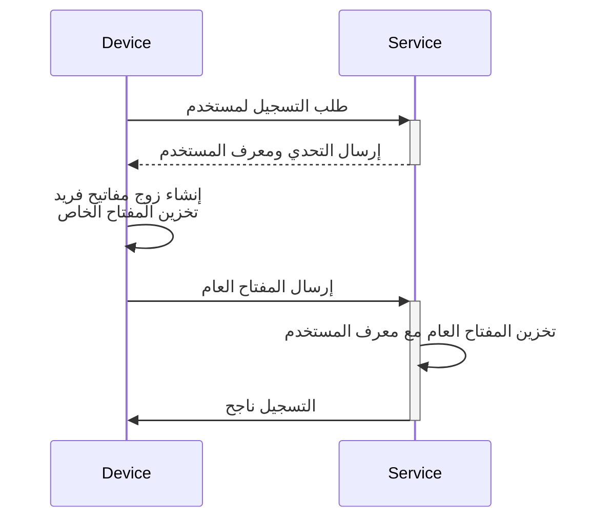
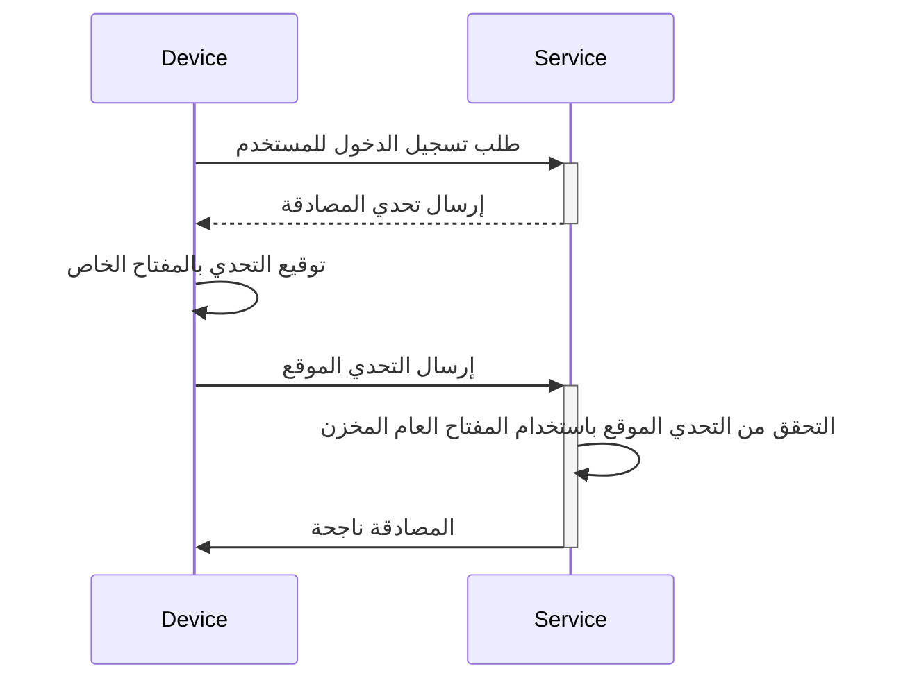

## ما هو مفتاح المرور (Passkey)؟

**مفتاح المرور (Passkey)** هو بديل آمن ومريح لكلمات المرور التقليدية يعتمد على [FIDO](https://fidoalliance.org/). يستخدمون التشفير المتقدم لحماية حساباتك من هجمات [التصيد الاحتيالي](https://en.wikipedia.org/wiki/Phishing).

- **فريد لكل خدمة**: عندما تسجل في خدمة، يقوم جهازك بإنشاء مفتاح مرور فريد مرتبط بنطاق تلك الخدمة المحددة.
- **مرتبط بالجهاز**: عادةً ما تكون مفاتيح المرور مرتبطة بجهاز، مثل الهاتف أو الكمبيوتر المحمول أو معرف بيومتري أو مفاتيح أمان الأجهزة.
- **زوج مفاتيح عامة وخاصة**: يحتفظ الجهاز بالمفتاح الخاص، بينما يتم مشاركة المفتاح العام مع الخدمة. تُسمى هذه الأزواج من المفاتيح التشفيرية مفاتيح المرور. (مقتبس من [FIDO](https://fidoalliance.org/how-fido-works/))
- **طرق مصادقة متعددة**: يمكنك استخدام مسح بصمة الإصبع أو التعرف على الوجه أو رمز PIN للجهاز أو مسح رمز QR أو مفاتيح الأمان للمصادقة باستخدام مفتاح المرور.
- **المزامنة عبر الأجهزة**: يمكن مزامنة مفاتيح المرور عبر الأجهزة باستخدام التخزين السحابي الآمن (مثل iCloud Keychain من Apple أو Google Password Manager)، مما يسمح لك بتسجيل الدخول من أي جهاز مدعوم.

## كيف يبدو سير عمل مفتاح المرور (Passkey)؟

إليك مثال واقعي لمساعدتك على فهم أفضل. لديك خدمة ويب MyApp التي ترغب في تنفيذ تسجيل الدخول باستخدام مفتاح المرور بدلاً من تسجيل الدخول المستند إلى كلمة المرور. يختار المستخدمون الجهاز الحالي مع مسح بصمة الإصبع كطريقة مصادقة لمفتاح المرور.

تعمل **مفاتيح المرور (Passkeys)** عن طريق استخدام التشفير بالمفتاح العام لتوفير بيانات اعتماد آمنة.

- **تسجيل مفتاح المرور**
    - عندما تسجل في خدمة، يقوم جهازك بإنشاء زوج مفاتيح تشفير فريد مرتبط بتلك الخدمة.
    - يبقى **المفتاح الخاص** على جهازك، بينما يتم مشاركة **المفتاح العام** مع الخدمة.

- **مصادقة مفتاح المرور**
    - عندما تحاول تسجيل الدخول، ترسل الخدمة **تحديًا** إلى جهازك.
    - يستخدم جهازك **المفتاح الخاص** لتوليد **توقيع** تشفيري بناءً على التحدي.
    - يتم إرسال **التوقيع** مرة أخرى إلى الخدمة، التي تتحقق منه باستخدام **المفتاح العام**.
    - إذا كان التوقيع صالحًا، فإن المصادقة تكون ناجحة.

اقرأ <Ref slug="webauthn" />، وهو API لتنفيذ مفاتيح المرور، لتتعلم التفاصيل.

## كيف يبدو سير عمل المستخدم النهائي لمفتاح المرور (Passkey)؟

تقدم مفاتيح المرور مرونة مع نوعين من المصادقين للاستخدام المحلي والسحابي، ويمكن للمستخدمين تمكين أحدهما أو كليهما للخدمة.

- **المصادق الأساسي (المصادق الداخلي):** مرتبط بنظام تشغيل جهاز محدد (مثل الهاتف أو الكمبيوتر المحمول)، باستخدام القياسات الحيوية أو رمز المرور للجهاز للتفويض. إنه سريع ومريح.
    - أمثلة: iCloud Keychain على أجهزة Apple (التحقق عبر Touch ID أو Face ID أو رمز مرور الجهاز)، Windows Hello، Google Password Manager على Android.
- **المصادق المتجول (المصادق الخارجي):** أجهزة أو برامج محمولة، مثل مفاتيح الأمان أو الهواتف الذكية. يمكن استخدامها عبر أجهزة متعددة ولكن قد تتطلب خطوات إضافية مثل مسح رمز QR أو الاقتران عبر NFC/Bluetooth.
    - أمثلة: YubiKey والحسابات السحابية على الهواتف الذكية. غالبًا ما تتطلب المصادقات المحمولة مسح رمز QR للربط مع أجهزة سطح المكتب، وتحتاج المصادقة عبر الأجهزة إلى الاتصال عبر Bluetooth أو NFC أو USB لضمان قرب المصادق.

## متى يجب استخدام مفتاح المرور (Passkey)؟

مفاتيح المرور هي عامل مصادقة حديث يمكن استخدامها كعامل أول أو ثاني.

- **تسجيل الدخول بمفتاح المرور:** تقدم مفاتيح المرور طريقة مصادقة أسرع وأكثر أمانًا بدون كلمة مرور مقارنة بكلمة المرور التقليدية.
    - عادةً ما تحتوي التطبيقات الحديثة على زر "تسجيل الدخول باستخدام مفتاح المرور" في صفحة تسجيل الدخول، مما يدفع المستخدمين للنقر على هذا الخيار بشكل استباقي.
    - بالإضافة إلى ذلك، يمكن لصفحة تسجيل الدخول أن تطالب تلقائيًا بنبذة تسجيل الدخول باستخدام مفتاح المرور إذا تعرفت على أن المستخدم يصل إلى نفس الجهاز والمتصفح حيث تم تسجيل مفتاح المرور الخاص به.
- **مفتاح المرور MFA:** يمكن أن تعمل مفاتيح المرور أيضًا كعامل ثانٍ لـ MFA.
    - عندما يحاول المستخدم تسجيل الدخول، يقوم أولاً بإدخال بريده الإلكتروني وكلمة المرور (أو عوامل أخرى أولى)، وبعد ذلك تطلب الخدمة منهم إكمال التحقق بخطوتين باستخدام مفتاح المرور.
    - إذا كانت هناك جلسات موجودة في المتصفح، يمكن للخدمة أن تطالب المستخدمين مباشرةً بتسجيل الدخول باستخدام مفتاح المرور الخاص بهم دون الحاجة إلى إدخال كلمة المرور مرة أخرى. تُعرف هذه العملية بإكمال MFA، لأن مفتاح المرور هو أمان عالي المستوى من خلال الربط بالجهاز الحالي والتحقق من المستخدمين عبر القياسات الحيوية أو رموز PIN أو طرق الأجهزة الأخرى.
- **التحقق الأمني**: في البيئات ذات الأمان العالي، غالبًا ما تُستخدم مفاتيح المرور للتحقق المزدوج من هوية المستخدم. على سبيل المثال، عند الوصول إلى معلومات مالية حساسة أو تنفيذ عمليات حاسمة (البنوك، الحكومة، النظام المؤسسي).

### لماذا تعتبر مفاتيح المرور الطريقة الأكثر أمانًا للمصادقة؟

تعتبر مفاتيح المرور واحدة من أكثر الطرق أمانًا للمستخدمين العاديين لتسجيل الدخول لأنها تستخدم **التشفير بالمفتاح العام**. على عكس كلمات المرور أو الرموز المؤقتة (TOTPs)، لا يغادر المفتاح الخاص جهازك أبدًا. حتى إذا قام مهاجم بسرقة المفتاح العام المتاح بحرية، فلا يمكنهم تزوير محاولة تسجيل دخول صالحة.

إليك مقارنة لتوضيح لماذا تعتبر مفاتيح المرور أكثر أمانًا بشكل كبير:

| الهجمات | مفاتيح المرور | برنامج TOTP (المصادق) |
| --- | --- | --- |
| **هجمات التصيد الاحتيالي** | مقاومة عالية للتصيد الاحتيالي، حيث لا يغادر المفتاح الخاص الجهاز أو يُدخل يدويًا في أي مكان، مما يجعل من الصعب سرقته. | عرضة للتصيد الاحتيالي، حيث يتم عرض برنامج TOTP على شاشتك، لذا يمكن للمهاجمين خداعك للكشف عنه على موقع وهمي. |
| **هجمات الرجل في الوسط (MitM)** | حماية قوية ضد MitM، حيث تجعل البروتوكولات التشفيرية القوية المفاتيح الخاصة تبقى فقط على جهازك. | عرضة لـ MitM، حيث يمكن اعتراض TOTPs بواسطة مهاجم MitM الذي يمكنه بعد ذلك استخدامها لتسجيل الدخول كأنك. |
| **هجمات الإعادة** | حماية قوية ضد هجمات الإعادة، حيث يكون كل طلب مفتاح مرور فريدًا، مما يجعله عديم الفائدة للمهاجم لالتقاطه وإعادة تشغيله لاحقًا. | ممكنة لهجمات الإعادة، حيث تتغير TOTP بشكل دوري، ولكن إذا تم اعتراضها قبل انتهاء صلاحيتها، يمكن إعادة استخدامها للوصول غير المصرح به. |

<SeeAlso slugs={["webauthn", "authentication", "authorization"]} />

<Resources
  urls={[
    "https://fidoalliance.org/passkeys/",
    "https://webauthn.io/"
  ]}
/>